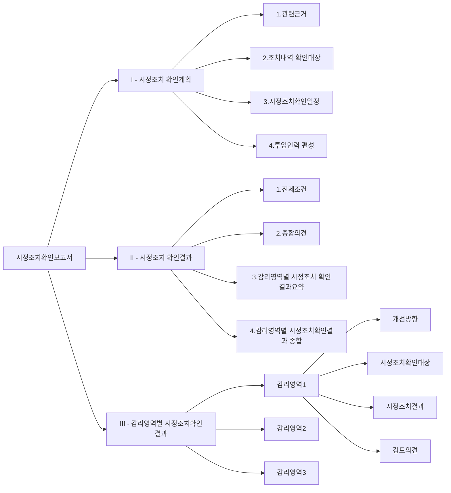

# 시정조치확인보고서: 프로젝트 품질 향상을 위한 필수 점검 도구

<!-- mtoc-start -->

- [정의 및 개념](#정의-및-개념)
- [주요 특징](#주요-특징)
- [구성도](#구성도)
- [활용 사례](#활용-사례)
- [기대 효과 및 필요성](#기대-효과-및-필요성)
- [마무리](#마무리)
- [Keywords](#keywords)

<!-- mtoc-end -->

정보시스템 감리에서 시정조치확인보고서(Corrective Action Verification Report)는 감리 지적사항에 대한 시정조치 이행 여부를 확인하고 평가하는 공식 문서입니다. 이 보고서는 감리 활동의 최종 단계로, 프로젝트 진행 상황과 품질 개선 현황을 체계적으로 점검하고 문서화하는 중요한 역할을 담당합니다.

## 정의 및 개념

- 시정조치확인보고서: 정보시스템 감리 과정에서 도출된 지적사항에 대한 조치 결과를 확인하고 평가하는 공식 문서.
- 목적: 감리에서 발견된 문제점에 대한 적절한 조치 여부 확인 및 프로젝트 품질 개선 보장.
- 특징: 객관적 평가 기준 제시, 증거 기반 검증 수행, 법적 효력 보유, 프로젝트 최종 승인 근거 제공.

## 주요 특징

- **객관성과 독립성**: 제3자적 관점에서 시정조치 결과 검증 및 평가
- **증거 기반 검증**: 문서검토, 인터뷰, 시연 등 다양한 방법을 통한 객관적 증거 확보
- **단계별 접근**: 계획 수립, 확인 실시, 결과 평가, 보고서 작성의 체계적 단계 수행
- **명확한 판정 기준**: 조치완료, 부분조치, 미조치, 확인불가 등 판정 기준 제시
- **사후관리 기반**: 지속적인 품질 개선과 위험 관리를 위한 근거 자료 제공

## 구성도

시정조치확인보고서는 계획, 결과, 세부영역별 결과로 구성되며, 각 영역은 세부 항목을 포함함. 특히 감리영역별 시정조치확인결과에서는 개선방향, 확인대상, 조치결과, 검토의견을 체계적으로 문서화하여 조치의 적절성을 평가함.

## 활용 사례

1. **공공 정보화 사업**: 전자정부 시스템 구축 프로젝트에서 정보시스템 감리 후 도출된 보안 취약점 및 성능 문제에 대한 시정조치 이행 여부 확인
2. **금융 시스템 개발**: 은행 핵심 뱅킹 시스템 구축 시 감리에서 지적된 트랜잭션 처리 로직 오류 및 데이터 무결성 이슈에 대한 조치 결과 검증
3. **의료정보 시스템**: 병원 정보 시스템 구축 과정에서 환자 데이터 보안 및 개인정보 보호 관련 지적사항 조치 확인
4. **기업 ERP 도입**: 대기업 ERP 시스템 구축 시 업무 프로세스 설계 및 인터페이스 구현 관련 지적사항 해결 여부 검증

## 기대 효과 및 필요성

- **프로젝트 품질 향상**: 감리 지적사항의 효과적 해결을 통한 시스템 품질 및 안정성 보장
- **위험 관리 강화**: 잠재적 문제점의 조기 발견 및 해결을 통한 프로젝트 위험 최소화
- **이해관계자 신뢰 구축**: 투명한 문제 해결 과정 공유를 통한 발주자와 수행사 간 신뢰 형성
- **법적 규정 준수**: 정보시스템 감리 관련 법적 요구사항 충족 및 규정 준수 입증
- **지속적 개선 촉진**: 프로젝트 수행 과정의 문제점 분석을 통한 조직의 시스템 개발 역량 강화

## 마무리

시정조치확인보고서는 단순한 형식적 문서가 아닌 프로젝트의 성공적 완수와 품질 보장을 위한 핵심 도구입니다. 체계적인 시정조치 확인 프로세스를 통해 발견된 문제점들이 적절히 해결되었는지 검증함으로써, 정보시스템의 안정성과 효율성을 확보하고 궁극적으로 사용자 만족도를 높이는 데 기여합니다. 따라서 모든 정보화 프로젝트에서는 시정조치확인보고서의 작성과 관리에 충분한 시간과 자원을 투입하여 프로젝트의 성공적 완료를 보장해야 할 것입니다.

## Keywords

Corrective Action Verification Report, 시정조치확인보고서, 정보시스템 감리, Audit Finding, 감리영역, 조치완료, Verification Process, 객관적 증거, 품질보증, 위험관리
