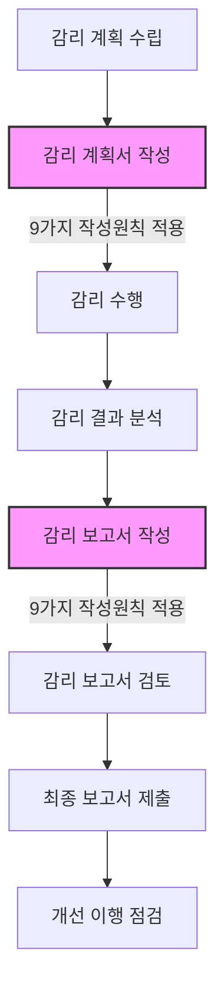

# 정보시스템 감리 문서화: 효과적인 계획서와 보고서 작성을 위한 9가지 원칙

<!-- mtoc-start -->

- [정의 및 개념](#정의-및-개념)
- [주요 특징](#주요-특징)
- [감리 문서화 프로세스](#감리-문서화-프로세스)
- [9가지 문서 작성 원칙 (유간논명완정객적준)](#9가지-문서-작성-원칙-유간논명완정객적준)
  - [1. 유용성](#1-유용성)
  - [2. 간결성](#2-간결성)
  - [3. 논리성](#3-논리성)
  - [4. 명확성](#4-명확성)
  - [5. 완전성](#5-완전성)
  - [6. 정확성](#6-정확성)
  - [7. 객관성](#7-객관성)
  - [8. 적시성](#8-적시성)
  - [9. 준거성](#9-준거성)
- [활용 사례](#활용-사례)
- [기대 효과 및 필요성](#기대-효과-및-필요성)
- [마무리](#마무리)
- [Keywords](#keywords)

<!-- mtoc-end -->

정보시스템 감리(Information System Audit)는 IT 프로젝트의 품질과 성공을 보장하기 위한 필수적인 프로세스입니다. 이 과정에서 감리 계획서와 보고서는 감리 활동의 핵심 산출물로, 이들 문서의 품질은 감리 결과의 유효성과 직결됩니다. 효과적인 감리 문서는 명확한 원칙에 따라 작성되어야 하며, 이는 감리의 투명성과 신뢰성을 확보하는 데 필수적입니다.

## 정의 및 개념

- 정보시스템 감리 계획서: 감리 활동의 범위, 방법, 일정, 자원 배분 등을 정의한 문서로, 감리 활동의 로드맵 역할 수행.
- 정보시스템 감리 보고서: 감리 수행 결과, 발견사항, 개선 권고사항 등을 포함한 문서로, 감리 활동의 결과물 및 증거 기능 제공.
- 작성 원칙: 유간논명완정개적준(유용성, 간결성, 논리성, 명확성, 완전성, 정확성, 객관성, 적시성, 준거성)의 9가지 핵심 원칙 기반.

## 주요 특징

1. **목적성**: 감리 문서는 감리 수행의 효과적인 관리와 결과 전달을 위한 명확한 목적성 보유
2. **증빙성**: 모든 감리 활동과 결과에 대한 공식적인 증빙 자료로서 법적, 행정적 효력 제공
3. **위험관리**: 프로젝트 위험 요소를 식별하고 관리하기 위한 기준점 제시
4. **의사소통**: 발주기관, 사업자, 감리인 간의 효과적인 의사소통 도구로 기능
5. **체계성**: 정형화된 구조와 원칙에 따라 작성되어 일관성 있는 감리 품질 보장

## 감리 문서화 프로세스

감리 계획서와 보고서는 감리 수행의 시작과 끝을 기록하는 핵심 문서로, 전체 감리 사이클에서 9가지 작성 원칙이 일관되게 적용됩니다. 두 문서는 감리의 목표 설정과 결과 평가의 기준점 역할을 수행합니다.

## 9가지 문서 작성 원칙 (유간논명완정객적준)

### 1. 유용성

- 실질적인 가치와 활용 가능성을 갖춘 정보 제공
- 프로젝트 개선에 직접적으로 기여할 수 있는 내용 포함
- 피감리기관이 실제로 적용 가능한 개선 권고사항 제시

### 2. 간결성

- 불필요한 내용을 배제하고 핵심 정보에 집중
- 명확한 문장 구조와 간결한 표현 방식 사용
- 중복 내용 최소화 및 요점 중심의 서술 방식 적용

### 3. 논리성

- 주장과 증거 간의 명확한 연결성 제시
- 체계적이고 일관된 흐름으로 내용 구성
- 결론에 이르는 과정이 논리적으로 전개

### 4. 명확성

- 모호한 표현이나 해석의 여지가 있는 문구 지양
- 구체적인 수치와 사실에 기반한 서술
- 전문 용어 사용 시 필요한 설명 병행

### 5. 완전성

- 감리 범위 내 모든 필수 영역 포함
- 누락된 정보 없이 포괄적인 내용 구성
- 감리 기준에 따른 모든 평가 항목 검토 결과 제시

### 6. 정확성

- 사실에 기반한 객관적 정보만 포함
- 검증 가능한 데이터와 증거 제시
- 오류 없는 정보와 분석 결과 제공

### 7. 객관성

- 개인적 견해나 편향된 관점 배제
- 균형 잡힌 시각에서의 평가 및 분석
- 감리 기준과 원칙에 따른 일관된 판단

### 8. 적시성

- 감리 시점에 적합한 시기에 문서 제공
- 문제 해결을 위한 충분한 대응 시간 확보
- 프로젝트 일정을 고려한 보고서 납기 준수

### 9. 준거성

- 관련 법규, 지침, 표준을 준수
- 정보시스템 감리 표준 지침 적용
- 감리 계약에 명시된 요구사항 충족

## 활용 사례

1. **대규모 공공 정보화 사업**: 전자정부 사업에서 감리 문서 작성 원칙을 적용하여 투명성 보장 및 예산 낭비 방지
2. **금융권 핵심 시스템 구축**: 엄격한 규제 환경에서 감리 문서화 원칙을 적용하여 컴플라이언스 충족
3. **의료정보시스템 도입**: 민감한 개인정보를 다루는 시스템에서 감리 문서 원칙을 적용하여 보안 및 안정성 확보
4. **기업 ERP 시스템 업그레이드**: 비즈니스 연속성을 유지하며 시스템 전환을 위한 감리 문서 작성 원칙 활용

## 기대 효과 및 필요성

1. **프로젝트 투명성 강화**: 명확한 감리 문서를 통해 프로젝트 진행 상황과 문제점에 대한 투명한 소통 가능
2. **위험 관리 향상**: 잠재적 이슈를 조기에 식별하고 관리할 수 있는 체계적인 접근 방식 제공
3. **품질 보증**: 일관된 감리 품질을 통한 정보시스템의 안정성 및 효율성 향상
4. **비용 절감**: 효과적인 감리를 통한 재작업 감소 및 프로젝트 실패 위험 최소화
5. **규제 준수**: 관련 법규 및 지침 준수를 통한 컴플라이언스 리스크 감소
6. **지식 축적**: 체계적인 문서화를 통한 조직의 감리 역량 및 프로젝트 관리 지식 축적

## 마무리

정보시스템 감리 계획서와 보고서 작성에 있어 9가지 원칙(유간논명완정개적준)의 적용은 감리의 품질과 효과를 결정하는 핵심 요소입니다. 이러한 원칙에 기반한 문서화는 단순한 형식적 절차가 아닌, 프로젝트의 성공적 수행을 위한 필수적인 도구로 인식되어야 합니다. 조직은 이러한 원칙을 내재화하고 지속적으로 감리 문서화 역량을 강화함으로써, IT 거버넌스의 성숙도를 높이고 정보시스템의 가치를 극대화할 수 있을 것입니다.

## Keywords

Information System Audit, 정보시스템 감리, Audit Documentation, 감리 문서화, Audit Principles, 감리 원칙, Audit Report, 감리 보고서, Audit Plan, 감리 계획서, Project Governance, 프로젝트 거버넌스, Compliance, 컴플라이언스, Quality Assurance, 품질 보증, Risk Management, 위험 관리
