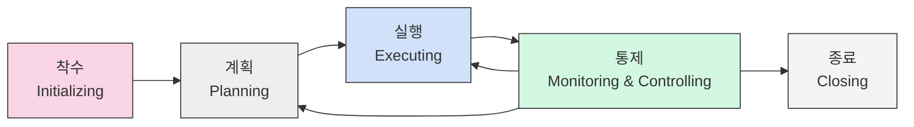

# 프로젝트 관리 (PM): 한정된 자원으로 사용자 만족 목표 달성하기

<!-- mtoc-start -->

- [정의 및 개념](#정의-및-개념)
- [주요 특징](#주요-특징)
- [프로젝트 관리 프로세스](#프로젝트-관리-프로세스)
- [프로젝트 관리 프레임워크: 프로세스 단계와 지식 영역](#프로젝트-관리-프레임워크-프로세스-단계와-지식-영역)
  - [프로젝트 관리 5단계 (프로세스 그룹)](#프로젝트-관리-5단계-프로세스-그룹)
  - [프로젝트 관리 10대 지식 영역](#프로젝트-관리-10대-지식-영역)
  - [프로젝트 관리 매트릭스: 프로세스 그룹과 지식 영역의 연계](#프로젝트-관리-매트릭스-프로세스-그룹과-지식-영역의-연계)
- [활용 사례](#활용-사례)
- [기대 효과 및 필요성](#기대-효과-및-필요성)
- [마무리](#마무리)
- [Keywords](#keywords)

<!-- mtoc-end -->

프로젝트 관리(Project Management)는 한정된 시간과 자원 안에서 사용자가 만족할만한 제품이나 서비스를 제공하기 위한 모든 기술적/관리적 업무를 포괄합니다. 고유한 목적을 가진 일시적 활동으로, 다양한 역할의 인력이 함께 협업하여 점진적으로 세부사항을 구체화해 나가는 과정입니다. 프로젝트 관리는 착수(Initializing), 계획(Planning), 실행(Executing), 통제(Monitoring & Controlling), 종료(Closing)의 5단계 프로세스를 따릅니다.

## 정의 및 개념

- 프로젝트: 고유한 목적(제품, 서비스, 결과물 등)을 달성하기 위해 일정 기간 다양한 역할의 사람들이 모여 함께하는 작업.
- 프로젝트 관리: 프로젝트 요구사항을 충족시키기 위해 지식, 기술, 도구, 기법을 프로젝트 활동에 적용하는 과정.

- 특징: 유일성(Uniqueness), 일시성(Temporary), 목적성(Purposeful), 점진적 상세화(Progressive Elaboration)
- 프로젝트 관리 지식 영역: 통합, 범위, 일정, 비용, 품질, 인력, 의사소통, 위험, 조달, 이해관계자 관리

## 주요 특징

- **유일성**: 모든 프로젝트는 독특한 특성을 가지며, 동일한 결과물이나 프로세스를 가진 프로젝트는 존재하지 않음
- **일시성**: 명확한 시작과 종료 시점을 가지는 한시적 활동으로, 영속적인 운영 업무와 구분됨
- **목적성**: 명확한 목표와 산출물을 달성하기 위한 활동으로, 모든 작업은 이 목적에 부합해야 함
- **점진적 상세화**: 프로젝트 초기의 높은 불확실성을 단계적으로 구체화하며 상세 정보를 지속적으로 보완해 나가는 특성

## 프로젝트 관리 프로세스

프로젝트 관리 프로세스는 착수, 계획, 실행, 통제, 종료의 5단계로 구성되며, 통제 단계에서는 계획과 실행 단계로 피드백을 제공하는 순환적인 구조를 가집니다. 각 단계는 명확한 산출물과 검토 포인트를 가지고 있습니다.

## 프로젝트 관리 프레임워크: 프로세스 단계와 지식 영역

### 프로젝트 관리 5단계 (프로세스 그룹)

| 프로세스 단계 | 영문 명칭                | 주요 활동                                 | 주요 산출물                                |
| ------------- | ------------------------ | ----------------------------------------- | ------------------------------------------ |
| 1. 착수       | Initiating               | 프로젝트 정의, 승인 획득, 이해관계자 식별 | 프로젝트 헌장, 이해관계자 등록부           |
| 2. 계획       | Planning                 | 범위 정의, 목표 구체화, 행동 방안 수립    | 프로젝트 관리 계획서, WBS, 일정, 예산      |
| 3. 실행       | Executing                | 계획에 따른 활동 수행, 자원 할당, 팀 관리 | 인도물, 작업 성과 데이터, 변경 요청        |
| 4. 통제       | Monitoring & Controlling | 성과 측정, 변경 관리, 시정 조치           | 성과 보고서, 변경 승인, 품질 통제 측정     |
| 5. 종료       | Closing                  | 최종 인수, 교훈 문서화, 자원 해제         | 최종 산출물, 프로젝트 종료 문서, 경험 교훈 |

### 프로젝트 관리 10대 지식 영역

| 지식 영역           | 영문 명칭                 | 주요 내용                      | 핵심 프로세스                                        |
| ------------------- | ------------------------- | ------------------------------ | ---------------------------------------------------- |
| 1. 통합 관리        | Integration Management    | 프로젝트 전반적인 조정 및 통합 | 프로젝트 헌장 개발, 프로젝트 계획 수립, 변경 통제    |
| 2. 범위 관리        | Scope Management          | 필요 작업 정의 및 관리         | 요구사항 수집, WBS 작성, 범위 검증                   |
| 3. 일정 관리        | Schedule Management       | 프로젝트 일정 개발 및 관리     | 활동 정의, 활동 순서 배열, 일정 개발, 일정 통제      |
| 4. 비용 관리        | Cost Management           | 예산 책정 및 비용 통제         | 비용 산정, 예산 결정, 비용 통제                      |
| 5. 품질 관리        | Quality Management        | 품질 요구사항 충족 보장        | 품질 계획, 품질 보증, 품질 통제                      |
| 6. 자원 관리        | Resource Management       | 인적·물적 자원 확보 및 활용    | 팀 구성, 자원 확보, 팀 개발, 팀 관리                 |
| 7. 의사소통 관리    | Communications Management | 정보 생성·배포·저장 체계       | 의사소통 계획, 정보 관리, 의사소통 모니터링          |
| 8. 위험 관리        | Risk Management           | 불확실성 식별 및 대응          | 위험 식별, 위험 분석, 위험 대응 계획, 위험 통제      |
| 9. 조달 관리        | Procurement Management    | 외부 자원·서비스 획득          | 조달 계획, 공급자 선정, 계약 관리, 계약 종료         |
| 10. 이해관계자 관리 | Stakeholder Management    | 이해관계자 식별 및 참여 관리   | 이해관계자 식별, 참여 계획, 참여 관리, 참여 모니터링 |

### 프로젝트 관리 매트릭스: 프로세스 그룹과 지식 영역의 연계

| 지식 영역 / 프로세스 그룹 | 착수 (Initiating)  | 계획 (Planning)                                 | 실행 (Executing)            | 통제 (Monitoring & Controlling)        | 종료 (Closing) |
| ------------------------- | ------------------ | ----------------------------------------------- | --------------------------- | -------------------------------------- | -------------- |
| **통합 관리**             | 프로젝트 헌장 개발 | 프로젝트 관리 계획 수립                         | 프로젝트 작업 지시 및 관리  | 프로젝트 작업 모니터링, 통합 변경 통제 | 프로젝트 종료  |
| **범위 관리**             | -                  | 범위 계획, 요구사항 수집, WBS 작성              | -                           | 범위 검증, 범위 통제                   | -              |
| **일정 관리**             | -                  | 일정 계획, 활동 정의, 활동 순서 배열, 일정 개발 | -                           | 일정 통제                              | -              |
| **비용 관리**             | -                  | 비용 산정, 예산 결정                            | -                           | 비용 통제                              | -              |
| **품질 관리**             | -                  | 품질 계획                                       | 품질 보증                   | 품질 통제                              | -              |
| **자원 관리**             | -                  | 자원 계획                                       | 자원 확보, 팀 개발, 팀 관리 | 자원 통제                              | -              |
| **의사소통 관리**         | -                  | 의사소통 계획                                   | 정보 배포                   | 의사소통 통제                          | -              |
| **위험 관리**             | -                  | 위험 계획, 위험 식별, 위험 분석, 위험 대응 계획 | -                           | 위험 통제                              | -              |
| **조달 관리**             | -                  | 조달 계획                                       | 공급자 선정, 계약 체결      | 계약 관리                              | 계약 종료      |
| **이해관계자 관리**       | 이해관계자 식별    | 이해관계자 참여 계획                            | 이해관계자 참여 관리        | 이해관계자 참여 모니터링               | -              |

## 활용 사례

- **IT 개발 프로젝트**: 소프트웨어 개발, 시스템 구축, 인프라 마이그레이션 등 IT 분야에서 계획부터 구현까지 체계적인 관리
- **건설 프로젝트**: 건물, 도로, 교량 등의 건설 과정에서 자원 배분, 일정 관리, 품질 관리를 위한 프레임워크 제공
- **신제품 개발**: 아이디어 발굴부터 시장 출시까지 제품 개발 전 과정의 체계적 관리
- **조직 변화 관리**: 기업의 구조 개편, 프로세스 혁신, 시스템 도입 등 조직 변화 과정을 프로젝트로 관리
- **이벤트 및 행사 기획**: 컨퍼런스, 전시회, 공연 등 대규모 행사를 한정된 기간과 예산 내에서 성공적으로 진행

## 기대 효과 및 필요성

- **자원 최적화**: 한정된 시간, 비용, 인력 등의 자원을 효율적으로 활용하여 투자 대비 성과 극대화
- **위험 감소**: 사전 위험 분석과 대응 계획을 통해 프로젝트 실패 가능성 최소화
- **품질 향상**: 체계적인 품질 관리를 통해 결과물의 완성도와 고객 만족도 제고
- **의사소통 개선**: 표준화된 보고 체계와 문서화를 통해 프로젝트 참여자 간 효과적인 정보 공유
- **변화 대응력 강화**: 유연한 프로젝트 관리 방법론 적용으로 환경 변화에 신속하게 대응
- **성과 측정 용이**: 명확한 목표와 지표 설정으로 프로젝트 성과를 객관적으로 평가 가능

## 마무리

프로젝트 관리는 조직의 전략적 목표를 달성하기 위한 핵심 역량입니다. 체계적인 프로젝트 관리 방법론과 도구를 활용함으로써 조직은 한정된 자원으로 최대의 가치를 창출할 수 있습니다. 특히 복잡성과 불확실성이 높은 현대 비즈니스 환경에서 프로젝트 관리 역량은 조직의 경쟁력을 좌우하는 중요한 요소입니다. 프로젝트 관리 지식과 기술을 지속적으로 발전시키고, 조직 문화에 내재화하는 것이 장기적인 성공을 위한 필수 요소입니다.

## Keywords

Project Management, 프로젝트 관리, Scope Management, 범위 관리, Schedule Control, 일정 통제, Risk Management, 위험 관리, Stakeholder Engagement, 이해관계자 참여, WBS(Work Breakdown Structure), 작업분할구조, Triple Constraint, 삼중제약조건, Progressive Elaboration, 점진적 상세화
