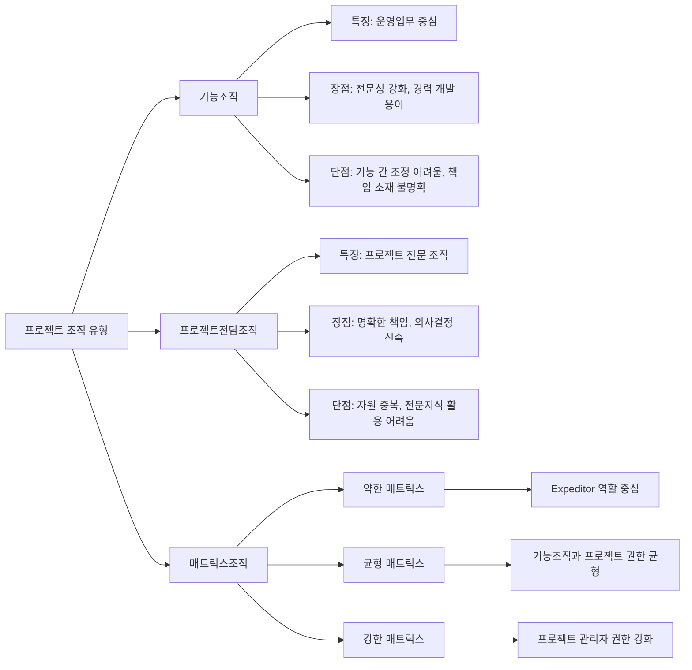

# 프로젝트 조직: 효율적인 업무 수행을 위한 구조적 접근

<!-- mtoc-start -->

- [정의 및 개념](#정의-및-개념)
- [주요 특징](#주요-특징)
- [프로젝트 조직 유형](#프로젝트-조직-유형)
- [주요 역할](#주요-역할)
- [활용 사례](#활용-사례)
- [기대 효과 및 필요성](#기대-효과-및-필요성)
- [마무리](#마무리)
- [Keywords](#keywords)

<!-- mtoc-end -->

프로젝트 조직(Project Organization)은 기업이나 기관에서 특정 목표를 달성하기 위해 구성하는 인적 자원의 구조적 배치입니다. 직무, 책임, 권한을 중심으로 구성원이나 작업 집단을 구분하고 연결하여 외형적 조합을 형성합니다. 효과적인 프로젝트 수행을 위해서는 조직의 특성과 프로젝트의 성격에 맞는 적절한 조직 구조의 선택이 중요합니다.

## 정의 및 개념

- 프로젝트 조직: 특정 목표 달성을 위해 직무, 책임, 권한 중심으로 구성원 또는 작업 집단을 배치한 외형적 조합.
- 목적: 효율적인 자원 활용, 명확한 책임과 권한 설정, 효과적인 의사소통 체계 구축을 통한 프로젝트 성공 달성.
- 특징: 일시적 존재, 목적 지향적 구조, 역할 기반 구성, 유연한 자원 배분.

## 주요 특징

- **목표 지향성**: 명확한 프로젝트 목표 달성을 위해 구성되며, 목표 완료 시 해체되는 일시적 특성 보유
- **역할 중심 구조**: 직무, 책임, 권한에 기반하여 명확한 역할 분담과 업무 경계 설정
- **자원 효율성**: 제한된 자원(인력, 시간, 예산)을 효율적으로 활용하기 위한 최적화된 구조 제공
- **의사소통 체계**: 수직적, 수평적 의사소통 경로를 명확히 하여 정보 흐름의 효율성 증대
- **적응성**: 프로젝트 진행 상황과 환경 변화에 따라 구조 조정 가능한 유연성 보유

## 프로젝트 조직 유형

프로젝트 조직은 기능조직, 프로젝트전담조직, 매트릭스조직으로 구분되며, 각각의 특성과 장단점을 고려하여 프로젝트 성격과 조직 환경에 맞게 선택해야 합니다. 매트릭스조직은 권한 배분에 따라 약한, 균형, 강한 매트릭스로 세분화됩니다.

## 주요 역할

- **프로젝트 관리자(PM)**: 프로젝트 전반에 대한 책임과 권한을 가지며 계획, 실행, 통제, 종료 등 프로젝트 생명주기 전체 관리
- **촉진자(Expeditor)**:
  - 의사결정 권한이 없음
  - 프로젝트 팀 지원 및 의사소통 촉진
  - 문제 해결을 위한 조정 역할 수행
  - 약한 매트릭스 조직에서 주로 활용
- **조정자(Coordinator)**:
  - 제한된 의사결정 권한 보유
  - 상위 관리자에게 직접 보고
  - 자원 배분 및 일정 조정 권한
  - PM의 역할에 가까운 기능 수행

## 활용 사례

- **IT 시스템 개발**: 기능조직(개발, 테스트, 인프라 등)과 프로젝트 관리자가 협업하는 매트릭스 구조 적용
- **신제품 개발**: R&D, 마케팅, 생산 등 다양한 기능 부서의 전문성을 활용하는 균형 매트릭스 조직 구성
- **글로벌 프로젝트**: 지역별, 기능별 전문성을 활용하면서 통합된 관리가 필요한 강한 매트릭스 구조 채택
- **단기 집중 프로젝트**: 기존 조직에서 인력을 차출하여 프로젝트전담조직을 구성, 목표 달성 후 원래 부서로 복귀
- **대규모 건설 프로젝트**: 다양한 전문 분야(토목, 건축, 전기 등)의 협업이 필요한 프로젝트전담조직 구성

## 기대 효과 및 필요성

- **자원 최적화**: 프로젝트 성격에 맞는 인적, 물적 자원의 효율적 배분으로 비용 효과성 증대
- **책임과 권한의 명확화**: 역할 기반 구조를 통한 업무 책임과 권한의 명확한 설정으로 갈등 최소화
- **의사결정 효율성**: 명확한 의사결정 구조를 통한 신속하고 효과적인 문제 해결 능력 향상
- **위험 관리 강화**: 전문성 결합을 통한 다각적 관점에서의 위험 식별 및 대응 능력 향상
- **학습 조직화**: 다양한 전문 영역 간의, 지식 공유와 학습을 통한 조직 역량 강화

## 마무리

프로젝트 조직은 목표 달성을 위한 효과적인 인적 자원 구조를 제공하는 핵심 요소입니다. 프로젝트의 성격, 규모, 복잡성 등을 고려하여 적합한 조직 유형을 선택하고, 명확한 역할과 책임 할당을 통해 효율적인 프로젝트 수행이 가능합니다. 기업의 전략적 목표와 조직 문화를 고려한 프로젝트 조직 구성은 프로젝트 성공의 기반이 될 것입니다.

## Keywords

Project Organization, 조직 구조, 기능조직(Functional Organization), 프로젝트전담조직(Projectized Organization), 매트릭스조직(Matrix Organization), Expeditor, Coordinator, PM(Project Manager), 역할 분담, 책임과 권한
