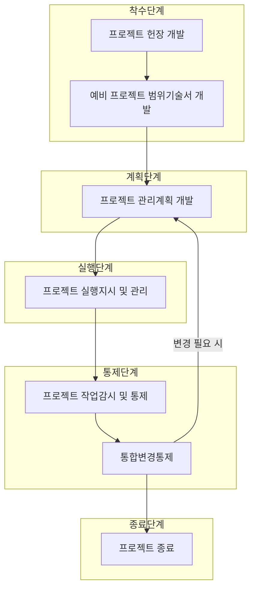

# 통합관리: 프로젝트 성공을 위한 총체적 프로세스 조정 접근법

<!-- mtoc-start -->

- [정의 및 개념](#정의-및-개념)
- [주요 특징](#주요-특징)
- [프로세스 구조](#프로세스-구조)
- [활용 사례](#활용-사례)
- [기대 효과 및 필요성](#기대-효과-및-필요성)
- [마무리](#마무리)
- [Keywords](#keywords)

<!-- mtoc-end -->

프로젝트 통합관리(Project Integration Management)는 프로젝트의 다양한 요소와 프로세스를 하나로 묶어 조화롭게 운영하기 위한 핵심 관리 영역입니다. 이는 단순한 작업 조율을 넘어, 프로젝트의 모든 구성요소가 유기적으로 작동하도록 보장하는 총체적 접근법으로, 프로젝트의 시작부터 종료까지 전체 생명주기를 아우릅니다.

## 정의 및 개념

- 통합관리: 프로젝트 내 다양한 프로세스를 정의, 결합, 조정 및 관리하는 총체적 프로세스.
- 목적: 고품질 상품개발(사용자 중심의 가치적 상품, 고퀄러티) 및 개발절차 준수(개발 및 자원관리 절차의 표준화와 준수).

## 주요 특징

- **총체적 접근법**: 프로젝트의 모든 영역(범위, 일정, 비용, 품질, 자원, 의사소통 등)을 통합적으로 관리하여 프로젝트 목표 달성 지원
- **조정과 균형**: 경쟁관계에 있는 프로젝트 제약사항(범위, 품질, 일정, 예산, 자원, 위험) 간의 균형 유지
- **Rolling Wave 계획 방식**: 가까운 미래는 상세하게, 먼 미래는 개략적으로 계획하여 유연성 확보
- **이해관계자 요구사항 조율**: 다양한 이해관계자의 요구와 기대를 조정하고 통합하여 프로젝트 성공 지원

## 프로세스 구조

프로젝트 통합관리는 착수, 계획, 실행, 통제, 종료의 5단계로 구성된 순환적 프로세스로 이루어집니다. 통합변경통제에서 변경 필요성이 확인되면 계획단계로 돌아가는 피드백 루프가 존재하여 프로젝트의 지속적인 개선을 지원합니다.

## 활용 사례

- **대규모 IT 시스템 구축 프로젝트**: 다양한 시스템 간 통합이 필요한 엔터프라이즈 시스템 구축 시 통합관리를 통해 시스템 요소 간 일관성 유지
- **신제품 개발 프로젝트**: 마케팅, 연구개발, 생산, 품질관리 등 다양한 부서 간 협업이 필요한 프로젝트에서 통합관리를 통해 일관된 방향성 유지
- **글로벌 프로젝트**: 다양한 지역과 문화적 배경을 가진 팀 간의 작업을 조율하고 통합하여 일관된 결과물 도출
- **애자일-전통적 방법론 하이브리드 프로젝트**: 서로 다른 방법론을 사용하는 팀들의 작업을 통합관리를 통해 조화롭게 조정

## 기대 효과 및 필요성

- **프로젝트 성공률 향상**: 체계적인 통합관리를 통해 프로젝트 요소 간 불일치 방지 및 목표 달성 확률 증가
- **효율적 자원 활용**: 중복 작업 방지와 자원 배분 최적화를 통한 프로젝트 효율성 제고
- **위험 최소화**: 프로젝트 전반에 걸친 통합적 시각으로 잠재적 문제점 조기 발견 및 대응
- **이해관계자 만족도 향상**: 요구사항의 균형 있는 통합과 효과적인 변경관리를 통한 이해관계자 기대 충족
- **가치 창출 극대화**: 비즈니스 가치에 초점을 맞춘 통합적 의사결정을 통한 프로젝트 성과 최적화

## 마무리

프로젝트 통합관리는 단순한 관리 프로세스가 아닌 프로젝트의 성공을 위한 필수적인 관리 체계입니다. 프로젝트의 분절된 요소들을 하나로 통합하고 조율함으로써 프로젝트의 목표 달성과 가치 창출을 보장합니다. 특히 복잡성이 높은 현대 프로젝트 환경에서는 체계적인 통합관리가 더욱 중요하며, 이를 통해 프로젝트의 성공 가능성을 크게 높일 수 있습니다.

## Keywords

Project Integration Management, 프로젝트 통합관리, Rolling Wave Planning, 통합변경통제, Project Charter, 프로젝트 헌장, 프로젝트 라이프사이클, 이해관계자 조율, Change Control, 가치 기반 관리
