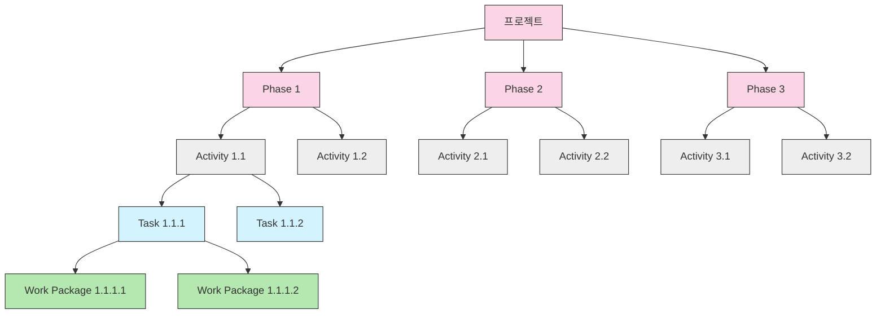

# WBS (Work Breakdown Structure): 체계적인 프로젝트 범위 관리 도구

<!-- mtoc-start -->

- [정의 및 개념](#정의-및-개념)
- [주요 특징](#주요-특징)
- [구성 체계](#구성-체계)
- [작성 절차](#작성-절차)
- [활용 사례](#활용-사례)
- [기대 효과 및 필요성](#기대-효과-및-필요성)
- [고려사항](#고려사항)
- [마무리](#마무리)
- [Keywords](#keywords)

<!-- mtoc-end -->

워크 브레이크다운 구조(Work Breakdown Structure, WBS)는 복잡한 프로젝트를 관리 가능한 작은 단위로 분해하여 체계적으로 관리할 수 있게 해주는 필수적인 프로젝트 관리 도구입니다. 프로젝트의 전체 작업 범위를 계층적으로 구조화함으로써 프로젝트 관리자와 팀원들이 필요한 모든 작업을 명확하게 파악하고 효과적으로 진행할 수 있도록 도와줍니다.

## 정의 및 개념

- 정의: 프로젝트 목표를 달성하기 위해 프로젝트 팀이 산출할 작업을 인도물 중심으로 분할한 계층적 구조 체계의 도구.
- 목적: 복잡한 프로젝트를 관리 가능한 작은 작업 단위(Work Package)로 분해하여 효율적인 계획, 실행, 통제를 가능하게 함.
- 역할: 진척도 관리, 자원 관리, 의사소통 도구로서 프로젝트 전반에 걸쳐 핵심 기준점 제공.

## 주요 특징

- **계층적 구조**: Phase > Activity > Task > Work Package 순으로 작업을 세분화하여 구조화함으로써 작업 간의 관계를 명확히 파악 가능.
- **인도물 중심**: 각 작업 요소는 측정 가능한 결과물(인도물)을 중심으로 정의되어 성과 측정의 기준 제공.
- **포괄성**: 프로젝트 범위에 필요한 모든 작업을 누락 없이 포함하여 프로젝트 전체 작업 범위를 완전히 표현.
- **유연성**: 프로젝트 진행 중 변경사항 발생 시 해당 부분만 수정 가능하여 전체 프로젝트 계획 조정 용이.
- **통합성**: 일정, 비용, 자원 등 프로젝트 관리의 다양한 측면과 연계되어 통합적인 프로젝트 관리 지원.

## 구성 체계

WBS는 최상위 프로젝트 수준부터 단계적으로 세분화되어 최하위 작업 패키지(Work Package)까지 구조화됩니다. 각 단계는 하위 요소의 100%를 포함하는 상호 배타적이고 완전한 분해 구조를 형성합니다.

## 작성 절차

1. **Activity 정의**: 프로젝트 목표 달성을 위한 모든 활동을 식별하고 정의
2. **Activity 실행 기간 측정**: 각 활동에 소요되는 시간 추정
3. **Activity 전후단계 분석**: 작업 간 선후관계 및 의존성 파악
4. **자원 할당**: 각 활동에 필요한 인적·물적 자원 할당
5. **WBS 산출**: 모든 정보를 통합하여 계층적 구조 작성
6. **WBS 실행**: 계획에 따라 작업 수행 및 모니터링

## 활용 사례

- **소프트웨어 개발 프로젝트**: 요구사항 분석, 설계, 개발, 테스트, 배포 등의 단계로 구분하고 각 단계별 세부 작업 정의
- **건설 프로젝트**: 기획, 설계, 시공, 준공 단계로 분류하고 각 단계별 필요 작업 세분화
- **제품 출시 프로젝트**: 기획, 개발, 생산, 마케팅, 유통 등의 단계로 구분하여 체계적 관리
- **조직 변경 프로젝트**: 현황 분석, 계획 수립, 변경 실행, 안정화 등의 단계로 분류하여 체계적인 변화 관리

## 기대 효과 및 필요성

- **진척도 관리 개선**: 명확한 작업 단위 설정으로 정확한 진행 상황 파악 및 보고 가능
- **효율적 자원 관리**: 작업별 필요 자원을 명확히 파악하여 최적의 자원 할당 가능
- **의사소통 촉진**: 프로젝트 참여자 간 공통된 작업 구조 인식으로 효과적인 의사소통 지원
- **위험 관리**: 작업 단위별 위험 요소 식별 및 관리 용이성 증대
- **유연한 대응**: 일정 지연 시 자원의 재배치나 Fast Tracking 등의 대응 방안 수립 가능
- **품질 향상**: 체계적인 공정 관리를 통한 전반적인 프로젝트 품질 제고

## 고려사항

- **자원과 비용 연계**: 각 작업 패키지에 자원과 비용을 명확히 연계하여 예산 관리의 기준점 제공
- **표준 용어 사용**: 모든 이해관계자가 일관되게 이해할 수 있는 표준 용어 사용 필요
- **적절한 분해 수준**: 너무 세분화하면 관리 복잡성 증가, 너무 개략적이면 통제 어려움
- **Milestone 버퍼**: 주요 이정표에 적절한 버퍼를 설정하여 예상치 못한 지연에 대비
- **변경 관리 프로세스**: WBS 변경 시 영향을 평가하고 승인하는 체계적인 절차 필요

## 마무리

WBS는 프로젝트의 복잡성을 다루는 강력한 도구로, 체계적인 작업 분해를 통해 프로젝트 관리의 기반을 제공합니다. 모든 프로젝트 참여자에게 명확한 방향성과 책임을 부여함으로써 프로젝트 성공 가능성을 높이는 핵심 요소입니다. 프로젝트의 규모와 복잡성에 관계없이 WBS의 효과적인 활용은 성공적인 프로젝트 완수를 위한 필수적인 첫걸음이라 할 수 있습니다.

## Keywords

Work Breakdown Structure, 프로젝트 범위 관리, Phase, Activity, Task, Work Package, Milestone, 계층적 구조, Project Scope, 인도물 중심 관리, Fast Tracking, Network Diagram, 자원 할당
