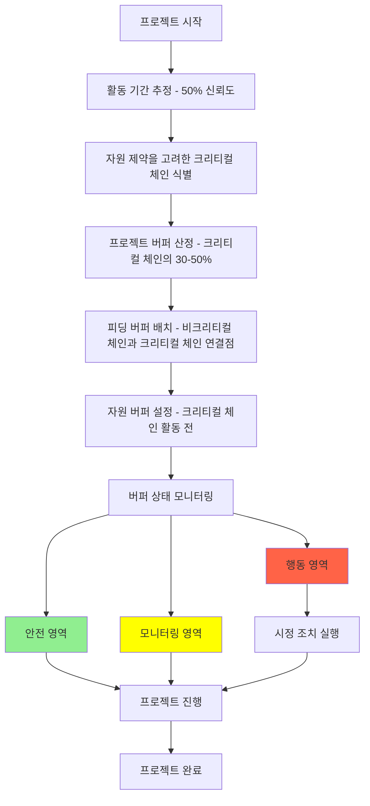

# CCM (Critical Chain Method): 통합된 버퍼 관리를 통한 프로젝트 일정 최적화

<!-- mtoc-start -->

- [정의 및 개념](#정의-및-개념)
- [주요 특징](#주요-특징)
- [메커니즘](#메커니즘)
- [전통적 일정관리와 CCM 비교](#전통적-일정관리와-ccm-비교)
- [잘못된 일정관리 사례](#잘못된-일정관리-사례)
- [버퍼 관리 프로세스](#버퍼-관리-프로세스)
- [기대 효과 및 필요성](#기대-효과-및-필요성)
- [마무리](#마무리)
- [Keywords](#keywords)

<!-- mtoc-end -->

크리티컬 체인 방법론(Critical Chain Method, CCM) 또는 크리티컬 체인 프로젝트 관리(Critical Chain Project Management, CCPM)는 프로젝트 일정 관리에 혁신적인 접근법을 제시합니다. 전통적인 프로젝트 관리와 달리, CCM은 각 활동(Activity)별로 과다하게 설정될 수 있는 여유시간을 제거하고 이를 통합된 버퍼로 재배치하여 프로젝트 일정을 효율적으로 관리하는 방법론입니다.

## 정의 및 개념

- 크리티컬 체인: 자원 제약을 고려한 프로젝트의 최장 경로로, 단순히 활동 간의 선후관계만 고려하는 기존 크리티컬 패스와 차별화.
- 통합 버퍼 관리: 개별 활동의 여유시간을 줄이고 이를 프로젝트 말미에 통합 버퍼로 관리하는 접근법.

## 주요 특징

- **파자후학(파킨슨 법칙, 자기방어, 후행공정 준비미흡, 학생증후군)** 극복: 전통적인 일정 지연 원인을 체계적으로 해결

  - 파킨슨 법칙: 주어진 시간만큼 일이 늘어나는 현상
  - 자기방어: 불확실성에 대비해 과도한 여유시간 설정
  - 후행공정 준비미흡: 선행 작업이 완료되어도 후속 작업 준비 부족
  - 학생증후군: 마감이 가까워져야 집중하는 현상

- **버퍼의 세 가지 유형**:

  - 프로젝트 버퍼(Project Buffer): 크리티컬 체인 말미에 배치하여 전체 프로젝트 보호
  - 피딩 버퍼(Feeding Buffer): 비크리티컬 체인이 크리티컬 체인에 합류하는 지점에 배치
  - 자원 버퍼(Resource Buffer): 크리티컬 체인 활동 전에 자원 가용성 알림 기능

- **집중적인 버퍼 모니터링**: 프로젝트 버퍼를 안전(Green), 모니터링(Yellow), 행동(Red) 영역으로 나누어 체계적 관리

## 메커니즘

CCM은 자원 제약을 고려한 크리티컬 체인을 식별하고, 통합된 버퍼 관리를 통해 일정 지연 요소를 체계적으로 관리합니다. 버퍼 소진 상태에 따라 프로젝트 상황을 파악하고 필요한 조치를 취하는 선제적 대응 체계를 구축합니다.

## 전통적 일정관리와 CCM 비교

| 구분          | 전통적 일정관리          | CCM                           |
| ------------- | ------------------------ | ----------------------------- |
| 여유시간 관리 | 개별 활동에 분산 배치    | 통합 버퍼로 관리              |
| 자원 고려     | 제한적 고려              | 자원 제약을 명시적으로 고려   |
| 진행 측정     | 계획 대비 실적           | 버퍼 소진 상태                |
| 일정 예측성   | 낮음                     | 높음                          |
| 핵심 경로     | 크리티컬 패스(시간 기반) | 크리티컬 체인(자원+시간 기반) |

## 잘못된 일정관리 사례

- 크리티컬 체인이 아닌 활동을 단축시켜 전체 일정 개선 효과가 없는 경우
- 활동 간 제약조건을 충분히 반영하지 않아 실행 과정에서 예상치 못한 지연 발생
- 개별 활동의 여유시간에 의존하여 통합적 버퍼 관리가 이루어지지 않는 경우
- 자원 가용성을 고려하지 않아 계획 대비 실행 간 괴리 발생

## 버퍼 관리 프로세스

1. **버퍼 설정**: 크리티컬 체인 활동 기간의 절반을 기준으로 프로젝트 버퍼 설정
2. **버퍼 분할**: 전체 버퍼를 안전(33%), 모니터링(33%), 행동(33%) 영역으로 분할
3. **버퍼 모니터링**: 프로젝트 진행에 따른 버퍼 소진율 추적
4. **버퍼 대응**: 소진 상태에 따른 차별화된 대응 전략 실행
   - 안전 영역: 정상 진행
   - 모니터링 영역: 주의 관찰 및 대안 검토
   - 행동 영역: 적극적 개입 및 시정 조치

## 기대 효과 및 필요성

- 프로젝트 납기 준수율 향상: 버퍼 중심 관리를 통한 납기 지연 위험 감소
- 자원 활용 최적화: 자원 제약을 고려한 일정 계획으로 자원 충돌 최소화
- 불확실성 관리 강화: 통합 버퍼를 통한 변동성 흡수 능력 증대
- 프로젝트 가시성 향상: 버퍼 소진 상태를 통한 직관적 프로젝트 상태 파악
- 팀 스트레스 감소: 과도한 멀티태스킹 방지와 단일 작업 집중 환경 조성

## 마무리

크리티컬 체인 방법론(CCM)은 프로젝트의 일정 지연 원인을 근본적으로 해결하는 혁신적인 접근법입니다. 통합된 버퍼 관리와 자원 제약을 고려한 일정 계획을 통해 프로젝트 납기를 향상시키고 불확실성을 효과적으로 관리할 수 있습니다. 특히 복잡한 자원 의존성을 가진 프로젝트에서 CCM 도입을 통해 프로젝트 성공률을 높이고 조직의 프로젝트 관리 역량을 강화할 수 있습니다.

## Keywords

Critical Chain Method, Critical Chain Project Management, 통합 버퍼 관리, 프로젝트 버퍼, 피딩 버퍼, 자원 버퍼, 파킨슨 법칙, 학생증후군, 자기방어, 불확실성 관리
