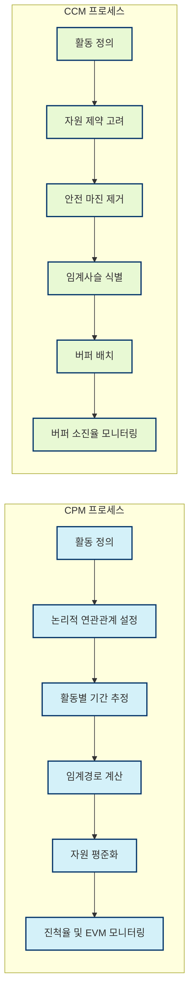

# 일정관리: CPM과 CCM 비교 분석

<!-- mtoc-start -->

- [정의 및 개념](#정의-및-개념)
- [주요 비교 요소](#주요-비교-요소)
  - [착수일 기준](#착수일-기준)
  - [관리 관점](#관리-관점)
  - [여유시간 관리](#여유시간-관리)
  - [자원제약 처리](#자원제약-처리)
- [프로세스 비교](#프로세스-비교)
- [불확실성 처리 방식](#불확실성-처리-방식)
  - [CPM의 불확실성 처리](#cpm의-불확실성-처리)
  - [CCM의 불확실성 처리](#ccm의-불확실성-처리)
- [활용 사례](#활용-사례)
- [장단점 비교](#장단점-비교)
  - [CPM의 장단점](#cpm의-장단점)
  - [CCM의 장단점](#ccm의-장단점)
- [구현 시 고려사항](#구현-시-고려사항)
- [마무리](#마무리)
- [Keywords](#keywords)

<!-- mtoc-end -->

프로젝트 관리에서 일정관리는 성공적인 프로젝트 완수를 위한 핵심 요소입니다. 특히 임계경로방식(Critical Path Method, CPM)과 임계사슬방식(Critical Chain Method, CCM)은 프로젝트 일정관리의 대표적인 두 가지 방법론으로, 각각 고유한 특성과 장단점을 가지고 있습니다. 두 방법론의 체계적인 비교를 통해 프로젝트 특성에 맞는 최적의 일정관리 기법을 선택할 수 있습니다.

## 정의 및 개념

- CPM(Critical Path Method): 프로젝트 내 작업 간의 논리적 연관성을 기반으로 가장 긴 작업 경로를 식별하여 프로젝트 완료 시간을 결정하는 기법.
- CCM(Critical Chain Method): 자원 제약 조건을 고려하고 불확실성을 관리하기 위해 버퍼를 전략적으로 배치하는 일정관리 방법론.

## 주요 비교 요소

### 착수일 기준

- CPM: 최빠른착수일(Early Start, ES)을 기준으로 계획 수립
- CCM: 후진계산법으로 최늦은착수일(Late Start, LS)을 기준으로 계획 수립

### 관리 관점

- CPM: 개별 작업의 진척률과 획득가치관리(EVM) 중심으로 관리
- CCM: 프로젝트 버퍼의 소진율을 중심으로 프로젝트 전체 상태 모니터링

### 여유시간 관리

- CPM: 각 액티비티별로 여유시간(Float)을 개별적으로 반영하고 관리
- CCM: 개별 여유시간을 통합하여 프로젝트 버퍼와 피딩 버퍼로 관리

### 자원제약 처리

- CPM: 의존성 관계를 고려한 일정계획 수립 후 자원평준화(Resource Leveling)로 해소
- CCM: 자원제약을 계획 초기 단계부터 고려하여 임계사슬에 직접 반영

## 프로세스 비교

CPM은 논리적 의존성 중심으로 임계경로를 도출한 후 자원 평준화를 수행하는 반면, CCM은 자원 제약을 먼저 고려하고 통합된 버퍼로 불확실성을 관리합니다.

## 불확실성 처리 방식

### CPM의 불확실성 처리

- 개별 액티비티마다 안전 마진 추가
- 액티비티별 여유시간 산정 및 관리
- 리스크 분석에 기반한 일정 조정

### CCM의 불확실성 처리

- 개별 안전 마진을 제거하고 프로젝트 종료 시점에 프로젝트 버퍼로 통합
- 임계사슬 외 경로에 피딩 버퍼 배치
- 버퍼 소진율을 통한 프로젝트 상태 모니터링

## 활용 사례

- 건설 프로젝트: 명확한 작업 순서와 의존성이 중요한 건설 프로젝트에서는 CPM이 효과적으로 활용됨
- 소프트웨어 개발: 자원 경쟁과 불확실성이 높은 소프트웨어 개발에서는 CCM이 적합함
- 연구개발(R&D): 높은 불확실성을 가진 R&D 프로젝트에서는 CCM의 버퍼 관리 방식이 유용함
- 다중 프로젝트 환경: 여러 프로젝트가 자원을 공유하는 환경에서는 CCM의 자원 중심 접근이 효과적임

## 장단점 비교

### CPM의 장단점

- 장점: 명확한 계획 수립, 여유시간 식별 용이, 진척률 측정 용이
- 단점: 자원 제약 고려 부족, 개별 안전 마진으로 인한 파킨슨 법칙 발생 위험, 스튜던트 신드롬 발생 가능성

### CCM의 장단점

- 장점: 현실적인 자원 제약 고려, 효율적인 불확실성 관리, 프로젝트 기간 단축 가능
- 단점: 도입 시 조직 문화 변화 필요, 버퍼 관리에 대한 이해 필요, 복잡한 다중 프로젝트 환경에서 적용 어려움

## 구현 시 고려사항

- 프로젝트 특성: 프로젝트의 복잡성, 불확실성, 자원 제약 정도에 따라 방법론 선택
- 조직 문화: 조직의 프로젝트 관리 성숙도와 변화 수용 능력 고려
- 도구 지원: 선택한 방법론을 지원하는 프로젝트 관리 도구 확보
- 교육 및 훈련: 프로젝트 팀원들의 방법론 이해 및 실행 능력 향상을 위한 교육 제공

## 마무리

CPM과 CCM은 각각 고유한 강점을 가진 일정관리 방법론으로, 프로젝트의 특성과 조직 환경에 따라 적절히 선택하거나 혼합하여 활용할 수 있습니다. CPM은 명확한 계획과 추적이 중요한 환경에서, CCM은 불확실성 관리와 자원 제약이 중요한 환경에서 효과적입니다. 일정관리 방법론의 핵심 원리를 이해하고 프로젝트 상황에 맞게 적용함으로써 프로젝트 성공 가능성을 높일 수 있습니다.

## Keywords

Critical Path Method, Critical Chain Method, 임계경로법, 임계사슬법, Project Buffer, 자원평준화(Resource Leveling), 버퍼관리, 획득가치관리(EVM), 프로젝트 일정관리, 불확실성 관리
