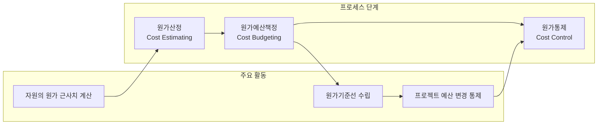

# 원가관리: 효율적인 프로젝트 비용 계획 및 통제 방법론

<!-- mtoc-start -->

- [정의 및 개념](#정의-및-개념)
- [주요 특징](#주요-특징)
- [원가관리 프로세스](#원가관리-프로세스)
- [원가추정 방식](#원가추정-방식)
  - [정량적 방법](#정량적-방법)
  - [정성적 방법](#정성적-방법)
- [원가관리 도구](#원가관리-도구)
- [활용 사례](#활용-사례)
- [기대 효과 및 필요성](#기대-효과-및-필요성)
- [마무리](#마무리)
- [Keywords](#keywords)

<!-- mtoc-end -->

원가관리(Cost Management)는 프로젝트 수행에 있어 승인된 예산 범위 내에서 프로젝트를 성공적으로 완료하기 위한 중요한 프로세스입니다. 범위와 일정을 기준으로 원가를 산정하고, 원가기준선을 작성하여 이에 맞는 통제 활동을 수행함으로써 프로젝트의 재정적 성공을 보장합니다.

## 정의 및 개념

- 원가관리: 프로젝트를 승인된 예산 내에서 완료하기 위해 원가에 대한 계획, 산정, 예산 수립, 통제 및 관리를 수행하는 프로세스.
- 원가기준선(Cost Baseline): 프로젝트 비용 지출 계획으로, 실제 지출과 비교하여 프로젝트 비용 성과를 측정하는 기준.

- 특징:
  - 범위와 일정 기반: 원가는 프로젝트 범위와 일정을 기준으로 작성
  - 통제 중심: 원가기준선을 작성하여 이에 맞는 통제 활동 수행
  - 성과 측정: 계획 대비 실제 원가를 지속적으로 모니터링하여 성과 측정

## 주요 특징

- **범위-일정-원가 삼각관계**: 원가는 프로젝트 범위와 일정에 직접적인 영향을 받으며, 이 세 요소는 상호 연관되어 프로젝트 성공에 영향을 미침
- **원가기준선 중심 관리**: 승인된 원가기준선을 토대로 프로젝트의 비용 성과를 측정하고 통제
- **지속적인 모니터링**: 실시간으로 비용 지출을 모니터링하여 예상 초과 비용을 조기에 감지하고 대응
- **변경관리 통합**: 프로젝트 변경사항이 원가에 미치는 영향을 분석하고 통제

## 원가관리 프로세스

원가관리는 원가산정, 원가예산책정, 원가통제의 세 가지 핵심 프로세스로 구성됩니다. 각 단계는 프로젝트 시작부터 종료까지 순차적으로 진행되며, 지속적인 피드백을 통해 원가 성과를 개선합니다.

## 원가추정 방식

### 정량적 방법

- **모수산정(Parametric Estimating)**: 과거 실적을 기준으로 계량화 변수를 활용하여 통계적인 방법으로 비용 추정
- **3점 추정방식(Three-Point Estimating)**: 낙관치, 가능성 높은 값, 비관치를 산정하여 기대값 계산
- **기능점수법(Function Point)**: 소프트웨어 기능 단위로 비용 산정
- **MM(Man-Month)**: 인력과 기간을 기준으로 비용 산정

### 정성적 방법

- **유사산정(Analogous Estimating)**: 유사 프로젝트의 실제 원가를 기준으로 현재 프로젝트 원가 산정
- **델파이 기법(Delphi Technique)**: 전문가들의 경험을 바탕으로 비용 산정 후, 조정/합의 도출
- **추론추정(Bottom-Up Estimating)**: 작업분해구조(WBS)의 최하위 작업부터 비용을 산정하여 상위로 합산

## 원가관리 도구

- **추론추정(Bottom-Up Estimating)**: 세부 작업별로 비용을 추정하고 상향식으로 합산하여 전체 프로젝트 비용 산정
- **모수산정(Parametric Estimating)**: 과거 실적과 통계적 관계를 활용한 비용 추정 방식
- **델파이 기법(Delphi Technique)**: 여러 전문가의 의견을 수집하고 합의점을 도출하는 방식
- **획득가치관리(Earned Value Management)**: 프로젝트 진행 중 원가와 일정의 통합 관리 및 성과 측정 기법

## 활용 사례

- **IT 시스템 구축 프로젝트**: 하드웨어, 소프트웨어, 인력 등의 비용을 체계적으로 관리하여 예산 초과 방지
- **R&D 프로젝트**: 불확실성이 높은 연구개발 프로젝트에서 단계별 원가관리를 통한 리스크 최소화
- **건설 프로젝트**: 자재비, 인건비, 장비비 등 다양한 원가 요소를 통합 관리하여 비용 효율성 극대화
- **글로벌 프로젝트**: 환율 변동, 국가별 비용 구조 차이 등을 고려한 원가관리로 국제 프로젝트의 재정 안정성 확보

## 기대 효과 및 필요성

- **예산 준수**: 체계적인 원가관리를 통해 승인된 예산 내에서 프로젝트 완료
- **재정적 투명성**: 원가 관련 의사결정의 근거 제공 및 재정적 투명성 확보
- **성과 측정**: 원가 성과를 객관적으로 측정하여 프로젝트 건전성 평가
- **조기 경고**: 비용 초과 징후를 조기에 발견하여 적절한 대응 조치 수립
- **자원 최적화**: 제한된 자원의 효율적 배분을 통한 비용 효율성 극대화

## 마무리

효과적인 원가관리는 프로젝트의 재정적 성공을 위한 핵심 요소입니다. 원가산정, 예산책정, 통제의 세 가지 프로세스를 체계적으로 수행하고, 다양한 원가추정 방식과 관리 도구를 적절히 활용함으로써 프로젝트 목표 달성과 재정적 안정성을 동시에 확보할 수 있습니다. 특히 범위와 일정의 변화가 원가에 미치는 영향을 지속적으로 모니터링하고 통제하는 것이 원가관리의 핵심 성공 요소입니다.

## Keywords

Cost Management, Cost Baseline, Earned Value Management, 원가산정, 원가예산책정, 원가통제, 모수산정, 델파이기법, 추론추정, 원가기준선
