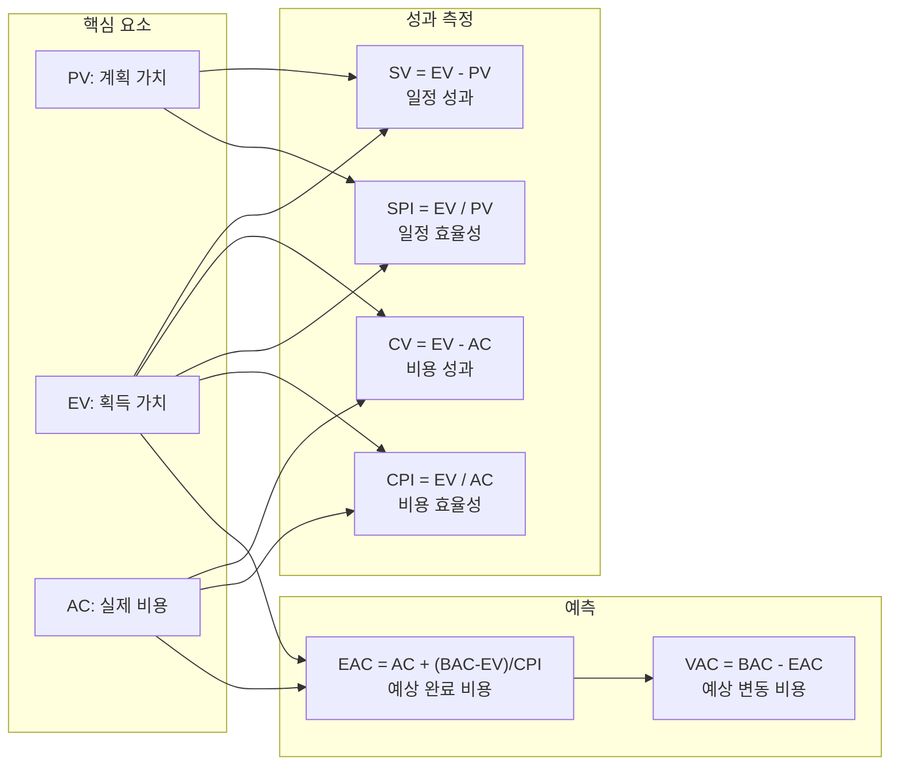

# EVM (Earned Value Management): 프로젝트 성과의 체계적 측정 및 예측 기법

<!-- mtoc-start -->

- [정의 및 개념](#정의-및-개념)
- [주요 요소](#주요-요소)
  - [1. 계획 요소](#1-계획-요소)
  - [2. 측정 요소](#2-측정-요소)
  - [3. 분석 요소](#3-분석-요소)
  - [4. 예측 요소](#4-예측-요소)
- [EVM 작동 원리](#evm-작동-원리)
- [EVM 성과 분석 방법](#evm-성과-분석-방법)
  - [1. 현재 성과 분석](#1-현재-성과-분석)
  - [2. 미래 성과 예측](#2-미래-성과-예측)
- [활용 사례](#활용-사례)
  - [1. IT 시스템 구축 프로젝트](#1-it-시스템-구축-프로젝트)
  - [2. 건설 프로젝트](#2-건설-프로젝트)
  - [3. 제품 개발 프로젝트](#3-제품-개발-프로젝트)
- [기대 효과 및 필요성](#기대-효과-및-필요성)
  - [1. 객관적 성과 측정](#1-객관적-성과-측정)
  - [2. 조기 경보 시스템](#2-조기-경보-시스템)
  - [3. 예측 기반 의사결정](#3-예측-기반-의사결정)
  - [4. 커뮤니케이션 개선](#4-커뮤니케이션-개선)
- [도입 시 고려사항](#도입-시-고려사항)
  - [1. 작업 분류 체계(WBS) 구축](#1-작업-분류-체계wbs-구축)
  - [2. 측정 기준 수립](#2-측정-기준-수립)
  - [3. 도구 및 시스템 구축](#3-도구-및-시스템-구축)
- [마무리](#마무리)
- [Keywords](#keywords)

<!-- mtoc-end -->

프로젝트 관리에서 가장 중요한 요소 중 하나는 프로젝트가 계획대로 진행되고 있는지 객관적으로 평가하는 것입니다. 언드 밸류 매니지먼트(Earned Value Management, EVM)는 프로젝트의 일정과 비용을 통합적으로 관리하여 프로젝트의 현재 상태를 정확히 파악하고 미래 성과를 예측할 수 있는 강력한 기법입니다. EVM은 계획 대비 실적을 화폐가치로 환산하여 일정과 비용을 동일한 기준으로 비교함으로써 프로젝트 관리자에게 객관적인 성과 지표를 제공합니다.

## 정의 및 개념

- EVM(Earned Value Management): 프로젝트의 진행 상황을 계획된 작업과 실제 수행된 작업, 그리고 실제 발생한 비용을 통합하여 측정하는 프로젝트 성과 관리 기법.
- 프로젝트의 일정과 비용을 동일한 화폐가치로 환산하여 성과를 정량적으로 측정하고 미래 성과를 예측하는 체계적인 방법론.

## 주요 요소

### 1. 계획 요소

- **BAC(Budget At Completion)**: 프로젝트 완료 시 소요될 것으로 예상되는 총예산
- **PV(Planned Value)**: 계획된 일정 상 특정 시점까지 완료되어야 할 작업의 예산 가치

### 2. 측정 요소

- **EV(Earned Value)**: 실제 수행된 작업량에 할당된 예산 가치
- **AC(Actual Cost)**: 실제 수행된 작업에 소요된 실제 비용

### 3. 분석 요소

- **SV(Schedule Variance)**: 일정편차(EV-PV), 양수면 일정 앞섬, 음수면 일정 지연
- **CV(Cost Variance)**: 비용편차(EV-AC), 양수면 예산 절감, 음수면 예산 초과
- **SPI(Schedule Performance Index)**: 일정성과지수(EV/PV), 1보다 크면 일정 앞섬
- **CPI(Cost Performance Index)**: 비용성과지수(EV/AC), 1보다 크면 비용 절감

### 4. 예측 요소

- **BCWR(Budgeted Cost of Work Remaining)**: 잔여예산(BAC-EV)
- **ETC(Estimate To Complete)**: 잔여예산원가(BCWR/CPI)
- **EAC(Estimate At Completion)**: 프로젝트 예상완료비용(AC+ETC)
- **VAC(Variance At Completion)**: 최종사업비편차(BAC-EAC)
- **TCPI(To Complete Performance Index)**: 완료성과지수((BAC-EV)/(BAC-AC))

## EVM 작동 원리

EVM은 계획요소, 측정요소, 분석요소, 예측요소 간의 유기적 관계를 통해 프로젝트 현황을 파악하고 미래를 예측합니다. 프로젝트의 건전성을 평가하는 다양한 지표들이 상호 연결되어 통합적인 성과 관리 체계를 구성합니다.

1. **핵심 요소**: 모든 EVM 계산의 기초가 되는 세 가지 핵심 값

   - PV (Planned Value): 계획된 작업의 예산 가치
   - EV (Earned Value): 실제 완료된 작업의 예산 가치
   - AC (Actual Cost): 실제 작업에 소요된 비용

2. **성과 측정**: 현재 프로젝트 상태를 평가하는 네 가지 주요 지표

   - SV (Schedule Variance): 일정 편차
   - CV (Cost Variance): 비용 편차
   - SPI (Schedule Performance Index): 일정 성과 지수
   - CPI (Cost Performance Index): 비용 성과 지수

3. **예측**: 프로젝트 완료 시점의 예상 결과
   - EAC (Estimate At Completion): 완료 시 예상 총비용
   - VAC (Variance At Completion): 완료 시 예상 비용 편차

## EVM 성과 분석 방법

### 1. 현재 성과 분석

프로젝트의 현재 성과는 주로 일정편차(SV)와 비용편차(CV), 그리고 일정성과지수(SPI)와 비용성과지수(CPI)를 통해 분석합니다.

| 지표 | 계산식  | 양호 기준 | 의미                               |
| ---- | ------- | --------- | ---------------------------------- |
| SV   | EV - PV | > 0       | 양수: 일정 앞섬, 음수: 일정 지연   |
| CV   | EV - AC | > 0       | 양수: 예산 절감, 음수: 예산 초과   |
| SPI  | EV / PV | > 1       | >1: 일정 앞섬, <1: 일정 지연       |
| CPI  | EV / AC | > 1       | >1: 비용 효율적, <1: 비용 비효율적 |

### 2. 미래 성과 예측

프로젝트의 미래 성과는 ETC, EAC, VAC, TCPI를 통해 예측할 수 있습니다.

| 지표 | 계산식                  | 분석 방법                                                                 |
| ---- | ----------------------- | ------------------------------------------------------------------------- |
| ETC  | (BAC - EV) / CPI        | 남은 작업을 완료하는 데 필요한 예상 비용                                  |
| EAC  | AC + ETC                | 프로젝트 완료 시 예상되는 총 비용                                         |
| VAC  | BAC - EAC               | 양수: 예산 내 완료 예상, 음수: 예산 초과 예상                             |
| TCPI | (BAC - EV) / (BAC - AC) | >1: 남은 작업에서 효율성 향상 필요, <1: 현재 효율성으로 예산 내 완료 가능 |

## 활용 사례

### 1. IT 시스템 구축 프로젝트

금융 기관의 차세대 시스템 구축 프로젝트에서 EVM을 활용하여 매주 성과를 측정한 결과, 개발 초기 단계에서 SPI가 0.85로 나타나 일정 지연을 조기에 발견할 수 있었습니다. 이에 따라 추가 인력 투입과 작업 우선순위 조정을 통해 프로젝트를 정상화했습니다.

### 2. 건설 프로젝트

대형 빌딩 건설 프로젝트에서 EVM을 적용하여 재료비 상승으로 인한 CPI 하락(0.92)을 조기에 파악했습니다. 이를 통해 대체 자재 검토와 공정 최적화를 실시하여 최종적으로 예산 초과를 최소화했습니다.

### 3. 제품 개발 프로젝트

신제품 개발 프로젝트에서 EVM 지표를 활용해 R&D 단계의 진행 상황을 모니터링했습니다. 주기적인 EAC 계산을 통해 초기 예산 대비 15% 추가 소요될 것으로 예측되어, 사전에 예산 조정 및 스폰서 승인을 받아 프로젝트를 성공적으로 완료했습니다.

## 기대 효과 및 필요성

### 1. 객관적 성과 측정

- 프로젝트 진행 상황을 주관적 판단이 아닌 정량적 지표로 측정
- 일정과 비용을 통합적으로 관리하여 종합적인 성과 평가 가능

### 2. 조기 경보 시스템

- 프로젝트 진행 중 발생할 수 있는 문제점을 조기에 발견
- SPI, CPI 등의 지표를 통해 프로젝트 위험 요소를 사전에 식별하여 대응 방안 수립

### 3. 예측 기반 의사결정

- EAC, VAC 등의 예측 지표를 활용한 데이터 기반 의사결정
- 프로젝트 완료 시점과 총 소요 비용에 대한 신뢰성 있는 예측 제공

### 4. 커뮤니케이션 개선

- 프로젝트 이해관계자들에게 표준화된 성과 보고 체계 제공
- 시각적 그래프와 차트를 통해 복잡한 프로젝트 상황을 명확하게 전달

## 도입 시 고려사항

### 1. 작업 분류 체계(WBS) 구축

EVM을 효과적으로 적용하기 위해서는 프로젝트 작업을 명확하게 분류하고 각 작업에 예산을 할당하는 WBS(Work Breakdown Structure)가 필수적입니다.

### 2. 측정 기준 수립

작업의 완료 여부를 객관적으로 측정할 수 있는 명확한 기준을 수립해야 합니다. 0/100 방식, 50/50 방식, 가중 마일스톤 방식 등 다양한 측정 방법 중 프로젝트 특성에 맞는 방식을 선택해야 합니다.

### 3. 도구 및 시스템 구축

EVM 데이터를 효율적으로 수집, 분석, 보고할 수 있는 도구나 시스템을 구축해야 합니다. MS Project, Primavera 등의 전문 도구나 자체 개발한 시스템을 활용할 수 있습니다.

## 마무리

프로젝트의 성공적인 완료를 위해서는 계획대로 진행되고 있는지, 그렇지 않다면 어떤 부분에서 문제가 발생하고 있는지를 정확히 파악하는 것이 중요합니다. EVM은 일정과 비용을 통합적으로 관리하여 프로젝트의 현재 상태를 객관적으로 평가하고 미래 성과를 예측할 수 있는 강력한 도구입니다. EVM을 통해 프로젝트 관리자는 데이터에 기반한 의사결정을 내릴 수 있으며, 이해관계자들에게 프로젝트 상황을 명확하게 전달할 수 있습니다. EVM의 원리와 적용 방법을 정확히 이해하고 실무에 적용한다면, 복잡한 IT 프로젝트의 성공 가능성을 크게 높일 수 있을 것입니다.

## Keywords

Earned Value Management, 성과관리기법, 프로젝트 측정지표, Schedule Variance, Cost Variance, Performance Index, 예산관리, 일정관리, 프로젝트 예측, 통합성과관리
