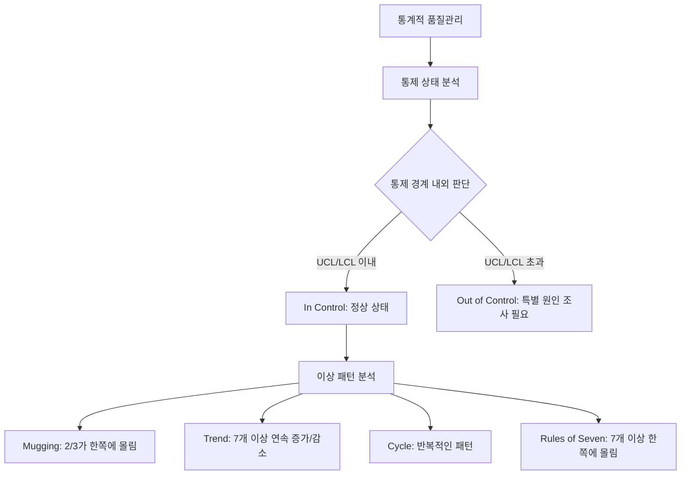
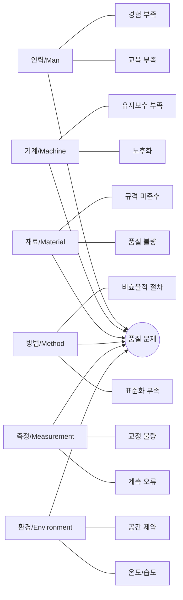

# 품질관리(Quality Management): 고객 요구사항 충족을 위한 체계적 접근

<!-- mtoc-start -->

- [정의 및 개념](#정의-및-개념)
- [품질관리 프로세스](#품질관리-프로세스)
- [품질비용 구조](#품질비용-구조)
  - [적합 비용(Cost of Conformance)](#적합-비용cost-of-conformance)
  - [부적합 비용(Cost of Non-Conformance)](#부적합-비용cost-of-non-conformance)
- [품질통제도(Control Chart)](#품질통제도control-chart)
- [품질 문제 분석 기법](#품질-문제-분석-기법)
- [활용 사례](#활용-사례)
- [품질관리 핵심 고려사항](#품질관리-핵심-고려사항)
- [기대 효과 및 필요성](#기대-효과-및-필요성)
- [마무리](#마무리)
- [Keywords](#keywords)

<!-- mtoc-end -->

품질관리는 제품이나 서비스가 고객의 실제 필요사항을 충족시키는 적합성(Fitness for use)과 제공하기로 약속한 요구사항 준수(Conformance to Requirements)를 보장하기 위한 체계적인 활동입니다. 현대적 품질관리(Quality Management)는 단순한 제품 검사를 넘어 조직 전체의 품질 문화와 프로세스를 포괄하는 종합적인 접근 방식으로 발전했습니다.

## 정의 및 개념

- 품질관리: 요구사항을 충족시키는데 필요한 품질정책, 품질목표 등을 결정하는 회사 차원의 모든 활동.
- 품질의 두 가지 관점: 고객 니즈 충족(Fitness for use)과 요구사항 준수(Conformance to Requirement).

## 품질관리 프로세스

- **품질계획(Quality Planning, QP)**: 프로젝트와 관련된 품질기준을 명시하고 달성 방법을 계획
- **품질보증(Quality Assurance, QA)**: 정기적인 프로젝트 성과평가 및 보증 활동(제3자적 관점)
- **품질통제(Quality Control, QC)**: 프로젝트 결과가 관련 품질기준 준수 여부를 체크하는 자체 품질활동

## 품질비용 구조

### 적합 비용(Cost of Conformance)

- **예방비용**: 결함 발생을 사전에 방지하기 위한 비용(교육, 품질계획, 공급자 평가 등)
- **평가비용**: 품질 요구사항 충족 여부를 평가하는 비용(검사, 테스트, 감사 활동 등)

### 부적합 비용(Cost of Non-Conformance)

- **내부실패비용**: 제품 출시 전 발견된 결함 처리 비용(재작업, 폐기, 디버깅 등)
- **외부실패비용**: 제품 출시 후 발견된 결함 처리 비용(고객 불만 처리, 보증, 리콜 등)

## 품질통제도(Control Chart)

품질통제도는 UCL(Upper Control Limit)과 LCL(Lower Control Limit) 사이에서 공정이 안정적으로 운영되는지 모니터링합니다. In Control 상태에서도 특정 패턴이 나타나면 공정에 이상이 있을 수 있습니다.

## 품질 문제 분석 기법

원인-결과 다이어그램(어골도)은 품질 문제의 잠재적 원인을 체계적으로 분석하는 도구입니다. 6M(인력, 기계, 재료, 방법, 측정, 환경) 요소별로 문제 원인을 파악하고 해결책을 찾는 데 활용됩니다.

## 활용 사례

- **제조업**: 자동차 제조사의 품질관리 시스템은 설계 단계부터 최종 검사까지 모든 과정에 품질기준을 적용하여 결함률 0.001% 미만 달성
- **IT 서비스**: 소프트웨어 개발 회사의 DevOps 환경에서 지속적 통합/배포(CI/CD) 파이프라인에 자동화된 품질 테스트를 통합하여 출시 후 결함 발견 70% 감소
- **금융 서비스**: 은행의 고객 서비스 프로세스에 품질관리 원칙을 적용하여 고객 대기 시간 단축 및 만족도 15% 향상

## 품질관리 핵심 고려사항

- 품질은 검사되는 것이 아니라, 계획되고 설계되며 제품/서비스에 내장되는 것
- 사업은 공동체 의식을 바탕으로 모든 구성원이 품질에 책임을 가져야 함
- 품질을 특정 역할이나 부서의 책임으로만 인식하는 관행에서 벗어나 전사적 마인드 전환 필요
- 예방적 품질관리가 사후 결함 수정보다 비용 효율적(1:10:100 법칙)

## 기대 효과 및 필요성

- **비용 절감**: 예방 활동 강화로 내부/외부 실패비용 감소 및 총 품질비용 최적화
- **고객 만족도 향상**: 제품/서비스의 일관된 품질 유지로 고객 신뢰 구축
- **시장 경쟁력 강화**: 품질 향상을 통한 브랜드 가치 제고 및 시장 점유율 확대
- **운영 효율성 증대**: 표준화된 프로세스와 지속적 개선 활동으로 생산성 향상
- **규제 준수**: 산업별 품질 기준과 법적 요구사항 충족으로 리스크 감소

## 마무리

품질관리는 단순한 검사 활동이 아닌 조직 문화와 철학의 핵심 요소입니다. 요구사항 충족(Conformance to Requirements)과 사용 적합성(Fitness for Use)이라는 두 가지 관점을 균형 있게 고려하여 고객 만족과 비즈니스 성과를 동시에 달성할 수 있습니다. 효과적인 품질관리 시스템 구축을 위해서는 프로세스 전반에 걸친 예방적 접근과 지속적 개선 활동이 필수적입니다.

## Keywords

Quality Management, Fitness for use, Conformance to Requirement, 품질비용, 품질계획(QP), 품질보증(QA), 품질통제(QC), 통제도(Control Chart), 원인-결과 분석(Cause-Effect Analysis), 고객 만족
