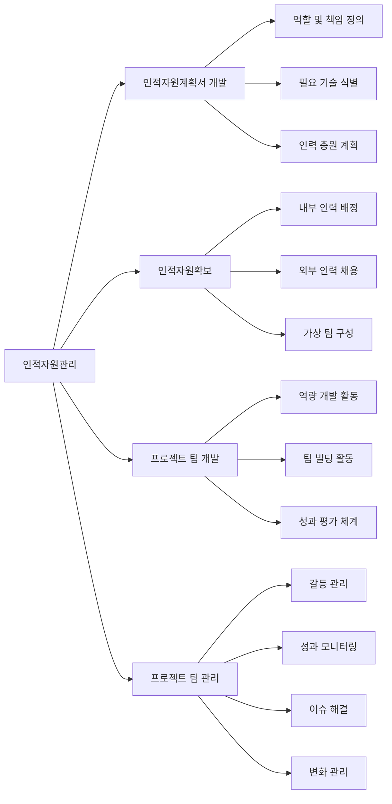

# 인적자원관리: 프로젝트 성공을 위한 체계적 인력 운영 전략

<!-- mtoc-start -->

- [정의 및 개념](#정의-및-개념)
- [주요 프로세스](#주요-프로세스)
- [인적자원관리 프레임워크](#인적자원관리-프레임워크)
- [인적자원 역량 매트릭스](#인적자원-역량-매트릭스)
- [활용 사례](#활용-사례)
- [인적자원관리의 도전 과제](#인적자원관리의-도전-과제)
- [기대 효과 및 필요성](#기대-효과-및-필요성)
- [마무리](#마무리)
- [Keywords](#keywords)

<!-- mtoc-end -->

인적자원관리(Human Resource Management)는 프로젝트의 성공적 수행을 위해 필수적인 요소로, 적합한 인력을 적시에 확보하고 효과적으로 운영하는 체계적인 프로세스입니다. 프로젝트의 규모와 복잡성이 증가함에 따라 인적자원의 전략적 관리는 더욱 중요해지고 있으며, 조직의 역량과 프로젝트 요구사항을 효과적으로 연계하는 핵심 경영 활동입니다.

## 정의 및 개념

- 인적자원관리: 프로젝트에 필요한 적합한 인원을 적기에 투입하고, 인적자원을 최대한 효과적으로 활용하기 위한 일련의 체계적 프로세스와 활동.
- 목적: 프로젝트 성공에 필요한 인력 확보, 개발, 유지 및 최적화를 통해 프로젝트 목표 달성과 조직 역량 향상.

## 주요 프로세스

인적자원관리는 다음과 같은 핵심 프로세스로 구성됩니다:

1. **인적자원계획서 개발**: 프로젝트 역할, 책임, 필요 기술 및 보고 관계를 정의하고 인력 충원 전략 수립
2. **인적자원확보**: 필요한 역량과 경험을 갖춘 인력을 내·외부에서 선발하고 배정
3. **프로젝트 팀 개발**: 팀원의 역량 강화 및 팀 성과 향상을 위한 교육, 훈련, 멘토링 활동
4. **프로젝트 팀 관리**: 팀 성과 추적, 피드백 제공, 갈등 해결 및 변화 관리를 통한 지속적 프로젝트 최적화

## 인적자원관리 프레임워크

인적자원관리 프레임워크는 계획 수립부터 팀 관리까지 체계적인 단계를 보여줍니다. 각 단계는 상호 연계되어 프로젝트 전 생애주기에 걸쳐 인적자원의 효과적 활용을 지원합니다.

## 인적자원 역량 매트릭스

프로젝트 인력의 역량을 체계적으로 관리하기 위한 도구로, 개인별 기술 수준과 프로젝트 요구 역량을 매핑합니다:

|    역할/역량    | 기술적 전문성 | 리더십 | 의사소통 | 문제해결 | 적응성 |
| :-------------: | :-----------: | :----: | :------: | :------: | :----: |
| 프로젝트 관리자 |       ◐       |   ●    |    ●     |    ●     |   ●    |
|    기술 리더    |       ●       |   ◐    |    ◐     |    ●     |   ◐    |
|     개발자      |       ●       |   ○    |    ◐     |    ●     |   ◐    |
|   품질 담당자   |       ◐       |   ○    |    ●     |    ◐     |   ◐    |
| 비즈니스 분석가 |       ◐       |   ◐    |    ●     |    ●     |   ◐    |

● 상급, ◐ 중급, ○ 초급

## 활용 사례

- **대규모 IT 프로젝트**: 다양한 기술 스택과 역할이 필요한 엔터프라이즈 시스템 구축에서 적합한. 인력 배치와 개발 통한 일정 준수
- **글로벌 가상 팀 운영**: 지리적 분산된 팀원들의 협업 체계 구축 및 문화적 다양성 활용한 시너지 창출
- **애자일 개발 환경**: 자기조직화 팀의 효과적 구성과 지속적인 역량 개발을 통한 적응형 프로젝트 관리
- **R&D 프로젝트**: 전문 지식과 창의성이 요구되는 환경에서 최적의 인재 확보 및 유지 전략 수립

## 인적자원관리의 도전 과제

- **역량 격차 관리**: 프로젝트 요구사항과 가용 인력의 역량 간 차이 식별 및 해소
- **원격/하이브리드 근무 환경**: 물리적 거리를 넘은 효과적인 팀 협업 및 성과 관리 체계 구축
- **다세대 인력 관리**: 서로 다른 세대의 기대치와 업무 스타일을 조화시키는 리더십 접근법 개발
- **지식 이전과 유지**: 핵심 인력 이탈 시에도 지식과 노하우가 조직 내에 보존되는 체계 마련

## 기대 효과 및 필요성

- **프로젝트 성공률 향상**: 적합한 인력 구성과 효과적인 팀 운영을 통한 목표 달성 확률 증대
- **인적 자본 최적화**: 개인 역량과 프로젝트 요구사항의 최적 매칭을 통한 자원 활용 극대화
- **팀 만족도와 유지율 향상**: 체계적인 역량 개발과 인정 체계를 통한 팀원 몰입도 증진
- **조직 학습 촉진**: 프로젝트 경험과 지식을 조직 자산화하여 지속적인 경쟁력 강화
- **변화 대응력 향상**: 유연한 인적자원 운영을 통한 프로젝트 및 비즈니스 환경 변화 대응력 강화

## 마무리

인적자원관리는 단순한 인력 배치를 넘어 프로젝트의 성공과 조직의 지속 가능한 경쟁력을 좌우하는 전략적 활동입니다. 체계적인 인적자원 계획, 확보, 개발 및 관리를 통해 프로젝트 목표 달성뿐만 아니라 조직 구성원의 성장과 만족도를 동시에 이끌어낼 수 있습니다. 급변하는 프로젝트 환경에서 인적자원관리의 중요성은 더욱 커지고 있으며, 이를 위한 전문적이고 체계적인 접근이 요구됩니다.

## Keywords

Human Resource Management, Project Team Development, 인적자원계획, 역량 매트릭스, 팀 빌딩, 갈등 관리, 인력 확보 전략, 가상 팀 관리, 성과 평가, 지식 이전
