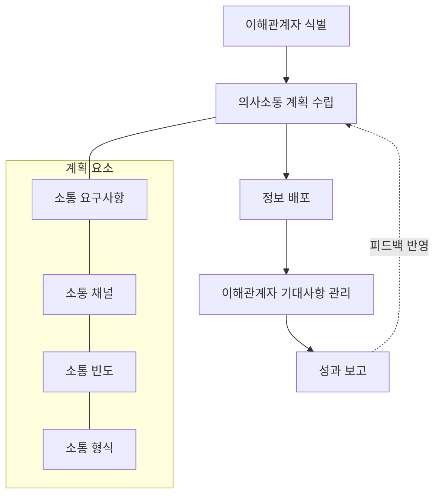

# 의사소통관리: 효과적인 프로젝트 이해관계자 소통 전략

<!-- mtoc-start -->

- [정의 및 개념](#정의-및-개념)
- [주요 프로세스](#주요-프로세스)
- [의사소통관리 프레임워크](#의사소통관리-프레임워크)
- [의사소통 방법 및 도구](#의사소통-방법-및-도구)
  - [의사소통 방법](#의사소통-방법)
  - [의사소통 도구](#의사소통-도구)
- [활용 사례](#활용-사례)
  - [글로벌 IT 프로젝트 사례](#글로벌-it-프로젝트-사례)
  - [애자일 개발 환경에서의 활용](#애자일-개발-환경에서의-활용)
- [기대 효과 및 필요성](#기대-효과-및-필요성)
- [마무리](#마무리)
- [Keywords](#keywords)

<!-- mtoc-end -->

의사소통관리(Communication Management)는 프로젝트 성공을 위한 핵심 요소로, 프로젝트 진행 과정에서 이해관계자 간에 어떤 정보를 생성하고 배포할 것인지를 결정하는 체계적인 프로세스입니다. 효과적인 의사소통은 프로젝트 목표 달성, 위험 감소, 이해관계자 만족도 향상에 직접적인 영향을 미치며, 프로젝트 관리자의 핵심 역량으로 간주됩니다.

## 정의 및 개념

- 의사소통관리: 프로젝트 수행 중 이해관계자 간 정보 생성, 수집, 배포, 저장, 검색을 체계적으로 관리하는 프로세스.
- 목적: 프로젝트 정보의 적시 생성, 수집, 배포를 통해 이해관계자 간 효율적 소통 보장.
- 필요성: 이해관계자 요구사항 충족, 위험 감소, 프로젝트 투명성 확보, 팀 협업 강화.

## 주요 프로세스

의사소통관리는 다음과 같은 순차적 프로세스로 구성됩니다:

1. **이해관계자 식별**: 프로젝트에 영향을 미치거나 받는 모든 개인과 조직 파악
2. **의사소통 계획 수립**: 이해관계자 요구사항에 따른 의사소통 방법, 빈도, 형식 결정
3. **정보 배포**: 계획에 따라 정보 생성 및 적절한 채널을 통한 전달
4. **이해관계자 기대사항 관리**: 지속적인 소통을 통한 기대치 조정 및 이슈 해결
5. **성과 보고**: 프로젝트 진행 상황, 성과 측정, 예측 정보 제공

## 의사소통관리 프레임워크

이 프레임워크는 의사소통관리의 순환적 특성을 보여주며, 각 단계별 활동이 상호 연결되어 프로젝트 전체 수명주기 동안 지속적으로 이루어짐을 나타냅니다. 성과 보고 결과는 의사소통 계획에 피드백으로 반영됩니다.

## 의사소통 방법 및 도구

### 의사소통 방법

- **공식적 서면 의사소통**: 보고서, 회의록, 이메일
- **공식적 구두 의사소통**: 회의, 프레젠테이션, 브리핑
- **비공식적 서면 의사소통**: 메모, 채팅, 게시판
- **비공식적 구두 의사소통**: 일상 대화, 비공식 미팅

### 의사소통 도구

- **협업 플랫폼**: Slack, Microsoft Teams, Zoom
- **프로젝트 관리 소프트웨어**: JIRA, Asana, Trello
- **문서 공유 시스템**: SharePoint, Google Workspace, Confluence
- **보고 도구**: 대시보드, BI 솔루션, 자동화된 보고서

## 활용 사례

### 글로벌 IT 프로젝트 사례

글로벌 IT 시스템 구축 프로젝트에서 다양한 국가와 부서의 이해관계자를 위한 의사소통 계획을 수립했습니다. 주간 상태 보고서, 월간 스티어링 커미티 미팅, 일일 스탠드업 미팅을 체계화하고 다국어 지원 협업 플랫폼을 활용하여 시차와 언어 장벽을 극복했습니다. 결과적으로 요구사항 변경 관리가 효율적으로 이루어지고 프로젝트 지연이 최소화되었습니다.

### 애자일 개발 환경에서의 활용

스크럼 방법론을 적용한 소프트웨어 개발 프로젝트에서 일일 스탠드업 미팅, 스프린트 계획 및 리뷰 미팅, 제품 백로그 관리를 의사소통 체계의 중심으로 활용했습니다. JIRA와 Confluence를 통합하여 요구사항 변경, 작업 진행 상황, 이슈 관리를 투명하게 공유함으로써 이해관계자의 지속적인 참여와 피드백을 유도했습니다.

## 기대 효과 및 필요성

- **의사결정 효율성 향상**: 적시에 정확한 정보 제공으로 신속한 의사결정 지원
- **위험 관리 강화**: 잠재적 문제의 조기 식별 및 대응 가능
- **이해관계자 만족도 증가**: 적절한 정보 공유를 통한 기대치 관리 및 신뢰 구축
- **팀 생산성 향상**: 명확한 의사소통으로 불필요한 작업 및 오해 감소
- **변경 관리 최적화**: 변경 사항에 대한 신속한 커뮤니케이션으로 영향 최소화
- **프로젝트 투명성 확보**: 프로젝트 상태에 대한 가시성 제공으로 책임감 강화

## 마무리

의사소통관리는 단순한 정보 전달을 넘어 프로젝트의 성공을 좌우하는 핵심 관리 영역입니다. 체계적인 의사소통 프로세스를 통해 이해관계자 간 정보의 효과적인 생성, 배포, 저장이 이루어질 때 프로젝트의, 목표 달성 가능성이 높아집니다. 프로젝트 규모나 복잡성과 관계없이 적절한 의사소통 계획을 수립하고 실행하는 것은 모든 프로젝트 관리자의 필수 역량이며, 프로젝트 성공의 핵심 요소입니다.

## Keywords

Communication Management, 의사소통관리, 이해관계자 관리, Stakeholder Engagement, 정보 배포, Information Distribution, 성과 보고, Performance Reporting, 의사소통 계획, Communication Plan, 프로젝트 투명성, Project Transparency
