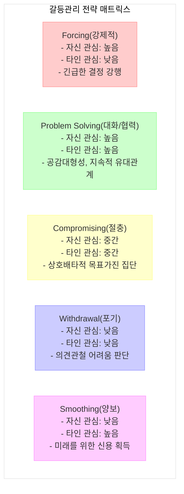

# 갈등관리: 효과적인 조직 내 갈등 해결 전략

<!-- mtoc-start -->

- [정의 및 개념](#정의-및-개념)
- [FPCWS 모델](#fpcws-모델)
- [갈등관리 전략 메커니즘](#갈등관리-전략-메커니즘)
- [갈등관리 전략별 특징](#갈등관리-전략별-특징)
  - [1. Forcing(강제적)](#1-forcing강제적)
  - [2. Problem Solving(대화/협력)](#2-problem-solving대화협력)
  - [3. Compromising(절충)](#3-compromising절충)
  - [4. Withdrawal(포기)](#4-withdrawal포기)
  - [5. Smoothing(양보)](#5-smoothing양보)
- [매슬로우 욕구 이론과 갈등관리](#매슬로우-욕구-이론과-갈등관리)
- [활용 사례](#활용-사례)
- [기대 효과 및 필요성](#기대-효과-및-필요성)
- [마무리](#마무리)
- [Keywords](#keywords)

<!-- mtoc-end -->

갈등관리(Conflict Management)는 조직이나 개인 간에 발생하는 다양한 이해관계와 의견 충돌을 효과적으로 다루는 프로세스입니다. 효율적인 갈등관리는 단순히 갈등을 피하는 것이 아니라, 이를 건설적으로 해결하여 조직의 성장과 혁신을 촉진하는 중요한 관리 기술입니다.

## 정의 및 개념

- 갈등관리: 개인 또는 집단 간의 이해관계, 목표, 가치관 차이로 인한 대립 상황을 인식하고 적절한 전략을 통해 관리하는 체계적 접근법.
- 갈등 유형: 업무적 갈등(과업 방식 차이), 관계적 갈등(개인 간 감정 충돌), 과정적 갈등(업무 진행 방식 차이) 등으로 구분.

## FPCWS 모델

갈등관리 전략은 자신에 대한 관심(Y축)과 타인에 대한 관심(X축)을 기준으로 다섯 가지 유형으로 분류됩니다:

- **F(Forcing, 강제적)**: 높은 자기 관심, 낮은 타인 관심
- **P(Problem Solving, 대화/협력)**: 높은 자기 관심, 높은 타인 관심
- **C(Compromising, 절충)**: 중간 수준의 자기 관심, 중간 수준의 타인 관심
- **W(Withdrawal, 포기)**: 낮은 자기 관심, 낮은 타인 관심
- **S(Smoothing, 양보)**: 낮은 자기 관심, 높은 타인 관심

## 갈등관리 전략 메커니즘

갈등관리 전략은 자신과 타인에 대한 관심 정도에 따라 다섯 가지 접근법으로 구분됩니다. 상황과 관계의 중요성에 따라 적절한 전략을 선택하는 것이 효과적인 갈등 해결의 핵심입니다.

## 갈등관리 전략별 특징

### 1. Forcing(강제적)

- **적용 상황**: 긴급한 결정이 필요할 때, 옳다고 믿는 주요 안건의 관철이 필요할 때
- **특징**: 자신의 입장을 강하게 주장하며 상대방의 의견을 고려하지 않음
- **결과**: 빠른 의사결정이 가능하나 관계 손상 위험이 높음

### 2. Problem Solving(대화/협력)

- **적용 상황**: 장기적 관계 유지가 중요할 때, 복잡한 문제 해결이 필요할 때
- **특징**: 양측의 니즈를 모두 충족시키는 방안을 함께 모색
- **결과**: 가장 이상적인 방법으로, 공감대 형성과 지속적 유대관계 구축 가능

### 3. Compromising(절충)

- **적용 상황**: 목표는 중요하나 설득이 힘들 때, 상호배타적 목표를 가진 집단 간 협상
- **특징**: 양측 모두 일부 양보하여 중간점 찾기
- **결과**: 완전한 만족은 아니지만 부분적 만족과 진행 가능성 확보

### 4. Withdrawal(포기)

- **적용 상황**: 자신의 의견 관철이 어렵다고 판단될 때, 갈등 상황에서 분위기를 식힐 필요가 있을 때
- **특징**: 갈등 상황에서 물러나거나 회피
- **결과**: 일시적 갈등 완화 가능하나 근본적 문제 해결은 되지 않음

### 5. Smoothing(양보)

- **적용 상황**: 미래를 위해 신용을 얻고자 할 때, 상대가 실패를 통해 배울 기회를 제공할 때
- **특징**: 상대방의 관심사를 우선시하고 자신의 관심사는 뒤로 미룸
- **결과**: 관계 유지에 도움이 되나 자신의 목표 달성은 어려움

## 매슬로우 욕구 이론과 갈등관리

갈등관리 전략의 선택은 개인의 욕구 충족 단계와도 연관됩니다:

1. **생리적 욕구**: 기본적 생존 니즈와 관련된 갈등
2. **안전 욕구**: 직업 안정성, 작업 환경 안전과 관련된 갈등
3. **소속 욕구**: 조직 내 소속감, 팀워크와 관련된 갈등
4. **존경 욕구**: 인정, 지위, 권한과 관련된 갈등
5. **자아실현 욕구**: 성장 기회, 창의성 발휘와 관련된 갈등

갈등 해결 시 개인이 어떤 욕구 단계에 있는지를 고려하면 더 효과적인 갈등관리가 가능합니다.

## 활용 사례

- **프로젝트 팀 내 갈등**: 여러 부서에서 온 멤버들이 작업 방식에 대해 의견 충돌 시 Problem Solving 접근법을 통해 모두의 니즈를 충족하는 작업 방식 개발
- **리소스 할당 갈등**: IT 부서와 마케팅 부서 간 예산 배분 문제를 Compromising 전략으로 해결하여 양측 모두 핵심 프로젝트 진행 가능
- **기술 도입 관련 갈등**: 신기술 도입에 대한 세대 간 의견 차이를 협력적 접근으로 해결하여 점진적 변화 전략 수립

## 기대 효과 및 필요성

- **생산성 향상**: 효과적인 갈등관리는 업무 중단을 최소화하고 효율적인 협업 환경 조성
- **혁신 촉진**: 건설적인 갈등은 새로운 아이디어와 해결책을 도출하는 원동력
- **조직 문화 개선**: 갈등해결 능력이 뛰어난 조직은 심리적 안전감이 높아 의사소통이 원활
- **이직률 감소**: 갈등을 효과적으로 관리하는 조직은 구성원 만족도가 높아 인재 유지율 상승
- **의사결정 품질 향상**: 다양한 관점의 충돌과 조화를 통해 더 나은 의사결정 가능

## 마무리

갈등관리는 조직 생활에서 피할 수 없는 갈등을 어떻게 다루느냐에 초점을 맞춘 중요한 관리 기술입니다. FPCWS 모델을 통해 상황에 적합한 전략을 선택하고, 개인의 욕구 단계를 이해하며 접근할 때 갈등은 조직 성장의 디딤돌이 될 수 있습니다. 효과적인 갈등관리 전략은 단기적 문제 해결뿐만 아니라 장기적인 조직 건강성과 성과 향상에 기여합니다.

## Keywords

Conflict Management, FPCWS Model, 갈등해결 전략, 협력적 문제해결, 매슬로우 욕구 이론, 조직 심리학, 강제적 접근법, 절충적 협상, 건설적 갈등, 관계 관리
