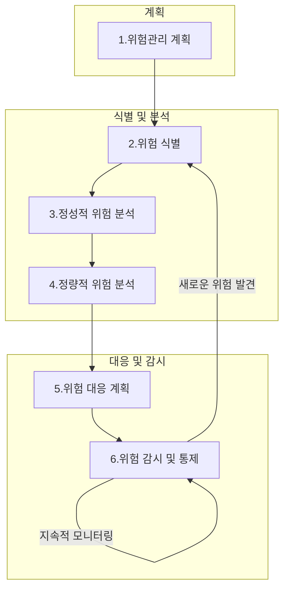

# 위험관리: 체계적인 접근을 통한 프로젝트 성공 확보

<!-- mtoc-start -->

- [정의 및 개념](#정의-및-개념)
- [위험 유형과 분석 프레임워크](#위험-유형과-분석-프레임워크)
- [위험관리 프로세스](#위험관리-프로세스)
  - [1. 위험관리 계획](#1-위험관리-계획)
  - [2. 위험 식별](#2-위험-식별)
  - [3. 정성적 위험 분석](#3-정성적-위험-분석)
  - [4. 정량적 위험 분석](#4-정량적-위험-분석)
  - [5. 위험 대응 계획](#5-위험-대응-계획)
  - [6. 위험 감시 및 통제](#6-위험-감시-및-통제)
- [위험 분석 및 대응 기법](#위험-분석-및-대응-기법)
  - [위험 식별 기법](#위험-식별-기법)
  - [위험 분석 기법](#위험-분석-기법)
  - [위험 대응 전략](#위험-대응-전략)
- [위험 평가 공식과 방법론](#위험-평가-공식과-방법론)
- [활용 사례](#활용-사례)
- [기대 효과 및 필요성](#기대-효과-및-필요성)
- [마무리](#마무리)
- [Keywords](#keywords)

<!-- mtoc-end -->

위험관리(Risk Management)는 프로젝트에서 발생할 수 있는 긍정적 또는 부정적 위험을 식별하고, 분석하며, 대응하는 체계적인 접근 방식입니다. 이는 프로젝트의 납기, 품질, 원가에 영향을 미칠 수 있는 다양한 사건과 상황에 대한 계획적인 대처를 가능하게 합니다. 효과적인 위험관리는 프로젝트의 성공 가능성을 높이고, 불확실성을 줄이는 핵심 요소로 작용합니다.

## 정의 및 개념

- 위험관리: 프로젝트 목표 달성에 영향을 미칠 수 있는 불확실한 사건을 체계적으로 식별, 분석, 대응하는 프로세스. 긍정적 위험(기회)과 부정적 위험(위협) 모두를 다루는 종합적 접근 방식.
- 위험(Risk): 프로젝트의 납기, 품질, 원가에 영향을 줄 수 있는 불확실한 사건으로, 그 발생 가능성과 영향도에 따라 분석 및 관리되는 요소.

- 위험관리 원칙:
  - 일관성(Consistency): 표준화된 접근 방식으로 위험을 지속적으로 관리
  - 개별성(Individuality): 각 위험의 고유한 특성을 고려한 맞춤형 대응
  - 형평성(Balance): 위험과 기회 간의 균형을 유지하며 전체적인 프로젝트 목표 달성

## 위험 유형과 분석 프레임워크

- 위험 유형:

  - 부정적 위험(위협): 프로젝트 목표 달성에 장애가 될 수 있는 사건이나 상황
  - 긍정적 위험(기회): 프로젝트에 이점을 제공할 수 있는 불확실한 사건이나 상황

- ACAM 프레임워크: 위험관리의 종합적 접근 방식
  - Analysis & Inspect: 위험 식별 및 분석
  - Control: 위험 통제 및 관리
  - Assessment: 위험 영향 평가
  - Monitoring: 지속적인 위험 모니터링

## 위험관리 프로세스

위험관리 프로세스는 계획부터 감시까지 순환적으로 진행되며, 새로운 위험이 식별될 경우 프로세스를 반복합니다. 이러한 체계적인 접근을 통해 프로젝트 전반에 걸친 불확실성을 관리하고 성공 가능성을 높입니다.

### 1. 위험관리 계획

- 위험에 대한 접근 방법 및 실행 방안 결정
- 위험관리 계획서 작성 및 이해관계자 동의 확보

### 2. 위험 식별

- 주요 기법: 문서검토, 델파이기법, 체크리스트, 가정분석
- 식별된 위험요인 문서화 및 위험 등록부 생성

### 3. 정성적 위험 분석

- 위험의 발생 가능성과 영향도에 따른 우선순위 설정
- P-I Matrix(확률-영향도 매트릭스)를 통한 위험 평가

### 4. 정량적 위험 분석

- 위험 영향력의 수치화 및 정량적 평가
- 주요 기법: 민감도 분석, 의사결정 분석, Monte Carlo Method

### 5. 위험 대응 계획

- 부정적 위험(위협) 대응 전략: 회피, 전가, 완화, 수용
- 긍정적 위험(기회) 대응 전략: 활용, 공유, 강화, 수용

### 6. 위험 감시 및 통제

- 지속적인 위험 모니터링 및 통제
- 새로운 위험 식별 및 위험관리 대장 업데이트

## 위험 분석 및 대응 기법

### 위험 식별 기법

- 문서검토: 기존 프로젝트 문서 및 계획 검토를 통한 위험 요소 파악
- 델파이기법: 전문가 의견 수렴을 통한 잠재적 위험 식별
- 체크리스트: 표준화된 위험 목록을 활용한 체계적 검토
- 가정분석: 프로젝트 가정에 대한 검증을 통한 위험 요소 발견

### 위험 분석 기법

- 순위결정법: 위험의 우선순위를 정하는 기법
- 민감도 분석: 특정 변수 변화에 따른 영향도 측정
- 의사결정 분석: 각 의사결정 지점에서의 기대값 계산을 통한 최적 결정 도출
- Monte Carlo Method: 난수표를 활용한 시뮬레이션으로 확률 분포 예측

### 위험 대응 전략

| 위험 유형       | 대응 전략      | 설명                                                          |
| --------------- | -------------- | ------------------------------------------------------------- |
| **부정적 위험** | 회피(Avoid)    | 프로젝트를 보호하기 위해 계획을 변경하여 위험 자체를 제거     |
|                 | 전가(Transfer) | 위험에 대한 책임을 제3자에게 이전(보험, 계약 등)              |
|                 | 완화(Mitigate) | 위험의 발생 확률이나 영향도를 용인 가능한 임계치까지 감소     |
|                 | 수용(Accept)   | 위험에 대한 별도의 조치 없이 발생 시 대처(소극적/적극적 수용) |
| **긍정적 위험** | 활용(Exploit)  | 기회가 확실히 실현되도록 적극적으로 행동                      |
|                 | 공유(Share)    | 기회를 실현할 수 있는 능력을 가진 제3자와 협력                |
|                 | 강화(Enhance)  | 기회의 발생 확률이나 긍정적 영향을 증가시키는 조치            |
|                 | 수용(Accept)   | 추가 노력 없이 발생하는 긍정적 효과를 수용                    |

## 위험 평가 공식과 방법론

- 총위험 = 위협 × 취약성 × 자산가치

  - 위협: 위험 요소가 발생할 가능성
  - 취약성: 시스템이나 프로젝트의 약점 정도
  - 자산가치: 위험에 노출된 자산의 중요도 및 가치

- 위험 우선순위 설정: 발생 가능성(Probability)과 영향도(Impact)를 고려한 P-I Matrix 활용
  - 고위험: 높은 확률과 높은 영향도를 가진 위험
  - 중위험: 중간 수준의 확률 또는 영향도를 가진 위험
  - 저위험: 낮은 확률과 낮은 영향도를 가진 위험

## 활용 사례

- IT 프로젝트 구현: 신규 시스템 도입 시 기술적 위험과 조직 변화 관리 위험을 식별하고 대응
- 금융 기관 리스크 관리: 투자 포트폴리오 구성 시 시장 위험, 신용 위험, 운영 위험 등을 종합적으로 분석
- 건설 프로젝트: 날씨, 자재 조달, 인력 부족 등의 위험에 대한 대응 계획 수립
- 신제품 개발: 시장 수용성, 기술적 실현 가능성, 경쟁 환경 변화 등의 위험 요소 관리
- 글로벌 공급망 관리: 지정학적 위험, 공급업체 불안정성, 물류 중단 등의 위험에 대한 종합적 대응 체계 구축

## 기대 효과 및 필요성

- 불확실성 감소: 체계적인 위험 식별 및 관리를 통한 프로젝트 예측 가능성 향상
- 의사결정 품질 개선: 데이터 기반의 위험 평가를 통한 합리적 의사결정 지원
- 비용 효율성: 선제적 위험 관리를 통한 위기 대응 비용 감소 및 자원 최적화
- 이해관계자 신뢰 구축: 위험 요소에 대한 투명한 소통을 통한 프로젝트 신뢰도 향상
- 기회 활용 극대화: 긍정적 위험의 체계적 관리를 통한 추가적 가치 창출
- 규제 준수: 산업별 위험 관리 관련 규제 및 표준 준수 용이성 제고
- 조직 학습 촉진: 위험 관리 과정에서 축적된 지식과 경험의 조직 내 공유 및 활용

## 마무리

위험관리는 단순히 문제를 예방하는 차원을 넘어, 프로젝트와 조직의 성공을 위한 전략적 접근 방식입니다. 계식분분대감(계획, 식별, 분석, 대응, 감시)의 체계적인 프로세스를 통해 부정적 위험은 최소화하고 긍정적 위험은 극대화하는 균형 잡힌 접근이 중요합니다. 특히 현대의 빠르게 변화하는 비즈니스 환경에서는 위험관리가 조직의 핵심 역량으로 자리 잡아, 불확실성을 기회로 전환할 수 있는 능력이 경쟁 우위를 결정짓는 중요한 요소가 되고 있습니다. 효과적인 위험관리 체계를 구축하고 지속적으로 개선해 나감으로써 조직의 회복탄력성과 지속가능성을 확보할 수 있을 것입니다.

## Keywords

Risk Management, 위험관리 프로세스, ACAM Framework, 위험대응전략, 정성적 위험분석, 정량적 위험분석, Monte Carlo Method, P-I Matrix, 위험식별기법, 프로젝트 불확실성
