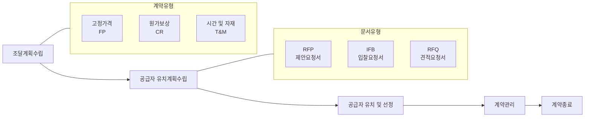

# 조달관리: 효율적인 프로젝트 자원 확보 프로세스

<!-- mtoc-start -->

- [정의 및 개념](#정의-및-개념)
- [주요 조달문서](#주요-조달문서)
- [조달 계약 유형](#조달-계약-유형)
- [조달관리 프로세스](#조달관리-프로세스)
- [조달 프로세스 세부 단계](#조달-프로세스-세부-단계)
  - [1. 조달계획수립](#1-조달계획수립)
  - [2. 공급자 유치계획수립](#2-공급자-유치계획수립)
  - [3. 공급자 유치 및 선정](#3-공급자-유치-및-선정)
  - [4. 계약관리](#4-계약관리)
  - [5. 계약종료](#5-계약종료)
- [활용 사례](#활용-사례)
- [기대 효과 및 필요성](#기대-효과-및-필요성)
- [조달관리 성공 요소](#조달관리-성공-요소)
- [마무리](#마무리)
- [Keywords](#keywords)

<!-- mtoc-end -->

조달관리(Procurement Management)는 프로젝트 성공을 위해 외부에서 필요한 제품, 서비스, 자원을 계약을 통해 획득하고 관리하는 체계적인 프로세스입니다. 프로젝트 관리의 핵심 영역 중 하나로, 조직 외부로부터 최적의 조건으로 필요한 자원을 확보하는 방법을 다룹니다.

## 정의 및 개념

- 프로젝트 외부에서 필요한 제품, 서비스, 자원을 계약을 통해 조달하는 체계적인 프로세스.
- 조직 내부 역량으로 충족할 수 없는 프로젝트 요구사항을 외부 공급자를 통해 해결하는 방법론.

- 목적: 프로젝트에 필요한 외부 자원을 적시에 적절한 비용으로 조달하여 프로젝트 목표 달성 지원
- 필요성: 내부 자원의 한계 극복, 전문성 활용, 비용 효율성 제고, 리스크 분산

## 주요 조달문서

- **RFP(Request For Proposal, 제안요청서)**: 구체적인 문제 해결책이나 서비스 제공 방법에 대한 제안을 요청하는 문서
- **IFB(Invitation For Bid, 입찰요청서)**: 명확한 사양과 조건을 제시하고 최저가 입찰자를 선정하기 위한 문서
- **RFQ(Request For Quotation, 견적요청서)**: 표준화된 제품이나 서비스에 대한 가격 정보를 요청하는 문서

## 조달 계약 유형

- **고정가격계약(Fixed Price, FP)**: 사전에 정해진 총액으로 계약하는 방식으로, 판매자가 리스크를 부담
- **원가보상계약(Cost Reimbursable, CR)**: 실제 발생한 비용에 수수료를 더해 지급하는 방식으로, 구매자가 리스크를 부담
- **시간 및 자재계약(Time & Material)**: 작업 시간과 소요 자재에 따라 비용을 지급하는 혼합형 계약 방식

## 조달관리 프로세스

조달관리 프로세스는 조달계획수립부터 계약종료까지 5단계로 구성되며, 각 단계에서 적합한 계약유형과 문서유형을 선택하여 진행합니다. 효과적인 조달관리를 위해서는 각 단계별 활동과 산출물에 대한 명확한 이해가 필요합니다.

## 조달 프로세스 세부 단계

### 1. 조달계획수립

- 구매 결정(Make-or-Buy) 분석 수행
- 프로젝트 요구사항에 맞는 적절한 계약 유형 선택
- 조달 일정 및 예산 계획 수립

### 2. 공급자 유치계획수립

- 적합한 조달문서(RFP, IFB, RFQ) 작성
- 공급자 선정 기준 및 평가 방법 수립
- 조달 지침 및 관련 법규 검토

### 3. 공급자 유치 및 선정

- 공급자 후보 식별 및 초청
- 제안서 평가 및 협상
- 최적 공급자 선정 및 계약 준비

### 4. 계약관리

- 계약 이행 모니터링 및 성과 평가
- 변경 요청 처리 및 계약 수정
- 지불 관리 및 문서화

### 5. 계약종료

- 계약 완료 확인 및 문서화
- 최종 성과 평가 및 교훈 도출
- 자산 이전 및 관계 종료 처리

## 활용 사례

- **IT 시스템 구축 프로젝트**: 하드웨어, 소프트웨어, 네트워크 장비 등의 조달과 외부 개발자 및 컨설턴트 계약
- **건설 프로젝트**: 자재, 장비, 하청업체 등의 조달 및 계약 관리
- **제조업**: 원자재, 부품, 생산 설비 등의 조달과 외부 전문 서비스 계약
- **공공사업**: 정부기관의 공개 입찰을 통한 서비스 및 물품 조달 과정

## 기대 효과 및 필요성

- **비용 효율성**: 체계적인 조달 프로세스를 통한 비용 절감 및 예산 관리 향상
- **품질 보장**: 명확한 요구사항과 계약 조건을 통한 제품 및 서비스 품질 확보
- **리스크 관리**: 적절한 계약 유형 선택을 통한 프로젝트 리스크 분산 및 관리
- **투명성 확보**: 표준화된 조달 프로세스를 통한 조직 내 투명성 및 책임성 강화
- **전문성 활용**: 외부 전문가 및 공급자의 역량을 활용한 프로젝트 성과 향상

## 조달관리 성공 요소

- **명확한 요구사항 정의**: 조달 대상에 대한 구체적이고 측정 가능한 요구사항 명세
- **공정한 공급자 선정**: 객관적인 평가 기준과 투명한 선정 과정
- **효과적인 계약 관리**: 철저한 이행 모니터링과 변경 관리
- **협력적 공급자 관계**: 상호 이익을 위한 파트너십 구축
- **법적 리스크 관리**: 계약 관련 법규 및 규정 준수

## 마무리

조달관리는 프로젝트 자원 확보의 핵심 프로세스로, 체계적인 계획과 실행을 통해 프로젝트의 성공 가능성을 높여줍니다. 조달계획수립부터 계약종료까지의 모든 단계에서 전략적 접근과 철저한 관리가 필요합니다. 특히 적절한 계약 유형 선택과 명확한 조달문서 작성은 성공적인 조달관리의 기반이 됩니다. 조직은 표준화된 조달관리 프로세스를 구축하고, 지속적인 개선을 통해 조달 효율성을 높여나가야 할 것입니다.

## Keywords

Procurement Management, 조달관리, Make-or-Buy Decision, 제안요청서(RFP), 입찰요청서(IFB), 견적요청서(RFQ), 고정가격계약, 원가보상계약, 시간 및 자재계약, 공급자 관계 관리
