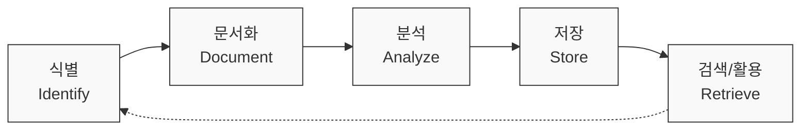

# Lessons Learned: 프로젝트 교훈을 통한 지속적 개선 체계

<!-- mtoc-start -->

- [정의 및 개념](#정의-및-개념)
- [주요 특징](#주요-특징)
- [프로세스](#프로세스)
  - [식별(Identify)](#식별identify)
  - [문서화(Document)](#문서화document)
  - [분석(Analyze)](#분석analyze)
  - [저장(Store)](#저장store)
  - [검색/활용(Retrieve)](#검색활용retrieve)
- [활용 사례](#활용-사례)
- [기대 효과 및 필요성](#기대-효과-및-필요성)
- [도입 시 고려사항](#도입-시-고려사항)
  - [조직 문화적 측면](#조직-문화적-측면)
  - [프로세스 측면](#프로세스-측면)
  - [실행 측면](#실행-측면)
- [마무리](#마무리)
- [Keywords](#keywords)

<!-- mtoc-end -->

교훈 학습(Lessons Learned)은 프로젝트 경험에서 얻은 지식과 통찰력을 체계적으로 수집, 분석하고 활용하는 프로세스입니다. 이는 프로젝트 종료 후 성공 요인과 실패 요인을 모두 검토하여 조직의 지식 자산으로 변환하는 중요한 지식 관리 활동으로, 향후 유사한 프로젝트에서 동일한 실수를 방지하고 성공 요소를 강화하는 데 기여합니다.

## 정의 및 개념

- 프로젝트나 활동 과정에서 얻은 지식, 경험, 통찰력을 체계적으로 문서화하고 공유하는 지식 관리 프로세스.
- 긍정적 경험(성공 요인)과 부정적 경험(실패 요인)을 모두 포함하여 조직의 지식 자산으로 전환하는 활동.

- 목적: 과거 경험으로부터 얻은 교훈을 바탕으로 미래 프로젝트의 성공 가능성 향상
- 필요성: 조직 지식의 체계적 관리를 통한 반복적 실수 방지 및 프로젝트 효율성 증대

## 주요 특징

1. **체계적 수집과 분석**: 프로젝트 전 과정에서 발생한 이슈, 해결책, 성공 요인 등을 구조화된 방식으로 수집하고 분석
2. **지식 자산화**: 개인적 경험과 암묵지를 형식지로 전환하여 조직 차원의 지식 자산으로 구축
3. **실행 가능한 개선사항**: 단순한 문제점 나열이 아닌, 향후 실제 적용 가능한 개선 방안 도출
4. **조직 학습 촉진**: 프로젝트 팀 및 조직 전체의 지속적 개선과 학습 문화 조성
5. **지식 공유 플랫폼**: 교훈을 효과적으로 저장하고 검색할 수 있는 지식 관리 시스템과 연계

## 프로세스

Lessons Learned 프로세스는 경험의 식별부터 실제 활용까지 순환적인 단계로 구성되며, 지속적인 피드백 루프를 통해 조직 지식이 진화하고 축적되는 체계를 보여줍니다.

### 식별(Identify)

- 프로젝트 진행 과정에서 발생한 중요한 사건, 도전 과제, 성공 사례 파악
- 정기적인 회고 미팅, 마일스톤 리뷰, 프로젝트 종료 회의 등을 통해 수집
- 팀원들의 다양한 관점과 경험을 포괄적으로 수집

### 문서화(Document)

- 표준화된 양식을 활용한 체계적 기록
- 이슈 발생 배경, 맥락, 대응 방안, 결과 등 구체적 정보 포함
- 서술형, 체크리스트, 평가 매트릭스 등 다양한 형태로 문서화

### 분석(Analyze)

- 수집된 데이터의 패턴, 경향, 원인-결과 관계 분석
- 근본 원인 분석(Root Cause Analysis)을 통한 심층적 이해
- 해결책의 효과성 평가 및 대안적 접근법 도출

### 저장(Store)

- 중앙화된 지식 저장소에 체계적으로 분류하여 저장
- 키워드, 카테고리, 태그 등을 활용한 효율적 검색 체계 구축
- 접근 권한 관리 및 버전 관리를 통한 지식 자산 보호

### 검색/활용(Retrieve)

- 새로운 프로젝트 계획 단계에서 관련 교훈 검색 및 적용
- 교육 및 훈련 프로그램에 활용
- 조직의 정책, 절차, 방법론 개선에 반영

## 활용 사례

1. **IT 시스템 구축 프로젝트**

   - 이전 ERP 구축 과정에서 발생한 데이터 마이그레이션 문제점과 해결책을 문서화하여 후속 구축 프로젝트에 적용
   - 테스트 전략의 효과성을 분석하여 향후 프로젝트의 테스트 계획 수립에 반영

2. **소프트웨어 개발 방법론 개선**

   - 애자일 방법론 도입 과정에서의 성공 요인과 장애 요소를 분석하여 조직 맞춤형 방법론 개발
   - 스프린트 회고를 통해 수집된 교훈을 개발 프로세스 개선에 활용

3. **IT 서비스 관리**

   - 주요 장애 사례의 대응 과정에서 얻은 교훈을 문서화하여 장애 관리 프로세스 강화
   - 서비스 수준 관리(SLM) 개선을 위한 핵심 지표 및 측정 방식 최적화

4. **정보보안 관리체계 개선**
   - 보안 사고 대응 과정에서 식별된 취약점과 대응 전략을 문서화하여 보안 정책 강화
   - 정보보안 인증 획득 과정의 효과적인 접근법 공유

## 기대 효과 및 필요성

1. **프로젝트 성공률 향상**

   - 과거 실패 요인의 사전 예방과 성공 요인의 적극적 활용을 통한 프로젝트 리스크 감소
   - 유사 프로젝트 간 경험과 지식의 효과적 전이로 인한 효율성 증대

2. **조직 역량 강화**

   - 개인의 경험이 조직의 지식으로 전환되어 인적 자원 변동에도 안정적인 역량 유지
   - 체계적인 지식 관리를 통한 조직 학습 역량 향상

3. **의사결정 품질 개선**

   - 과거 경험에 기반한 데이터 기반 의사결정 지원
   - 유사 상황에서의 대안 평가 및 선택의 정확성 향상

4. **비용 및 시간 절감**

   - 동일한 문제의 반복적 해결에 소요되는 자원 낭비 방지
   - 검증된 접근법 활용을 통한 프로젝트 수행 기간 단축

5. **혁신 촉진**
   - 과거 경험의 비판적 검토를 통한 새로운 관점과 아이디어 발굴
   - 지속적 개선 문화 형성을 통한 조직 내 혁신 분위기 조성

## 도입 시 고려사항

### 조직 문화적 측면

- 개방적이고 비난 없는(blame-free) 피드백 문화 조성
- 실패를 학습 기회로 인식하는 긍정적 관점 장려
- 경영진의 적극적인 지원과 참여 확보

### 프로세스 측면

- 표준화된 교훈 수집 및 문서화 양식 개발
- 프로젝트 라이프사이클에 교훈 학습 활동 통합
- 효과적인 지식 공유 채널 및 플랫폼 구축

### 실행 측면

- 담당자 지정 및 책임과 권한 명확화
- 교훈 활용 효과성에 대한 정기적 평가 및 개선
- 교훈 학습 프로세스 자체에 대한 지속적 개선

## 마무리

Lessons Learned는 단순한 프로젝트 종료 활동이 아닌, 조직의 지속적 개선과 혁신을 위한 핵심 지식 관리 프로세스입니다. 과거의 경험을 미래의 성공으로 연결하는 이 체계적인 접근법은 IT 조직의 경쟁력 강화와 프로젝트 성공률 향상에 크게 기여합니다. 효과적인 Lessons Learned 체계를 구축하고 활용함으로써, 조직은 반복적인 실수를 줄이고 최적의 접근법을 확산시켜 지속적인 발전의 기반을 마련할 수 있습니다.

## Keywords

Lessons Learned, 프로젝트 교훈, Knowledge Management, 지식 관리, Continuous Improvement, 지속적 개선, 경험 기반 학습, Project Retrospective, 프로젝트 회고, Root Cause Analysis, 근본 원인 분석, Organizational Learning, 조직 학습
