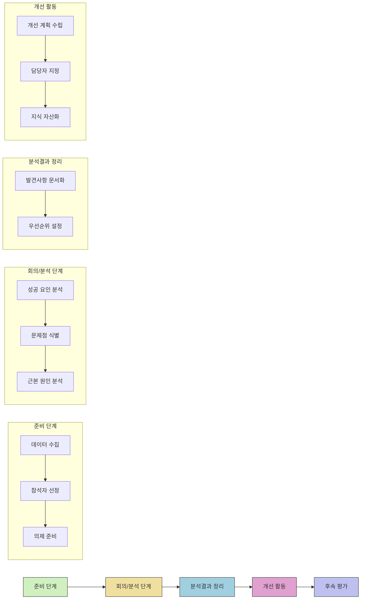

# Post Mortem: 소프트웨어 개발 성공과 실패의 교훈을 찾는 분석 활동

<!-- mtoc-start -->

- [정의 및 개념](#정의-및-개념)
- [주요 특징](#주요-특징)
- [포스트 모텀 프로세스](#포스트-모텀-프로세스)
- [포스트 모텀 실행 기법](#포스트-모텀-실행-기법)
  - [5 Whys 분석](#5-whys-분석)
  - [타임라인 매핑](#타임라인-매핑)
- [활용 사례](#활용-사례)
- [기대 효과 및 필요성](#기대-효과-및-필요성)
- [포스트 모텀 진행 시 주의사항](#포스트-모텀-진행-시-주의사항)
- [마무리](#마무리)
- [Keywords](#keywords)

<!-- mtoc-end -->

포스트 모텀(Post Mortem)은 소프트웨어 개발 프로젝트가 완료된 후 진행되는 중요한 회고 및 분석 활동입니다. 이는 프로젝트의 성공과 실패 요인을 체계적으로 분석하여 향후 유사한 문제를 방지하고 개발 프로세스를 지속적으로 개선하는 데 초점을 맞춥니다. 효과적인 포스트 모텀은 단순한 비난이 아닌 건설적인 학습 경험을 제공하며, 팀의 협업과 소프트웨어 품질 향상에 크게 기여합니다.

## 정의 및 개념

- 포스트 모텀: 소프트웨어 개발 프로젝트 완료 후 관계자들이 모여 문제점, 원인, 개선점을 도출하는 체계적 분석 활동.
- 목적: 제품 및 프로세스 품질 확보를 통한 동일 문제 재발 방지와 지식 자산화.
- 특징: 비난이 아닌 학습 중심, 데이터 기반 분석, 개방적 의사소통 환경 조성.

## 주요 특징

1. **비난 없는 환경 조성**: 개인 비난보다는 프로세스와 시스템적 문제에 초점을 맞추어 참가자들이 자유롭게 의견을 개진할 수 있는 안전한 환경 구축
2. **다양한 이해관계자 참여**: 개발자, QA, 제품 관리자, 디자이너, 운영팀 등 프로젝트 관련 모든 이해관계자를 포함하여 다양한 관점에서의 인사이트 수집

3. **체계적 데이터 수집**: 프로젝트 지표, 이슈 트래킹 시스템, 고객 피드백 등 다양한 소스에서 객관적 데이터를 수집하여 분석의 기반으로 활용

4. **구체적 개선 계획 수립**: 발견된 문제점에 대한 명확한 개선 계획과 실행 방안을 수립하고 책임자 지정을 통한 실질적 개선 보장

## 포스트 모텀 프로세스

포스트 모텀 프로세스는 준비 단계부터 후속 평가까지 체계적으로 구성되며, 각 단계별 활동이 유기적으로 연결되어 문제 해결과 지속적 개선으로 이어집니다. 특히 근본 원인 분석과 지식 자산화는 향후 프로젝트 성공의 핵심 요소가 됩니다.

## 포스트 모텀 실행 기법

### 5 Whys 분석

- 문제의 표면적 증상에서 근본 원인까지 도달하기 위해 연속적으로 "왜?"라는 질문을 던지는 기법
- 예시:
  - 왜 배포가 지연되었나? → 테스트 단계에서 심각한 버그 발견
  - 왜 테스트 단계에서 발견되었나? → 코드 리뷰 과정에서 누락됨
  - 왜 코드 리뷰에서 누락되었나? → 코드 리뷰 체크리스트 불완전
  - 왜 체크리스트가 불완전한가? → 최신 요구사항 반영 미흡
  - 왜 요구사항이 반영되지 않았나? → 요구사항 변경 관리 프로세스 부재

### 타임라인 매핑

- 프로젝트 진행 과정에서 발생한 주요 이벤트와 의사결정을 시간순으로 배열하여 연관성 분석
- 패턴과 트렌드를 식별하고 핵심 전환점을 발견하는 데 효과적

## 활용 사례

1. **대규모 서비스 장애 분석**: 금융 서비스 회사에서 발생한 시스템 다운타임 후 포스트 모텀을 통해 모니터링 시스템 개선과 장애 대응 프로토콜 수립

2. **릴리스 지연 요인 분석**: 소프트웨어 제품의 반복적인 출시 지연에 대한 포스트 모텀으로 요구사항 관리 프로세스와 개발-QA 간 협업 방식 개선

3. **성공적 프로젝트 분석**: 예상보다 빠르게 완료된 프로젝트의 성공 요인 분석으로 효과적인 애자일 프랙티스와 팀 구성 방식을 조직 내 표준 프로세스로 확립

4. **사용자 피드백 기반 개선**: 새로운 기능 출시 후 부정적 사용자 피드백에 대한 포스트 모텀으로 사용자 테스트 강화 및 점진적 릴리스 전략 도입

## 기대 효과 및 필요성

- **지식 자산화**: 문제 해결 경험과 노하우를 조직 지식으로 축적하여 유사 상황에서 활용 가능
- **팀 역량 강화**: 투명한 분석과 개방적 논의를 통해 팀의 문제 해결 능력과 협업 역량 향상
- **프로세스 개선**: 반복되는 문제점 식별을 통한 개발 프로세스 및 방법론 개선
- **고객 만족도 향상**: 품질 이슈 해결을 통한 제품 안정성 및 신뢰도 제고
- **조직 문화 개선**: 실패를 숨기지 않고 배움의 기회로 삼는 건강한 학습 조직 문화 형성

## 포스트 모텀 진행 시 주의사항

1. **비난 문화 지양**: 개인 책임 추궁이 아닌 시스템적 문제와 개선에 초점
2. **구체적 행동 계획**: 추상적 개선점이 아닌 실행 가능한 구체적 액션 아이템 도출
3. **문서화와 추적**: 분석 결과와 개선 계획의 철저한 문서화 및 이행 상황 추적
4. **정기적 진행**: 대규모 문제 발생 시에만 진행하는 것이 아닌 정기적인 검토 문화 정착

## 마무리

포스트 모텀은 단순한 사후 분석을 넘어 조직의 학습과 성장을 위한 핵심 프로세스입니다. 비난 없는 환경에서 체계적인 분석을 통해 도출된 인사이트는 소프트웨어 품질 향상과 팀 역량 강화로 이어집니다. 프로젝트의 성공과 실패 모두에서 배움의 기회를 찾고, 이를 지식 자산으로 축적하는 포스트 모텀 문화를 정착시킨다면, 조직은 지속적인 개선과 혁신의 선순환 구조를 만들어낼 수 있을 것입니다.

## Keywords

Post Mortem, Root Cause Analysis, 근본원인분석, 사후분석, Blameless Culture, 비난 없는 문화, 개선활동, Continuous Improvement, 지식자산화, 소프트웨어 품질 향상
