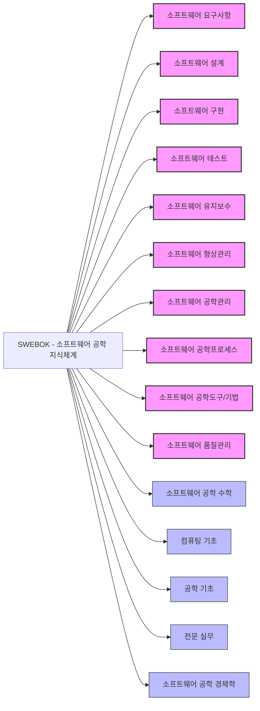

# SWEBOK: SW 공학자의 필수 지식 체계 정립을 위한 국제 표준

<!-- mtoc-start -->

- [정의 및 개념](#정의-및-개념)
- [주요 특징](#주요-특징)
- [SWEBOK 지식영역 구성도](#swebok-지식영역-구성도)
- [SWEBOK 항목 및 세부항목 테이블](#swebok-항목-및-세부항목-테이블)
  - [핵심 지식영역 (10개 영역)](#핵심-지식영역-10개-영역)
  - [지원 지식영역 (5개 영역)](#지원-지식영역-5개-영역)
- [핵심 지식영역 세부 내용](#핵심-지식영역-세부-내용)
  - [요구사항(Software Requirements)](#요구사항software-requirements)
  - [설계(Software Design)](#설계software-design)
  - [구현(Software Construction)](#구현software-construction)
  - [테스트(Software Testing)](#테스트software-testing)
  - [유지보수(Software Maintenance)](#유지보수software-maintenance)
  - [형상관리(Software Configuration Management)](#형상관리software-configuration-management)
- [국제 표준으로서의 SWEBOK](#국제-표준으로서의-swebok)
  - [표준화 프로세스](#표준화-프로세스)
  - [버전 변천사](#버전-변천사)
- [활용 사례](#활용-사례)
- [기대 효과 및 필요성](#기대-효과-및-필요성)
- [마무리](#마무리)
- [Keywords](#keywords)

<!-- mtoc-end -->

소프트웨어 공학 지식체계(Software Engineering Body of Knowledge, SWEBOK)는 소프트웨어 엔지니어가 알아야 할 필수적인 지식의 범위를 체계적으로 정리한 국제 표준입니다. 이는 소프트웨어 엔지니어링 분야의 전문성을 정의하고 교육과 훈련의 기준을 제시하며, ISO/IEC 24773으로 공식 채택되어 전 세계적으로 소프트웨어 엔지니어링 실무와 교육의 기준점으로 활용되고 있습니다.

## 정의 및 개념

- SWEBOK: 소프트웨어 엔지니어가 반드시 알아야 할 필수적인 15개 지식영역과 그에 따른 권장 실무(recommended practice)를 체계적으로 정리한 국제 표준 지식체계.
- 목적: 소프트웨어 엔지니어링 분야의 전문성 확립 및 교육·훈련 프로그램의 표준화를 통한 소프트웨어 품질 향상과 산업 경쟁력 강화.

## 주요 특징

- **체계적 구조화**: 소프트웨어 엔지니어링 전 영역을 15개 핵심 지식영역으로 분류하여 체계적으로 구조화
- **국제 표준 채택**: ISO/IEC 24773으로 공식 채택되어 글로벌 스탠다드로 인정받음
- **What 중심 접근**: 구체적인 방법론(How)보다 알아야 할 내용(What)에 중점을 둔 지식체계
- **정기적 개정**: 기술 발전과 산업 트렌드를 반영한 주기적 업데이트를 통해 최신성 유지
- **전문가 합의**: 국제 소프트웨어 공학 전문가들의 합의를 통해 도출된 표준 지식체계

## SWEBOK 지식영역 구성도

SWEBOK은 10개의 핵심 지식영역(요설구테유 형공프도품)과 5개의 지원 지식영역으로 구성되어 있으며, 각 영역은 소프트웨어 개발 생명주기와 밀접하게 연관되어 있습니다. 이 구조는 소프트웨어 엔지니어링의 전체 스펙트럼을 포괄합니다.

## SWEBOK 항목 및 세부항목 테이블

### 핵심 지식영역 (10개 영역)

| 지식영역                            | 세부항목                                                                                                                 | 주요 내용                                                                                                                                                                                                         |
| ----------------------------------- | ------------------------------------------------------------------------------------------------------------------------ | ----------------------------------------------------------------------------------------------------------------------------------------------------------------------------------------------------------------- |
| **1. 소프트웨어 요구사항**          | 요구사항 도출 요구사항 분석 요구사항 명세 요구사항 검증 요구사항 관리                                        | • 이해관계자 식별 및 요구사항 수집 • 요구사항 모델링 및 우선순위화 • 기능/비기능 요구사항 명세 • 요구사항 검토 및 검증 • 요구사항 변경 관리                                                           |
| **2. 소프트웨어 설계**              | 설계 기초 주요 설계 이슈 소프트웨어 구조 및 아키텍처 설계 품질 분석 및 평가 설계 표기법 설계 전략 및 방법 | • 설계 개념과 원칙 • 동시성, 제어, 데이터 지속성 • 아키텍처 스타일 및 패턴 • 설계 품질 속성과 평가 • 구조적/객체지향/컴포넌트 기반 설계 • 디자인 패턴 적용                                         |
| **3. 소프트웨어 구현**              | 구현 기초 언어 변환 기술 코딩 실무와 표준 재사용 구현 품질 통합                                           | • 프로그래밍 언어와 코딩 원칙 • 컴파일러, 인터프리터, 코드 생성 • 코딩 표준과 컨벤션 • 컴포넌트 및 라이브러리 재사용 • 코드 품질과 가독성 • 지속적 통합과 빌드 자동화                              |
| **4. 소프트웨어 테스트**            | 테스트 기초 테스트 수준 테스트 기법 테스트 관련 측정 테스트 프로세스 테스트 도구                          | • 테스트 목적 및 용어 • 단위/통합/시스템/인수 테스트 • 화이트박스/블랙박스/경험 기반 테스트 • 테스트 측정 및 메트릭 • 테스트 계획 및 실행 • 테스트 자동화 및 관리 도구                             |
| **5. 소프트웨어 유지보수**          | 유지보수 기초 유지보수 과정 유지보수 비용 및 가치 유지보수 관리 레거시 시스템                                | • 유지보수 유형과 특성 • 수정/적응/완전/예방 유지보수 • 유지보수 비용 및 ROI 분석 • 유지보수 요청 관리 • 레거시 시스템 분석 및 개선                                                                   |
| **6. 소프트웨어 형상관리**          | SCM 이론 및 용어 SCM 프로세스 SCM 계획 형상 식별 형상 제어 상태 회계 형상 감사 릴리스 관리          | • 형상관리 개념과 기본 용어 • 형상관리 프로세스와 활동 • SCM 계획 및 조직 • 형상 항목 식별 및 베이스라인 • 변경 통제 및 관리 • 형상 상태 보고 • 형상 저장소 감사 • 소프트웨어 릴리스 및 배포 |
| **7. 소프트웨어 공학관리**          | 프로젝트 착수 및 범위 정의 프로젝트 계획 프로젝트 실행 검토 및 평가 측정 프로젝트 종료                    | • 프로젝트 착수 및 이해관계자 분석 • 작업 분해 및 견적 • 리스크 관리 및 프로젝트 모니터링 • 품질 검토와 팀 관리 • 프로젝트 측정 및 메트릭 • 완료 기준 및 프로젝트 종료                             |
| **8. 소프트웨어 공학 프로세스**     | 프로세스 구현 및 변경 프로세스 정의 프로세스 평가 프로세스 및 제품 측정 프로세스 도구                        | • 프로세스 개선 및 적용 • 생명주기 모델 및 방법론 • 프로세스 능력 및 성숙도 평가 • 프로세스 및 제품 메트릭 • 프로세스 지원 도구                                                                       |
| **9. 소프트웨어 공학 도구 및 기법** | 도구 유형 도구 통합 도구 선택                                                                                      | • 개발/테스트/관리/지원 도구 • 도구 환경 및 통합 • 도구 선택 및 도입 전략                                                                                                                                   |
| **10. 소프트웨어 품질**             | 품질 기초 품질 관리 프로세스 실무적 고려사항 품질 도구                                                          | • 품질 개념 및 속성 • 품질 보증 및 검증 • 품질 계획 및 관리 • 품질 관리 도구 및 기법                                                                                                                     |

### 지원 지식영역 (5개 영역)

| 지식영역                       | 세부항목                                                                                                                        | 주요 내용                                                                                                                                                                              |
| ------------------------------ | ------------------------------------------------------------------------------------------------------------------------------- | -------------------------------------------------------------------------------------------------------------------------------------------------------------------------------------- |
| **11. 소프트웨어 공학 수학**   | 집합, 관계, 함수 기초 논리 증명 기법 그래프 및 트리 이산 확률                                                       | • 수학적 구조 및 연산 • 논리적 연산 및 표현 • 귀납법 및 연역법 • 자료구조 기초 • 확률 이론과 통계                                                                          |
| **12. 컴퓨팅 기초**            | 알고리즘 및 자료구조 프로그래밍 기초 컴퓨터 구조 운영체제 네트워크 기초 데이터베이스 기초 병렬 및 분산 컴퓨팅 | • 알고리즘 설계 및 분석 • 프로그래밍 패러다임 • 하드웨어 아키텍처 • 프로세스 및 자원 관리 • 통신 프로토콜 및 보안 • 데이터 모델링 및 질의 • 병렬 처리 및 분산 시스템 |
| **13. 공학 기초**              | 경험적 방법 및 실험 기법 통계적 분석 측정 공학 설계 시뮬레이션 및 모델링 근본 원인 분석                          | • 실험 설계 및 수행 • 데이터 분석 및 해석 • 메트릭 정의 및 측정 • 엔지니어링 원칙 • 시스템 모델링 및 시뮬레이션 • 문제 원인 파악 및 해결                                |
| **14. 전문 실무**              | 윤리적 책임 그룹 역학 및 심리학 의사소통 기술 전문성                                                                   | • 전문가 윤리 및 행동 강령 • 팀워크 및 협업 • 효과적인 커뮤니케이션 • 지속적인 학습 및 발전                                                                                   |
| **15. 소프트웨어 공학 경제학** | 재무적 고려사항 비용 편익 분석 가치 분석 제품 수명주기 계약 및 조달                                                 | • 소프트웨어 개발 투자 분석 • ROI 및 경제적 타당성 • 가치 기반 소프트웨어 개발 • 제품 수명주기 관리 • 계약 유형 및 협상                                                    |

## 핵심 지식영역 세부 내용

### 요구사항(Software Requirements)

- **정의**: 사용자 니즈를 소프트웨어 요구사항으로 변환하는 프로세스와 관련된 지식
- **구성요소**: 요구사항 도출, 분석, 명세, 검증 및 관리 기법
- **활용 도구**: 요구사항 추적 매트릭스, 유스케이스, 사용자 스토리

### 설계(Software Design)

- **정의**: 소프트웨어 아키텍처와 상세 설계에 관한 지식
- **구성요소**: 구조적 설계, 객체지향 설계, 아키텍처 패턴, 설계 원칙
- **활용 도구**: UML, 디자인 패턴, 아키텍처 프레임워크

### 구현(Software Construction)

- **정의**: 실행 가능한 소프트웨어 생성을 위한 코딩, 검증, 단위 테스트에 관한 지식
- **구성요소**: 코딩 표준, 리팩토링, 정적 분석, 코드 품질
- **활용 도구**: 개발 IDE, 코드 분석 도구, 버전 관리 시스템

### 테스트(Software Testing)

- **정의**: 소프트웨어 결함을 찾고 품질을 검증하기 위한 방법론과 기술에 관한 지식
- **구성요소**: 테스트 계획, 테스트 케이스 설계, 테스트 자동화, 성능 테스트
- **활용 도구**: 테스트 관리 도구, 자동화 테스트 프레임워크, 성능 모니터링 도구

### 유지보수(Software Maintenance)

- **정의**: 배포 후 소프트웨어의 수정, 개선, 최적화에 관한 지식
- **구성요소**: 수정 유지보수, 적응 유지보수, 완전 유지보수, 예방 유지보수
- **활용 도구**: 이슈 추적 시스템, 릴리스 관리 도구, 문서화 도구

### 형상관리(Software Configuration Management)

- **정의**: 소프트웨어 변경사항을 체계적으로 추적하고 제어하는 프로세스에 관한 지식
- **구성요소**: 형상 식별, 형상 통제, 상태 회계, 형상 감사
- **활용 도구**: Git, SVN, CI/CD 파이프라인, 빌드 자동화 도구

## 국제 표준으로서의 SWEBOK

### 표준화 프로세스

- IEEE Computer Society와 ACM의 주도로 개발되어 국제 표준으로 채택
- 전 세계 소프트웨어 엔지니어링 전문가들의 합의를 바탕으로 지속적 개선
- ISO/IEC 24773 인증을 통한 공식 국제 표준 지위 획득

### 버전 변천사

- SWEBOK 1.0 (2004): 초기 표준화 버전 발표
- SWEBOK 3.0 (2014): 주요 개정을 통해 현대적 소프트웨어 엔지니어링 반영
- 현재: 소프트웨어 산업의 급속한 발전에 따른 지속적인 업데이트 진행 중

## 활용 사례

- **교육 기관**: 컴퓨터 공학 및 소프트웨어 엔지니어링 커리큘럼 설계의 기준
- **기업 교육**: 소프트웨어 엔지니어 역량 개발 프로그램의 표준 프레임워크
- **자격증 제도**: 소프트웨어 엔지니어링 전문가 자격증(CSEP) 시험의 기본 지식체계
- **프로젝트 관리**: 소프트웨어 개발 프로젝트의 품질 관리 및 프로세스 정립
- **조직 역량 평가**: 소프트웨어 개발 조직의 역량 평가 및 개선 지표로 활용

## 기대 효과 및 필요성

- **전문성 강화**: 소프트웨어 엔지니어링의 체계적인 전문 지식체계 확립을 통한 전문가 양성
- **글로벌 호환성**: 국제 표준 준수를 통한 글로벌 소프트웨어 산업과의 호환성 확보
- **교육 표준화**: 일관된 교육 콘텐츠 제공을 통한 양질의 소프트웨어 인재 양성
- **품질 향상**: 표준화된 프로세스와 방법론 적용을 통한 소프트웨어 품질 향상
- **효율성 증대**: 검증된 방법론과 지식의 활용을 통한 개발 효율성 및 생산성 증대
- **위험 관리**: 체계적인 지식 적용을 통한 소프트웨어 개발 위험 감소

## 마무리

SWEBOK은 단순한 지식 체계를 넘어 소프트웨어 엔지니어링의 전문성을 정의하고 발전시키는 핵심 표준입니다. 요구사항부터 품질관리까지 소프트웨어 개발 생명주기 전반을 포괄하는 이 지식체계를 적극 활용함으로써, 조직은 더 체계적이고 품질 높은 소프트웨어를 개발할 수 있으며, 개인은 국제적으로 인정받는 소프트웨어 엔지니어로 성장할 수 있습니다. 급변하는 디지털 시대에 소프트웨어 엔지니어링의 전문성을 확립하기 위해 SWEBOK의 적극적인 도입과 활용이 권장됩니다.

## Keywords

Software Engineering Body of Knowledge, 소프트웨어 요구사항, 소프트웨어 설계, 소프트웨어 구현, 소프트웨어 테스트, 유지보수, 형상관리, 공학관리, ISO/IEC 24773, 소프트웨어 품질관리
