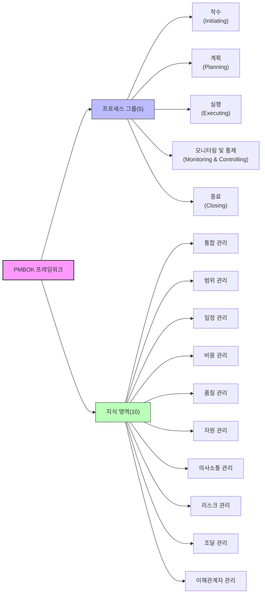
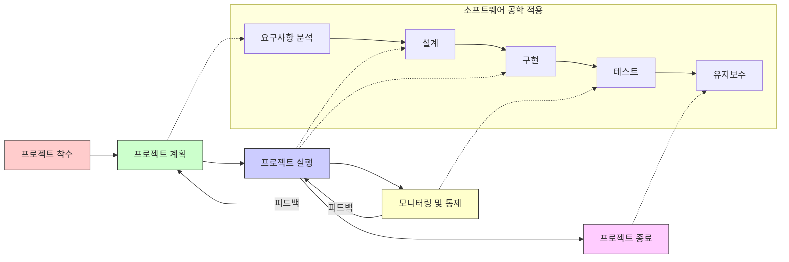

# PMBOK (Project Management Body of Knowledge): 효과적인 프로젝트 관리 지식체계

<!-- mtoc-start -->

- [정의 및 개념](#정의-및-개념)
- [핵심 구성요소](#핵심-구성요소)
  - [5개 프로세스 그룹](#5개-프로세스-그룹)
  - [10개 지식 영역](#10개-지식-영역)
- [PMBOK 프레임워크 구조](#pmbok-프레임워크-구조)
- [PMBOK와 소프트웨어 공학의 시너지](#pmbok와-소프트웨어-공학의-시너지)
- [PMBOK 적용 프로세스](#pmbok-적용-프로세스)
- [PMBOK 5대 프로세스 그룹 × 10대 지식 영역 매트릭스](#pmbok-5대-프로세스-그룹-×-10대-지식-영역-매트릭스)
- [PMBOK 주요 산출물](#pmbok-주요-산출물)
- [PMBOK와 소프트웨어 개발 생명주기 연계](#pmbok와-소프트웨어-개발-생명주기-연계)
- [활용 사례](#활용-사례)
  - [IT 프로젝트에서의 활용](#it-프로젝트에서의-활용)
  - [다양한 산업 분야 적용 사례](#다양한-산업-분야-적용-사례)
- [기대 효과 및 필요성](#기대-효과-및-필요성)
  - [조직적 측면](#조직적-측면)
  - [프로젝트 성과 측면](#프로젝트-성과-측면)
  - [IT 및 소프트웨어 개발 측면](#it-및-소프트웨어-개발-측면)
- [마무리](#마무리)
- [Keywords](#keywords)

<!-- mtoc-end -->

프로젝트 관리 분야에서 국제적으로 인정받는 표준이자 지식체계인 PMBOK(Project Management Body of Knowledge)는 미국 프로젝트 관리 협회(PMI, Project Management Institute)에서 개발한 프로젝트 관리 방법론입니다. PMBOK는 다양한 산업 분야에서 프로젝트를 효과적으로 관리하기 위한 모범 사례, 용어, 지침을 체계적으로 정리하여 제공함으로써, 프로젝트 관리자(PM)들이 일관된 접근 방식으로 프로젝트를 성공적으로 수행할 수 있도록 지원합니다.

## 정의 및 개념

- PMBOK: 프로젝트 관리에 필요한 지식, 기술, 도구 및 테크닉을 체계화한 국제 표준 지식체계.
- 목적: 전산업 분야에 적용 가능한 프로젝트 관리 방법론을 제공하여 프로젝트의 성공적 완수를 지원.
- 구성: 5개 프로세스 그룹과 10개 지식 영역으로 구성된 포괄적 프로젝트 관리 프레임워크.
- 특징: 프로젝트 관리 분야의 모범 사례(Best Practices)를 집대성하여 체계적으로 정리한 지침서.

## 핵심 구성요소

### 5개 프로세스 그룹

- **착수(Initiating)**: 프로젝트 또는 단계의 시작을 공식화하는 프로세스
- **계획(Planning)**: 프로젝트 목표를 정의하고 달성 방법을 구체화하는 프로세스
- **실행(Executing)**: 프로젝트 계획을 실제로 수행하는 프로세스
- **모니터링 및 통제(Monitoring and Controlling)**: 프로젝트 진행 상황을 추적, 검토, 조정하는 프로세스
- **종료(Closing)**: 프로젝트 또는 단계를 공식적으로 완료하는 프로세스

### 10개 지식 영역

- **통합 관리**: 프로젝트의 다양한 구성요소를 통합하고 조정
- **범위 관리**: 필요한 작업만 포함되도록 프로젝트 범위 관리
- **일정 관리**: 프로젝트의 일정 계획, 개발, 관리, 실행, 통제
- **비용 관리**: 프로젝트 예산 계획, 추정, 관리, 통제
- **품질 관리**: 품질 정책, 목표, 책임을 결정하고 관리
- **자원 관리**: 인적 자원 및 물적 자원의 식별, 확보, 관리
- **의사소통 관리**: 프로젝트 정보의 적시적, 효과적 생성, 수집, 배포, 저장, 검색
- **리스크 관리**: 프로젝트 리스크의 식별, 분석, 대응계획 수립, 통제
- **조달 관리**: 프로젝트 수행에 필요한 제품, 서비스, 결과물의 구매 또는 획득
- **이해관계자 관리**: 이해관계자 식별, 분석, 계획, 관리, 참여 유도

## PMBOK 프레임워크 구조

PMBOK 프레임워크는 5개의 프로세스 그룹과 10개의 지식 영역이 상호 교차하며 구성되어 있습니다. 각 지식 영역은 여러 프로세스 그룹에 걸쳐 적용되며, 모든 프로세스는 프로젝트 수명주기 동안 반복적으로 수행될 수 있습니다.

## PMBOK와 소프트웨어 공학의 시너지

PMBOK는 다양한 산업 분야에 적용 가능한 일반적인 프로젝트 관리 프레임워크를 제공하는 반면, 소프트웨어 공학은 소프트웨어 개발에 특화된 기술적 방법론을 제공합니다. 이 두 가지가 결합될 때 다음과 같은 시너지가 발생합니다:

- **통합적 접근**: PMBOK의 관리 방법론과 소프트웨어 공학의 기술적 방법론이 결합되어 소프트웨어 프로젝트의 효율성 향상
- **위험 관리 강화**: 소프트웨어 개발 특유의 위험을 PMBOK의 체계적인 위험 관리 프로세스로 효과적으로 관리
- **품질 보증**: 소프트웨어 공학의 품질 관리 기법과 PMBOK의 품질 관리 프로세스가 상호 보완
- **예측 가능성 향상**: 소프트웨어 개발 프로젝트의 복잡성을 PMBOK의 체계적인 접근 방식으로 관리하여 예측 가능성 증대

## PMBOK 적용 프로세스

PMBOK의 프로세스 그룹은 소프트웨어 개발 생명주기와 밀접하게 연계되어 적용됩니다. 프로젝트 계획 단계에서는 요구사항 분석, 실행 단계에서는 설계 및 구현, 모니터링 및 통제 단계에서는 테스트가 수행되며, 이러한 통합적 접근을 통해 효율적인 소프트웨어 프로젝트 관리가 가능합니다.

## PMBOK 5대 프로세스 그룹 × 10대 지식 영역 매트릭스

| 지식 영역           | 착수 (Initiating) |                                       계획 (Planning)                                        |               실행 (Executing)                |    모니터링 및 통제 (Monitoring & Controlling)     |    종료 (Closing)    |
| ------------------- | :------------------: | :---------------------------------------------------------------------------------------------: | :----------------------------------------------: | :---------------------------------------------------: | :---------------------: |
| **통합 관리**       |  프로젝트 헌장 개발  |                                     프로젝트 관리 계획 개발                                     | 프로젝트 작업 지시 및 관리 프로젝트 지식 관리 | 프로젝트 작업 모니터링 및 통제 통합 변경 통제 수행 | 프로젝트 또는 단계 종료 |
| **범위 관리**       |          -           |                    범위 관리 계획 요구사항 수집 범위 정의 WBS 생성                     |                        -                         |                범위 검증 범위 통제                 |            -            |
| **일정 관리**       |          -           | 일정 관리 계획 활동 정의 활동 순서 배열 활동 자원 산정 활동 기간 산정 일정 개발  |                        -                         |                       일정 통제                       |            -            |
| **비용 관리**       |          -           |                            비용 관리 계획 비용 산정 예산 결정                             |                        -                         |                       비용 통제                       |            -            |
| **품질 관리**       |          -           |                                         품질 관리 계획                                          |                  품질 보증 수행                  |                       품질 통제                       |            -            |
| **자원 관리**       |          -           |                                자원 관리 계획 활동 자원 산정                                 |         자원 확보 팀 개발 팀 관리          |                       자원 통제                       |            -            |
| **의사소통 관리**   |          -           |                                       의사소통 관리 계획                                        |                  의사소통 관리                   |                   의사소통 모니터링                   |            -            |
| **리스크 관리**     |          -           | 리스크 관리 계획 리스크 식별 정성적 리스크 분석 정량적 리스크 분석 리스크 대응 계획 |                        -                         |                    리스크 모니터링                    |            -            |
| **조달 관리**       |          -           |                                         조달 관리 계획                                          |                    조달 수행                     |                       조달 통제                       |        조달 종료        |
| **이해관계자 관리** |   이해관계자 식별    |                                      이해관계자 관리 계획                                       |               이해관계자 참여 관리               |               이해관계자 참여 모니터링                |            -            |

## PMBOK 주요 산출물

| 프로세스 그룹        | 주요 산출물                                                                                                                                                                                                  |
| -------------------- | ------------------------------------------------------------------------------------------------------------------------------------------------------------------------------------------------------------ |
| **착수**             | 프로젝트 헌장(Project Charter) 이해관계자 등록부(Stakeholder Register)                                                                                                                                    |
| **계획**             | 프로젝트 관리 계획서(Project Management Plan) 요구사항 문서(Requirements Documentation) WBS(Work Breakdown Structure) 일정 계획(Schedule) 예산(Budget) 리스크 관리 계획(Risk Management Plan) |
| **실행**             | 변경 요청(Change Requests) 품질 보증 보고서(Quality Assurance Reports) 팀 성과 평가(Team Performance Assessments) 조달 문서(Procurement Documentation)                                              |
| **모니터링 및 통제** | 작업 성과 보고서(Work Performance Reports) 변경 로그(Change Log) 이슈 로그(Issue Log) 리스크 등록부 업데이트(Risk Register Updates)                                                                 |
| **종료**             | 최종 제품, 서비스 또는 결과물 이전(Final Product, Service, or Result Transition) 최종 보고서(Final Report) 프로젝트 문서 아카이브(Project Documents Archive)                                           |

## PMBOK와 소프트웨어 개발 생명주기 연계

| PMBOK 프로세스 그룹  | 소프트웨어 개발 생명주기 단계               | 주요 활동                                                                                  |
| -------------------- | ------------------------------------------- | ------------------------------------------------------------------------------------------ |
| **착수**             | 개념화                                      | 프로젝트 목표 정의 주요 이해관계자 식별 초기 요구사항 개요 작성                      |
| **계획**             | 요구사항 분석 아키텍처 설계              | 상세 요구사항 정의 시스템 아키텍처 설계 프로젝트 계획 수립 리스크 식별 및 분석    |
| **실행**             | 상세 설계 구현 단위 테스트            | 모듈 상세 설계 코드 개발 단위 테스트 수행 품질 보증 활동                          |
| **모니터링 및 통제** | 통합 테스트 시스템 테스트 인수 테스트 | 테스트 수행 및 결과 분석 이슈 추적 및 관리 변경 요청 처리 성과 측정 및 보고       |
| **종료**             | 배포 운영 및 유지보수                    | 시스템 배포 사용자 교육 프로젝트 문서화 완료 교훈 문서 작성 프로젝트 종료 승인 |

## 활용 사례

### IT 프로젝트에서의 활용

- **ERP 시스템 구축**: PMBOK의 통합 관리와 이해관계자 관리를 통해 다양한 부서의 요구사항을 조율하고 일정 관리 프로세스를 활용하여 단계적 구축
- **애자일 개발 방법론과의 결합**: PMBOK의 체계적인 관리 프로세스와 애자일의 유연성을 결합하여 변화에 신속하게 대응하면서도 체계적인 관리 유지
- **클라우드 마이그레이션**: 리스크 관리와 조달 관리를 통해 클라우드 서비스 공급업체 선정 및 마이그레이션 위험 최소화

### 다양한 산업 분야 적용 사례

- **건설 프로젝트**: 범위, 일정, 비용 관리를 통한 대규모 건설 프로젝트의 체계적 관리
- **의료 시스템 개발**: 품질 관리와 위험 관리를 중심으로 한 의료 시스템 개발 프로젝트 관리
- **국제 개발 프로젝트**: 다양한 문화와 환경에서의 의사소통 관리와 이해관계자 관리를 통한 효과적인 국제 프로젝트 수행

## 기대 효과 및 필요성

### 조직적 측면

- **표준화된 프로젝트 관리**: 일관된 접근 방식으로 조직 내 프로젝트 관리 역량 강화
- **지식 이전 용이성**: 문서화된 방법론을 통해 프로젝트 경험과 지식의 조직 내 공유 촉진
- **자원 최적화**: 체계적인 자원 관리를 통한 조직 자원의 효율적 활용

### 프로젝트 성과 측면

- **성공률 향상**: 검증된 방법론 적용을 통한 프로젝트 성공 가능성 증대
- **위험 감소**: 체계적인 위험 관리를 통한 프로젝트 실패 위험 최소화
- **품질 향상**: 품질 관리 프로세스를 통한 프로젝트 산출물의 품질 보장
- **이해관계자 만족도 증가**: 효과적인 이해관계자 관리를 통한 프로젝트 관련자 만족도 향상

### IT 및 소프트웨어 개발 측면

- **기술적-관리적 접근 통합**: 소프트웨어 공학 기술과 프로젝트 관리 방법론의 시너지 효과
- **제어 가능성 향상**: 복잡한 소프트웨어 개발 과정에 대한 체계적인 모니터링 및 통제 가능
- **요구사항 변경 관리 강화**: 범위 관리 프로세스를 통한 요구사항 변경의 효과적 관리

## 마무리

PMBOK는 글로벌 표준으로서 다양한 산업 분야의 프로젝트 관리에 적용 가능한 체계적인 지식체계를 제공합니다. 특히 소프트웨어 공학과 결합될 때, 기술적 측면과 관리적 측면이 균형 있게 통합되어 소프트웨어 프로젝트의 성공 가능성을 높입니다. 조직은 PMBOK를 도입함으로써 프로젝트 관리의 표준화, 효율성 증대, 위험 감소, 품질 향상 등 다양한 이점을 얻을 수 있습니다. 프로젝트 관리자와 팀은 PMBOK의 지식과 도구를 활용하여 복잡한 프로젝트 환경에서도 일관된 방식으로 목표를 달성할 수 있으며, 이는 궁극적으로 조직의 경쟁력 강화로 이어집니다.

## Keywords

Project Management Body of Knowledge, 프로젝트 관리 지식체계, PMI(Project Management Institute), 프로젝트 관리 프로세스, 지식 영역(Knowledge Areas), 프로세스 그룹(Process Groups), 소프트웨어 공학 시너지, 프로젝트 성공률, 표준화된 관리, 이해관계자 관리
