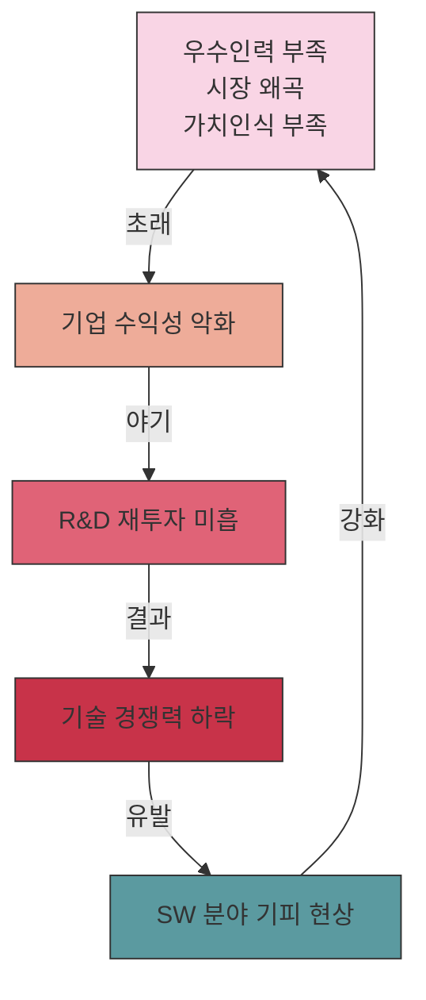

# 국내 SW산업: 문제점과 해결방안

<!-- mtoc-start -->

- [정의 및 개념](#정의-및-개념)
- [주요 문제점](#주요-문제점)
  - [정부 측면](#정부-측면)
  - [기술적 측면](#기술적-측면)
  - [시장 현황 측면](#시장-현황-측면)
- [생태계 악순환 구조](#생태계-악순환-구조)
- [해결방안](#해결방안)
  - [정부 차원의 해결방안](#정부-차원의-해결방안)
  - [사업자 측면의 해결방안](#사업자-측면의-해결방안)
  - [개발자 측면의 해결방안](#개발자-측면의-해결방안)
- [기대 효과 및 필요성](#기대-효과-및-필요성)
- [마무리](#마무리)
- [Keywords](#keywords)

<!-- mtoc-end -->

국내 소프트웨어 산업(Software Industry)은 IT 인프라와 하드웨어 분야에서의 성장에 비해 상대적으로 경쟁력이 부족한 실정입니다. 글로벌 시장에서 경쟁력을 갖추기 위해서는 현재 산업이 직면한 다양한 문제점들을 정확히 진단하고 체계적인 해결방안을 모색해야 합니다. 이 글에서는 국내 SW산업의 주요 문제점과 이에 대한 해결방안을 다양한 측면에서 살펴보겠습니다.

## 정의 및 개념

- 국내 SW산업: 소프트웨어 개발, 공급 및 관련 서비스를 제공하는 국내 기업들의 생태계와 시장 환경.
- SW산업 경쟁력: 핵심 원천기술 확보, 우수 인력 유치, 선진 개발 프로세스 구축, 공정한 시장 환경 조성 등을 통한 지속가능한 성장 역량.

- 주요 측면: 정부, 기술, 시장, 정책, 사업자 등 다양한 관점에서 발생하는 복합적 문제들의 총체.
- 악순환 구조: 우수인력 부족, 시장 왜곡, 가치인식 부족으로 인한 기업 수익 악화, 재투자 미흡, 인력 기피 현상의 반복적 순환.

## 주요 문제점

### 정부 측면

- 발주·인력·표준화 문제: SW 통합발주 관행으로 인한 중소기업 참여 제한, 고급인력 양성체계 미흡, 표준화 부재.
- 하도급 관행: 불공정한 하도급 구조로 인한 중소기업 수익성 악화 및 생태계 왜곡.

### 기술적 측면

- 핵심 원천기술 부족: 자체 개발 역량보다 외산 기술 의존도가 높음.
- 고급인력 부족: 복잡한 소프트웨어 설계와 아키텍처를 담당할 전문 인력 부족.
- 개발 프로세스 후진성: 체계적인 개발 방법론과 품질 관리 프로세스 미흡.

### 시장 현황 측면

- 불합리한 수주 관행: 최저가 낙찰제 등으로 인한 품질 저하 및 수익성 악화.
- 기능보다 영업 중심: 기술력보다 영업력이 시장 경쟁력을 좌우하는 왜곡된 환경.
- 대형 SI업체 시장 독점: 대기업 계열사 중심의 시장 구조로 중소기업 성장 제한.
- 외산 SW 선호 경향: 국내 SW에 대한 낮은 신뢰도와 외산 SW 선호 현상.
- 계열사 의존도: 대기업 계열사 간 거래 의존도가 높아 중소기업 진입장벽 강화.

## 생태계 악순환 구조

국내 SW산업은 인력-시장-투자-경쟁력-인식 간의 악순환 구조에 갇혀 있으며, 이로 인해 산업 전반의 발전이 저해되고 있습니다. 이 악순환을 끊기 위해서는 각 단계별 체계적인 개입이 필요합니다.

## 해결방안

### 정부 차원의 해결방안

- **분리·분할 발주 시행**: SW 발주 시 분리·분할 발주를 통해 중소기업의 참여 기회 확대
- **민관 공동 인력 양성**: 산업계와 학계, 정부가 공동으로 참여하는 고급 SW 인력 양성 체계 구축
- **표준화 추진**: 국가 차원의 SW 표준화 정책 수립 및 우수기업 육성 체계 마련
- **하도급 관행 개선**: 불합리한 하도급 관행을 타파하기 위한 법·제도 정비 및 감시체계 강화

### 사업자 측면의 해결방안

- **고급기술 개발 집중**: 단순 SI 사업에서 벗어나 고부가가치 핵심 기술 개발에 집중
- **해외시장 개척**: 글로벌 시장 분석을 통한 틈새시장 발굴 및 공략 전략 수립
- **R&D 투자 확대**: 미래 경쟁력 확보를 위한 연구개발 투자 비중 확대
- **SW 융합 촉진**: 타 산업과의 융합을 통한 새로운 블루오션 시장 창출

### 개발자 측면의 해결방안

- **인식 전환**: SW 개발을 단순 코딩이 아닌 아키텍처 기반의 종합산업으로 인식 전환
- **지식재산권 존중**: 불법 SW 사용 금지 및 정품 SW 사용 문화 정착
- **글로벌화 노력**: 창업-성장-글로벌화를 위한 지속적인 역량 강화 및 도전정신 함양

## 기대 효과 및 필요성

- **산업 경쟁력 강화**: 핵심 원천기술 확보를 통한 글로벌 시장에서의 경쟁력 강화
- **일자리 창출**: 고급 SW 인력 양성과 중소기업 성장을 통한 양질의 일자리 창출
- **경제적 파급효과**: SW 산업의 성장이 타 산업 혁신을 견인하는 경제적 파급효과 창출
- **국가 위상 제고**: 디지털 경제 시대에 국가 경쟁력과 위상 제고에 기여
- **지속가능한 생태계**: 공정하고 상생하는 SW 산업 생태계 구축으로 지속가능한 성장 기반 마련

## 마무리

국내 SW산업이 직면한 다양한 문제점들은 단기간에 해결하기 어려운 구조적인 이슈들입니다. 그러나 정부, 사업자, 개발자 등 모든 이해관계자들의 공동 노력을 통해 악순환의 고리를 끊고 선순환 구조로 전환할 수 있습니다. 핵심 기술 확보, 고급 인력 양성, 공정한 시장 환경 조성 등을 통해 국내 SW산업이 글로벌 경쟁력을 갖추고 디지털 경제 시대의 핵심 산업으로 자리매김하길 기대합니다.

## Keywords

Software Industry, 발주 체계, 분리발주, 원천기술, 고급인력 양성, 시장 왜곡, 하도급 관행, R&D 투자, SW 융합, 산업생태계
