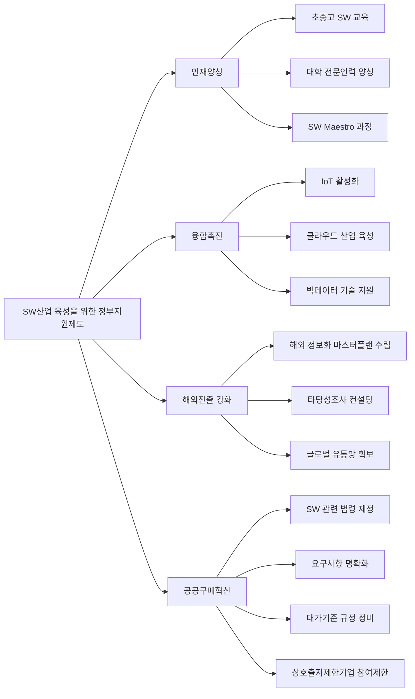

# 국내 SW산업 육성을 위한 법/제도: 지속가능한 발전과 혁신 생태계 구축

<!-- mtoc-start -->

- [정의 및 개념](#정의-및-개념)
- [주요 법제도 현황](#주요-법제도-현황)
- [적용 대상 및 범위](#적용-대상-및-범위)
- [정부 지원 체계](#정부-지원-체계)
- [인재양성 프로그램](#인재양성-프로그램)
- [융합촉진 전략](#융합촉진-전략)
- [해외진출 강화 방안](#해외진출-강화-방안)
- [공공구매혁신 제도](#공공구매혁신-제도)
- [기대 효과 및 필요성](#기대-효과-및-필요성)
- [마무리](#마무리)
- [Keywords](#keywords)

<!-- mtoc-end -->

소프트웨어 산업(Software Industry)은 현대 산업 구조에서 핵심적인 위치를 차지하며, 반도체 시장의 4배, 휴대폰 시장의 6배에 달하는 거대한 시장 규모를 형성하고 있습니다. 금융, 유통, 의료, 자동차 등 다양한 분야와 결합하여 고부가가치 산업 창출이 가능한 분야로, 국내 경쟁력 강화를 위해 정부는 다양한 법과 제도적 지원책을 마련하고 있습니다.

## 정의 및 개념

- SW산업 육성 법/제도: 국내 소프트웨어 산업의 경쟁력 강화 및 지속가능한 성장을 촉진하기 위한 정부 주도의 법적, 제도적 지원 체계.
- 목적: 글로벌 시장에서 국내 SW기업의 경쟁력 강화, 전문 인력 양성, 산업 생태계 활성화를 통한 국가 경제 발전 도모.
- 필요성: 타 산업 대비 높은 성장성과 광범위한 산업 연계성을 바탕으로 국가 경제의 신성장 동력 확보.

## 주요 법제도 현황

- **대기업 참여 제한**: 중소기업의 참여 기회 확대와 성장 지원을 위한 대기업의 공공 SW사업 참여 제한 정책
- **SW 분리발주 시행**: 소프트웨어 개발과 하드웨어 구매를 분리하여 SW의 가치를 독립적으로 평가하고 적정 대가 보장
- **발주/관리 표준프로세스 도입**: SW사업의 품질 향상과 효율적 관리를 위한 표준화된 프로세스 적용
- **SW 대가산정기준 개정**: 소프트웨어 개발 및 유지보수에 대한 적정한 가격 책정 기준 마련
- **SW 기술성평가기준 제정**: 가격 외 기술력을 중심으로 평가하는 기준 도입으로 품질 경쟁력 확보

## 적용 대상 및 범위

- **공공기관**: 7억 원 이상 SW사업
- **지방자치단체**: 5억 원 이상 SW사업
- **조달청 종합쇼핑몰**: 가격과 상관없이 GS인증 여부와 관계없이 등록된 모든 SW 제품
- **사전검토제도**: 일정 규모 이상의 모든 공공 SW사업에 의무 적용

## 정부 지원 체계

국내 SW산업 육성을 위한 정부 지원 체계의 주요 4개 축(인재양성, 융합촉진, 해외진출 강화, 공공구매혁신)과 각 영역별 세부 지원 정책을 보여줍니다. 각 영역은 상호 연계되어 SW산업의 종합적 발전을 지원합니다.

## 인재양성 프로그램

- **초중고 SW 교육**: 소프트웨어 기초 소양 함양을 위한 공교육 과정 강화
- **대학의 인재양성**: 산학협력 기반의 실무형 SW 전문인력 양성 과정 지원
- **개발자 양성교육**: SW Maestro 과정 및 다양한 양성 프로그램 운영을 통한 고급 인력 배출
- **현업 재교육**: 기술 변화에 대응한 현직 개발자 역량 강화 지원

## 융합촉진 전략

- **3대 신사업 활성화**: IoT, 클라우드, 빅데이터를 중심으로 한 신성장동력 발굴 및 지원
- **산업 간 융합**: 제조, 금융, 의료 등 전통산업과 SW 기술 간 융합 지원
- **융합 생태계 조성**: 표준화, 규제 개선, 협업 플랫폼 구축 등 융합 환경 조성
- **R&D 지원**: 융합기술 개발을 위한 연구개발 자금 지원 및 협력 네트워크 구축

## 해외진출 강화 방안

- **사업발굴**: 해외 전략국가 정보화 마스터플랜 수립 및 타당성조사 컨설팅 지원
- **유통망 확보**: 글로벌 유통 채널 구축 및 현지화 지원
- **수출 금융**: 해외진출 기업 대상 금융지원 확대
- **국제협력**: 정부 간 협력을 통한 공공 프로젝트 참여 기회 확대

## 공공구매혁신 제도

- **SW 관련 법령 제정**: 소프트웨어 산업 진흥법 등 법적 기반 마련
- **요구사항 명확화**: 공공 SW사업의 명확한 요구사항 정의 의무화
- **대가기준 규정 정비**: 적정한 개발 대가 보장을 위한 기준 마련
- **상호출자제한기업 공공 참여제한**: 대기업의 참여 제한을 통한 중소기업 성장 기반 조성
- **조달청 종합쇼핑몰**: SW 제품의 공공조달 접근성 향상을 위한 플랫폼 운영

## 기대 효과 및 필요성

- **산업 경쟁력 강화**: 국내 SW기업의 기술력 및 경쟁력 제고를 통한 글로벌 시장 점유율 확대
- **일자리 창출**: 고부가가치 SW 전문인력 양성 및 취업 기회 확대
- **산업구조 고도화**: 전통산업과 SW 융합을 통한 산업 전반의 디지털 전환 촉진
- **경제적 파급효과**: 반도체, 휴대폰 등 하드웨어 산업 대비 높은 성장률과 부가가치 창출
- **기술 자립도 향상**: 해외 의존도가 높은 핵심 SW 기술의 국산화 촉진

## 마무리

국내 SW산업 육성을 위한 법과 제도적 지원은 단순한 산업 보호 정책을 넘어 국가 경제의 디지털 전환과 미래 성장동력 확보를 위한 필수적인 전략입니다. 인재양성부터 공공구매혁신까지 다양한 지원 체계가 상호 연계되어 작동할 때, SW산업의 생태계가 건강하게 발전할 수 있습니다. 특히 공공부문의 SW조달 체계 개선과 적정 대가 보장은 품질 중심의 산업 문화를 정착시키는 중요한 토대가 될 것입니다. 향후에는 급변하는 기술 환경에 맞춰 법과 제도의 유연한 개선과 함께, 글로벌 경쟁력을 갖춘 SW 전문기업 육성에 더욱 집중할 필요가 있습니다.

## Keywords

Software Industry, SW 산업 진흥법, 분리발주, 대가산정기준, SW Maestro, 융합촉진, 공공구매혁신, 해외진출 지원, 인재양성, 디지털 전환
