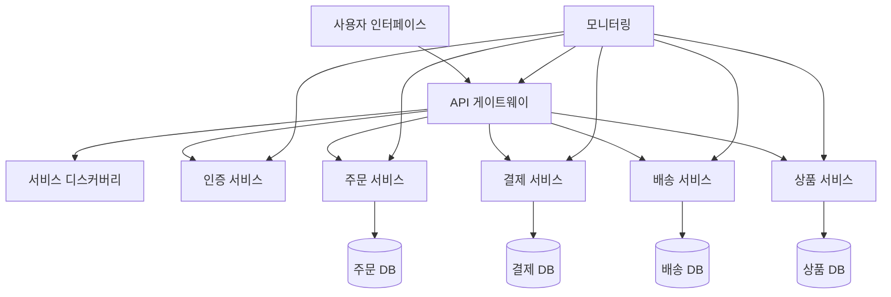

# 마이크로서비스 (Microservice): 독립적 서비스 기반 아키텍처의 실현

<!-- mtoc-start -->

- [정의 및 개념](#정의-및-개념)
- [주요 특징](#주요-특징)
- [마이크로서비스 아키텍처](#마이크로서비스-아키텍처)
- [통신 메커니즘](#통신-메커니즘)
  - [동기식 통신](#동기식-통신)
  - [비동기식 통신](#비동기식-통신)
- [활용 사례](#활용-사례)
- [도입 고려사항](#도입-고려사항)
- [기대 효과 및 필요성](#기대-효과-및-필요성)
- [마무리](#마무리)
- [Keywords](#keywords)

<!-- mtoc-end -->

마이크로서비스(Microservice)는 현대 소프트웨어 개발 환경에서 복잡한 애플리케이션을 더 효율적으로 구축하고 관리하기 위한 아키텍처 접근 방식입니다. 기존의 모노리식 구조와 달리, 마이크로서비스는 애플리케이션을 작고 독립적인 서비스들로 분해하여 개발 민첩성, 확장성, 그리고 유지보수성을 크게 향상시킵니다.

## 정의 및 개념

- 기본 개념: 애플리케이션을 작은 독립 서비스들의 모음으로 구성하는 아키텍처 스타일로, 각 서비스가 자체 프로세스에서 실행되며 경량 메커니즘으로 통신.
- 핵심 원칙: 단일 책임 원칙을 따르는 서비스 구성과 느슨한 결합을 통한 독립적 배포 및 확장 가능.

## 주요 특징

- **독립적 배포 가능성**: 각 서비스는 다른 서비스에 영향을 주지 않고 개별적으로 배포 가능
- **기술 다양성**: 서비스별로 최적의 프로그래밍 언어와 데이터 저장소 선택 가능
- **비즈니스 도메인 중심**: 각 서비스는 특정 비즈니스 기능 또는 도메인에 집중
- **탄력적 확장성**: 필요에 따라 개별 서비스만 선택적으로 확장 가능
- **장애 격리**: 한 서비스의 장애가 전체 시스템으로 확산되지 않음

## 마이크로서비스 아키텍처

마이크로서비스 아키텍처는 API 게이트웨이를 통해 각 독립 서비스에 접근하며, 각 서비스는 자체 데이터베이스를 관리합니다. 서비스 디스커버리와 모니터링 시스템이 전체 아키텍처의 안정성을 지원합니다.

## 통신 메커니즘

### 동기식 통신

- **REST API**: HTTP 기반의 가장 일반적인 통신 방식으로 직관적인 구현
- **gRPC**: 더 효율적인 직렬화와 강력한 타입 지원으로 고성능 통신 제공

### 비동기식 통신

- **메시지 큐**: RabbitMQ, Apache Kafka 등을 통한 비동기 이벤트 기반 통신
- **이벤트 소싱**: 상태 변경을 이벤트로 저장하여 시스템 일관성 유지

## 활용 사례

- **Netflix**: 수천 개의 마이크로서비스를 활용하여 고가용성과 확장성을 달성
- **Amazon**: 작은 팀이 독립적으로 서비스를 개발하고 배포하여 빠른 혁신 촉진
- **우버**: 실시간 위치 추적, 결제, 라이더-드라이버 매칭 등 다양한 서비스를 독립적으로 관리
- **금융권**: 계좌 관리, 트랜잭션 처리, 보안 인증 등을 독립 서비스로 분리하여 안정성 향상

## 도입 고려사항

- **분산 시스템 복잡성**: 서비스 간 통신, 데이터 일관성, 트랜잭션 관리의 어려움 고려
- **운영 오버헤드**: 다수의 서비스 배포 및 모니터링을 위한 자동화 인프라 필요
- **장애 처리 전략**: 서비스 간 통신 실패, 부분적 장애 상황에 대한 대응 방안 수립
- **팀 구조**: 서비스 경계에 맞춘 조직 구조 조정 (콘웨이의 법칙)

## 기대 효과 및 필요성

- **빠른 출시 주기**: 독립적 배포로 인한 개발 및 릴리스 사이클 단축
- **혁신 촉진**: 서비스별 기술 다양성을 통한 최적 솔루션 적용 가능
- **확장성 향상**: 수요가 높은 서비스만 선택적으로 확장하여 비용 효율성 증대
- **팀 자율성**: 작은 팀이 특정 서비스에 집중하여 생산성과 소유권 의식 증가
- **유지보수 용이성**: 코드베이스가 작고 이해하기 쉬워 기능 추가 및 버그 수정 용이

## 마무리

마이크로서비스 아키텍처는 현대적인 소프트웨어 개발 요구사항에 효과적으로 대응할 수 있는 강력한 접근 방식입니다. 복잡성과 운영 오버헤드를 감수할 준비가 되어 있다면, 마이크로서비스는 더 빠른 혁신과 확장, 그리고 고품질 소프트웨어 제공을 위한 훌륭한 선택이 될 수 있습니다. 조직의 규모와 요구사항에 맞게 점진적으로 도입하여 디지털 트랜스F메이션의 기반을 마련하시기 바랍니다.

## Keywords

Microservice Architecture, Domain-Driven Design, 서비스 독립성, 분산 시스템, API 게이트웨이, 컨테이너화, 서비스 디스커버리, 느슨한 결합, 탄력적 확장성, CI/CD 파이프라인
