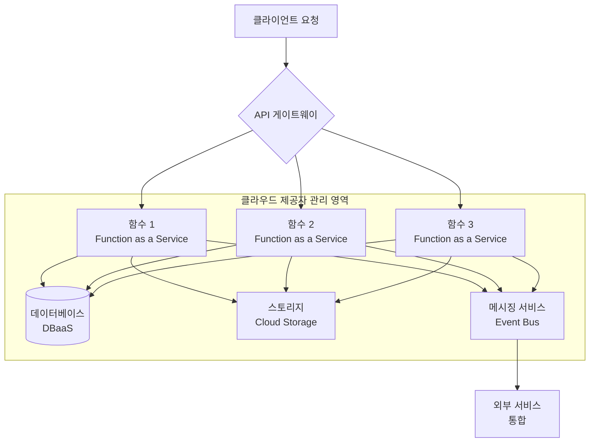

# 서버리스 (Serverless): 인프라 없이 코드만으로 구현하는 클라우드 혁명

<!-- mtoc-start -->

- [정의 및 개념](#정의-및-개념)
- [주요 특징](#주요-특징)
- [아키텍처 및 구성 요소](#아키텍처-및-구성-요소)
- [서버리스 구현 유형](#서버리스-구현-유형)
  - [FaaS (Function as a Service)](#faas-function-as-a-service)
  - [BaaS (Backend as a Service)](#baas-backend-as-a-service)
- [활용 사례](#활용-사례)
- [주요 클라우드 제공자별 서버리스 서비스](#주요-클라우드-제공자별-서버리스-서비스)
- [장점 및 단점](#장점-및-단점)
  - [장점](#장점)
  - [단점](#단점)
- [기대 효과 및 필요성](#기대-효과-및-필요성)
- [마무리](#마무리)
- [Keywords](#keywords)

<!-- mtoc-end -->

서버리스 컴퓨팅(Serverless Computing)은 개발자가 서버 인프라를 직접 관리하지 않고도 애플리케이션을 개발하고 실행할 수 있게 해주는 클라우드 컴퓨팅 실행 모델입니다. 이름과 달리 실제로 서버가 없는 것은 아니며, 서버의 프로비저닝, 관리, 유지보수와 같은 인프라 관련 작업을 클라우드 제공자가
담당함으로써 개발자는 핵심 비즈니스 로직에만 집중할 수 있습니다.

## 정의 및 개념

- 서버리스: 개발자가 서버 인프라를 고려하지 않고 코드 로직에만 집중할 수 있도록 하는 클라우드 컴퓨팅 모델.
- 특징: 이벤트 기반 실행, 자동 확장성, 사용한 만큼만 비용 지불, 인프라 관리 부담 제거.
- 목적: 개발 생산성 향상, 운영 비용 절감, 신속한 시장 출시, 인프라 복잡성 감소.

## 주요 특징

- **이벤트 기반 아키텍처**: 특정 이벤트나 트리거에 반응하여 함수가 실행되며, 필요할 때만 리소스를 소비함으로써 효율성 극대화.
- **자동 확장성(Auto-scaling)**: 트래픽 증가에 따라 자동으로 인스턴스를 확장하고, 트래픽이 감소하면 축소되어 리소스 낭비 방지.
- **종량제 과금(Pay-as-you-go)**: 함수 실행 시간과 리소스 사용량에 따라 비용이 부과되며, 유휴 상태에서는 비용이 발생하지 않음.
- **관리 오버헤드 감소**: 서버 프로비저닝, 패치, 확장 등의 인프라 관리 작업을 클라우드 제공자가 담당하여 운영 부담 경감.
- **개발 주기 단축**: 인프라 구성보다 비즈니스 로직 개발에 집중할 수 있어 신속한 기능 개발 및 배포 가능.

## 아키텍처 및 구성 요소

서버리스 아키텍처는 API 게이트웨이를 통한 클라이언트 요청 처리, 함수 형태로 제공되는 비즈니스 로직(FaaS), 그리고 관리형 데이터 저장소와 이벤트 처리 시스템의 통합으로 구성됩니다. 개발자는 함수 로직만 작성하고 나머지 인프라 관리는 클라우드 제공자가 담당합니다.

## 서버리스 구현 유형

### FaaS (Function as a Service)

- 가장 대표적인 서버리스 구현 방식으로, 개별 함수 단위로 코드를 실행
- AWS Lambda, Azure Functions, Google Cloud Functions 등이 대표적 서비스
- 이벤트 발생 시에만 함수가 실행되며 실행 시간에 따라 비용 부과

### BaaS (Backend as a Service)

- 인증, 데이터베이스, 스토리지와 같은 백엔드 기능을 서비스로 제공
- Firebase, AWS Amplify 등이 대표적인 BaaS 플랫폼
- 프론트엔드 개발자가 별도의 백엔드 개발 없이 애플리케이션 구축 가능

## 활용 사례

- **이벤트 처리 시스템**: 파일 업로드, 데이터베이스 변경, 메시지 수신 등의 이벤트에 반응하여 처리 작업 수행
- **마이크로서비스 아키텍처**: 각 비즈니스 기능을 독립적인 서버리스 함수로 구현하여 유연하고 확장 가능한 시스템 구축
- **주기적 작업 자동화**: 정기적인 데이터 처리, 백업, 리포트 생성과 같은 작업을 서버리스 함수로 스케줄링
- **모바일 백엔드**: 모바일 애플리케이션의 백엔드 로직을 서버리스 함수로 구현하여 확장성과 비용 효율성 확보
- **IoT 데이터 처리**: 수많은 IoT 디바이스에서 발생하는 간헐적인 데이터 스트림을 효율적으로 처리

## 주요 클라우드 제공자별 서버리스 서비스

| 클라우드 제공자 | 서비스명         | 주요 특징                                              |
| --------------- | ---------------- | ------------------------------------------------------ |
| AWS             | Lambda           | 다양한 언어 지원, 최대 15분 실행, AWS 서비스와 통합    |
| Microsoft       | Azure Functions  | 다양한 트리거 지원, 바인딩 개념, 종속성 자동 관리      |
| Google          | Cloud Functions  | 경량 함수, Google 서비스와 긴밀한 통합, HTTP 기반 함수 |
| IBM             | Cloud Functions  | Apache OpenWhisk 기반, 작업 오케스트레이션             |
| Alibaba         | Function Compute | 다양한 이벤트 소스, 중국 리전 지원                     |

## 장점 및 단점

### 장점

- **비용 효율성**: 사용한 컴퓨팅 리소스에 대해서만 비용 지불, 유휴 리소스 비용 제거
- **개발 생산성**: 인프라 관리 부담 감소로 개발자는 비즈니스 로직에 집중 가능
- **자동 확장성**: 트래픽 변화에 자동으로 대응하여 사용자 경험 유지
- **빠른 배포**: 개별 함수 단위의 배포로 신속한 업데이트 및 롤백 가능

### 단점

- **콜드 스타트(Cold Start)**: 비활성 함수의 첫 실행 시 지연 발생 가능
- **복잡한 애플리케이션 관리**: 수많은 함수로 구성된 시스템의 모니터링 및 디버깅 어려움
- **벤더 종속성**: 특정 클라우드 제공자의 서비스에 의존성 발생
- **장기 실행 프로세스 제약**: 대부분의 FaaS 플랫폼에서 실행 시간 제한 존재

## 기대 효과 및 필요성

- **IT 비용 최적화**: 실제 사용량에 따른 비용 지불로 자원 낭비 없는 효율적인 예산 관리
- **신속한 시장 출시**: 인프라 구축 시간 단축으로 새로운 기능과 서비스를 빠르게 시장에 출시
- **기술 부채 감소**: 서버 인프라 관리와 관련된 기술 부채 감소로 지속적인 혁신 가능
- **확장성 확보**: 트래픽 폭증 상황에서도 안정적인 서비스 제공으로 사용자 경험 향상
- **개발자 경험 향상**: 복잡한 인프라 관리보다 핵심 비즈니스 가치 창출에 집중할 수 있는 환경 제공

## 마무리

서버리스 컴퓨팅은 개발자가 인프라 관리에서 벗어나 코드 로직에만 집중할 수 있게 함으로써 IT 운영의 패러다임을 변화시키고 있습니다. 점점 더 복잡해지는 비즈니스 요구사항과 경쟁 환경에서 서버리스 아키텍처는 빠른 혁신, 비용 효율성, 확장성이 요구되는 기업에게 중요한 경쟁 우위를 제공합니다. 현대 클라우드 네이티브 애플리케이션 개발에 있어 서버리스는 선택이 아닌 필수적인 접근 방식으로 자리 잡고 있습니다.

## Keywords

Serverless Computing, FaaS(Function as a Service), BaaS(Backend as a Service), 이벤트 기반 아키텍처, 자동 확장성(Auto-scaling), 종량제 과금, 콜드 스타트(Cold Start), 마이크로서비스, 클라우드 네이티브, 인프라 추상화
