# 로우코드 개발(Low-Code Development): 최소 코딩으로 구현하는 신속한 애플리케이션 개발 방식

<!-- mtoc-start -->

- [정의 및 개념](#정의-및-개념)
- [주요 특징](#주요-특징)
- [개발 프로세스](#개발-프로세스)
- [로우코드 vs 노코드 vs 전통적 개발](#로우코드-vs-노코드-vs-전통적-개발)
- [활용 사례](#활용-사례)
- [주요 로우코드 플랫폼](#주요-로우코드-플랫폼)
- [기대 효과 및 필요성](#기대-효과-및-필요성)
- [한계점 및 고려사항](#한계점-및-고려사항)
- [마무리](#마무리)
- [Keywords](#keywords)

<!-- mtoc-end -->

로우코드 개발은 복잡한 프로그래밍 지식 없이도 애플리케이션을 개발할 수 있게 해주는 시각적 개발 플랫폼입니다. 최소한의 코드 작성으로도 비즈니스 요구사항을 충족하는 솔루션을 빠르게 구현할 수 있어, 개발 주기를 획기적으로 단축시킵니다. 2027년까지 전 세계 로우코드 시장 규모가 650억 달러에 이를 것으로 전망되는 등 IT 개발 환경에서 중요한 패러다임으로 자리잡고 있습니다.

## 정의 및 개념

- 로우코드 개발(Low-Code Development): 시각적 인터페이스와 사전 구성된 템플릿을 활용하여 최소한의 수작업 코딩으로 애플리케이션을 개발하는 방식. 비개발자도 사용할 수 있는 접근성이 특징.
- 목적: 개발 속도 향상, 기술 부채 감소, 비즈니스와 IT 간 협업 강화를 통한 신속한 디지털 트랜스포메이션 지원.
- 필요성: 소프트웨어 개발 인력 부족, 빠른 비즈니스 요구사항 변화 대응, 시장 출시 시간 단축 필요성 증가에 따른 대안적 개발 방식.

## 주요 특징

- **시각적 개발 환경**: 드래그 앤 드롭 인터페이스와 시각적 모델링 도구를 통해 복잡한 코딩 없이 애플리케이션 구성 요소 설계
- **사전 구성 컴포넌트**: 재사용 가능한 UI 컴포넌트, 비즈니스 로직, 데이터 모델 등 다양한 빌딩 블록 제공
- **자동화된 코드 생성**: 시각적 설계를 기반으로 기반 코드를 자동 생성하여 개발 효율성 향상
- **통합 기능**: 다양한 시스템, 데이터베이스, API와 쉽게 연동할 수 있는 커넥터 제공
- **협업 지원**: 비즈니스 사용자와 IT 전문가가 함께 작업할 수 있는 환경 제공으로 개발 과정의 소통 강화

## 개발 프로세스

```mermaid
flowchart LR
    A[요구사항 정의] --> B[시각적 모델링]
    B --> C[컴포넌트 구성]
    C --> D[비즈니스 로직 정의]
    D --> E[통합 및 연결]
    E --> F[테스트 및 검증]
    F --> G[배포]
    G --> H[지속적 개선]

    style A fill:#f9d5e5,stroke:#333,stroke-width:1px
    style B fill:#eeeeee,stroke:#333,stroke-width:1px
    style C fill:#eeeeee,stroke:#333,stroke-width:1px
    style D fill:#eeeeee,stroke:#333,stroke-width:1px
    style E fill:#eeeeee,stroke:#333,stroke-width:1px
    style F fill:#eeeeee,stroke:#333,stroke-width:1px
    style G fill:#d0f0c0,stroke:#333,stroke-width:1px
    style H fill:#d0f0c0,stroke:#333,stroke-width:1px
```

로우코드 개발 프로세스는 전통적인 개발 방식보다 간소화되어 있으며, 시각적 모델링과 컴포넌트 구성이 핵심입니다. 요구사항 정의부터 지속적 개선까지 비개발자도 참여 가능한 순환적 구조로 설계되어 있습니다.

## 로우코드 vs 노코드 vs 전통적 개발

| 특성         | 로우코드            | 노코드          | 전통적 개발         |
| ------------ | ------------------- | --------------- | ------------------- |
| 코딩 필요성  | 최소한의 코딩 필요  | 코딩 불필요     | 전체 코드 작성 필요 |
| 사용자 대상  | 개발자 및 파워 유저 | 비즈니스 사용자 | 전문 개발자         |
| 커스터마이징 | 중간~높음           | 제한적          | 매우 높음           |
| 개발 속도    | 빠름                | 매우 빠름       | 느림                |
| 복잡한 기능  | 구현 가능           | 제한적          | 완전 지원           |
| 유지보수     | 비교적 용이         | 매우 용이       | 복잡함              |

## 활용 사례

- **내부 업무 애플리케이션**: 부서별 데이터 관리, 워크플로우 자동화, 리포팅 도구 등 사내 업무 효율화를 위한 애플리케이션 개발
- **고객 포털**: 고객 정보 관리, 셀프 서비스 포털, 예약 시스템 등 고객 경험 향상을 위한 솔루션 구현
- **모바일 앱**: 간단한 모바일 애플리케이션을 신속하게 개발하여 시장 검증 및 피드백 수집
- **레거시 시스템 현대화**: 기존 레거시 시스템을 로우코드 플랫폼으로 재구축하여 유지보수성 향상
- **프로토타이핑**: 새로운 비즈니스 아이디어의 빠른 검증을 위한 프로토타입 개발

## 주요 로우코드 플랫폼

- **Microsoft Power Apps**: Office 365와의 긴밀한 통합, 기업용 애플리케이션 개발에 적합
- **OutSystems**: 엔터프라이즈급 애플리케이션 개발을 위한 강력한 기능 제공
- **Mendix**: AI 보조 개발 기능과 협업 환경이 특징
- **Appian**: 비즈니스 프로세스 관리와 통합된 애플리케이션 개발 플랫폼
- **Salesforce Lightning**: CRM 기반 애플리케이션 개발에 최적화

## 기대 효과 및 필요성

- **개발 속도 향상**: 전통적인 개발 방식 대비 최대 10배 빠른 개발 속도로 시장 대응력 강화
- **IT 백로그 감소**: 비개발자도 간단한 애플리케이션을 직접 개발함으로써 IT 부서의 업무 부담 경감
- **혁신 촉진**: 아이디어를 신속하게 프로토타입으로 구현하여 검증할 수 있는 환경 제공
- **비용 효율성**: 개발 시간 단축과 인력 비용 절감으로 ROI 향상
- **유지보수 간소화**: 시각적 인터페이스를 통한 애플리케이션 관리로 유지보수 부담 감소
- **디지털 트랜스포메이션 가속화**: 비즈니스 요구사항을 신속하게 디지털 솔루션으로 전환

## 한계점 및 고려사항

- **복잡한 요구사항 처리**: 고도로 복잡한 비즈니스 로직이나 사용자 정의 기능 구현에 제한적
- **성능 이슈**: 대규모 트랜잭션 처리나 고성능이 요구되는 애플리케이션에는 적합하지 않을 수 있음
- **벤더 종속성**: 특정 로우코드 플랫폼에 종속되어 이식성 및 확장성에 제약 발생 가능
- **보안 고려사항**: 자동 생성된 코드의 보안 취약점 관리 필요
- **거버넌스 체계**: 로우코드 개발 환경에서의 품질 관리 및 거버넌스 체계 수립 필요

## 마무리

로우코드 개발은 디지털 트랜스포메이션 시대에 IT 부서와 비즈니스 부서 간의 간극을 좁히는 중요한 역할을 합니다. 개발 속도를 획기적으로 단축시키고, 비개발자도 애플리케이션 개발에 참여할 수 있게 함으로써 기업의 민첩성과 혁신 역량을 향상시킵니다. 단, 로우코드 플랫폼의 한계를 인식하고 적절한 사용 사례를 선정하는 것이 성공적인 도입의 핵심입니다. 기업의 디지털 전략에 로우코드 개발 방식을 적극 검토하고, 비즈니스 요구에 맞는 최적의 로우코드 플랫폼을 선정하여 디지털 경쟁력을 강화하시기 바랍니다.

## Keywords

Low-Code Development, Visual Development Environment, Rapid Application Development, 로우코드 개발, 시각적 개발 환경, 프로토타이핑, 개발 가속화, 비즈니스-IT 협업, 디지털 트랜스포메이션, 애플리케이션 현대화
