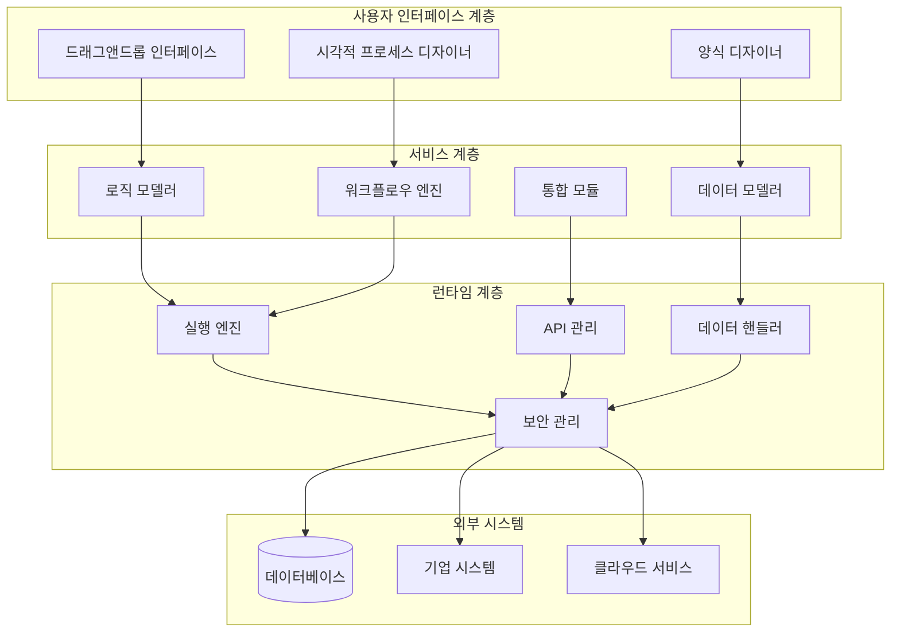
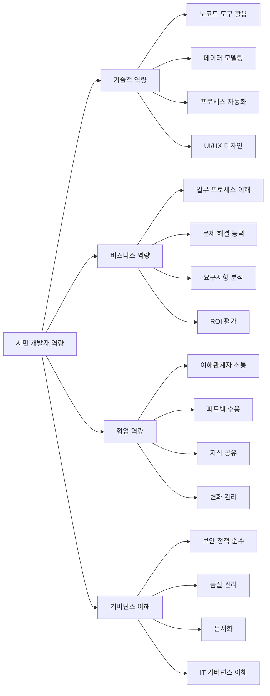

# 노코드 플랫폼: 비즈니스 민첩성을 높이는 시민 개발자의 도구

<!-- mtoc-start -->

- [정의 및 개념](#정의-및-개념)
- [주요 특징](#주요-특징)
- [아키텍처 구성](#아키텍처-구성)
- [활용 사례](#활용-사례)
- [주요 노코드 플랫폼 비교](#주요-노코드-플랫폼-비교)
- [시민 개발자 역량 프레임워크](#시민-개발자-역량-프레임워크)
- [기대 효과 및 필요성](#기대-효과-및-필요성)
- [도입 시 고려사항](#도입-시-고려사항)
- [마무리](#마무리)
- [Keywords](#keywords)

<!-- mtoc-end -->

노코드 플랫폼(No-Code Platform)은, 전통적인 프로그래밍 기술이나 지식 없이도 직관적인 그래픽 인터페이스를 통해 애플리케이션이나 업무 흐름을 구축할 수 있는 혁신적인 개발 환경입니다. 이러한 플랫폼은 IT 부서의 과부하를 줄이고, 비즈니스 사용자가 직접 필요한 솔루션을 개발할 수 있도록 권한을 부여하며, '시민 개발자(Citizen Developer)'의 개념을 조직 내에서 확장시키고 있습니다.

## 정의 및 개념

- 코딩 없이 그래픽 인터페이스를 통해 애플리케이션을 개발할 수 있는 소프트웨어 플랫폼.
- 드래그앤드롭, 시각적 모델링, 템플릿 등을 활용하여 비개발자도 디지털 솔루션을 구축 가능.

- 특징: 직관적 인터페이스, 재사용 가능한 구성요소, 템플릿 기반 개발, 자동화된 배포
- 목적: IT 병목현상 해소, 디지털 역량 강화, 비즈니스 민첩성 증대, 개발 민주화
- 필요성: 디지털 전환 가속화, 개발자 부족 현상 대응, 비즈니스 요구사항 신속 대응

## 주요 특징

1. **시각적 개발 환경**: 코드 작성 대신 드래그앤드롭 인터페이스, 흐름도, 양식 디자이너 등 시각적 도구를 제공하여 직관적인 애플리케이션 구축 지원.

2. **사전 구축된 템플릿과 커넥터**: 일반적인 비즈니스 프로세스를 위한 템플릿과 다양한 시스템(ERP, CRM, 데이터베이스 등)과의 연동을 위한 커넥터 제공.

3. **자동화된 기술 스택 관리**: 인프라, 백엔드, 프론트엔드, 데이터베이스, 보안 등의 기술적 복잡성을 추상화하여 사용자가 비즈니스 로직에만 집중할 수 있도록 지원.

4. **협업 기능**: 여러 이해관계자가 동시에 작업하고 피드백을 공유할 수 있는 협업 환경 제공으로 개발 주기 단축.

5. **확장성 및 통합성**: 기존 IT 시스템과의 통합 및 필요시 전문 개발자의 코드 추가가 가능한 하이브리드 접근 방식 지원.

## 아키텍처 구성

노코드 플랫폼의 아키텍처는 사용자 인터페이스 계층, 서비스 계층, 런타임 계층, 그리고 외부 시스템 연결 계층으로 구성됩니다. 각 계층은 사용자의 시각적 디자인을 실제 작동하는 애플리케이션으로 변환하는 과정을 담당하며, 이를 통해 코딩 없이도 완전한 기능의 솔루션 개발이 가능합니다.

## 활용 사례

1. **업무 프로세스 자동화**: 승인 워크플로우, 데이터 수집 및 처리, 보고서 생성 등 반복적인 업무 프로세스를 자동화하여 효율성 향상.

2. **고객 관리 솔루션**: 맞춤형 CRM 시스템, 고객 온보딩 프로세스, 고객 피드백 수집 및 분석 도구 등 비즈니스 요구사항에 맞는 솔루션 개발.

3. **내부 운영 도구**: 자산 관리, 재고 추적, 프로젝트 관리, 팀 협업 도구 등 조직 내부 운영을 위한 맞춤형 애플리케이션 구축.

4. **데이터 시각화 및 분석**: 비즈니스 인텔리전스 대시보드, 성과 지표 모니터링, 데이터 기반 의사결정 지원 도구 개발.

5. **모바일 앱 개발**: 내부 직원용 또는 고객 대상 모바일 애플리케이션을 빠르게 개발하여 디지털 채널 확장.

## 주요 노코드 플랫폼 비교

| 플랫폼                   | 주요 특징                    | 적합한 활용 영역               |
| ------------------------ | ---------------------------- | ------------------------------ |
| Microsoft Power Platform | 오피스 365와 통합, AI 기능   | 기업 환경, 문서 자동화         |
| Bubble                   | 웹앱 중심, 커스터마이징 강점 | 웹 서비스, 스타트업 프로토타입 |
| Zapier                   | 앱 간 자동화 특화            | 워크플로우 자동화, 시스템 통합 |
| Airtable                 | 데이터베이스 기반 솔루션     | 데이터 관리, 협업 프로젝트     |
| Appian                   | 엔터프라이즈급 보안, 확장성  | 대기업, 규제 산업              |
| Mendix                   | 로우코드/노코드 하이브리드   | 복잡한 기업 애플리케이션       |

## 시민 개발자 역량 프레임워크

이 프레임워크는 효과적인 시민 개발자가 갖추어야 할 핵심 역량을 기술적, 비즈니스, 협업, 거버넌스 측면에서 정의합니다. 조직에서 노코드 플랫폼을 도입할 때 이러한 역량을 개발하고 지원하는 교육 프로그램을 함께 구축하는 것이 성공적인 구현의 핵심입니다.

## 기대 효과 및 필요성

1. **IT 부서 부담 경감**: 개발 요청 대기열 감소, IT 리소스의 전략적 활용 가능성 증대.

2. **개발 주기 단축**: 기존 개발 방식 대비 5-10배 빠른 애플리케이션 개발 및 배포로 비즈니스 민첩성 향상.

3. **비즈니스-IT 격차 해소**: 비즈니스 사용자가 직접 솔루션을 개발함으로써 요구사항 해석 오류 감소 및 만족도 증가.

4. **혁신 문화 조성**: 시험과 학습을 촉진하는 환경 조성으로 조직 내 혁신 문화 확산.

5. **총소유비용(TCO) 절감**: 전문 개발자 고용 및 유지 비용 절감, 레거시 시스템 유지보수 비용 감소.

6. **디지털 역량 강화**: 전사적 디지털 리터러시 향상 및 디지털 전환 가속화.

## 도입 시 고려사항

1. **거버넌스 체계 구축**: 노코드 개발에 대한 명확한 정책, 가이드라인, 품질 관리 프로세스 수립.

2. **보안 및 규정 준수**: 데이터 보안, 접근 제어, 산업별 규제 준수를 위한 체계 마련.

3. **기존 IT 인프라와의 통합**: 레거시 시스템, 데이터 소스, 기존 애플리케이션과의 원활한 통합 방안 모색.

4. **확장성 계획**: 초기 소규모 프로젝트에서 엔터프라이즈급 애플리케이션으로 확장할 수 있는 로드맵 수립.

5. **역량 개발 프로그램**: 시민 개발자 육성을 위한 교육, 멘토링, 커뮤니티 지원 체계 구축.

## 마무리

노코드 플랫폼은 단순히 개발 도구의 진화가 아니라, 조직의 디지털 역량을 근본적으로 변화시키는 패러다임 전환입니다. 비개발자에게 애플리케이션 개발 권한을 부여함으로써, 기업은 IT 부서의 병목 현상을 해소하고 비즈니스 요구에 더 민첩하게 대응할 수 있습니다. 하지만 성공적인 노코드 전략을 위해서는 적절한 거버넌스, 보안 체계와 함께 시민 개발자 육성에 대한 체계적인 접근이 필수적입니다. 디지털 전환을 가속화하고 조직의 혁신 역량을 강화하고자 하는 기업이라면, 노코드 플랫폼의 도입을 적극적으로 검토해 볼 가치가 있습니다.

## Keywords

No-Code Platform, 시민 개발자(Citizen Developer), 비즈니스 민첩성, 드래그앤드롭 인터페이스, 업무 자동화, 디지털 역량 강화, Shadow IT 관리, 애플리케이션 거버넌스, 비개발자 임파워먼트, 프로세스 혁신
