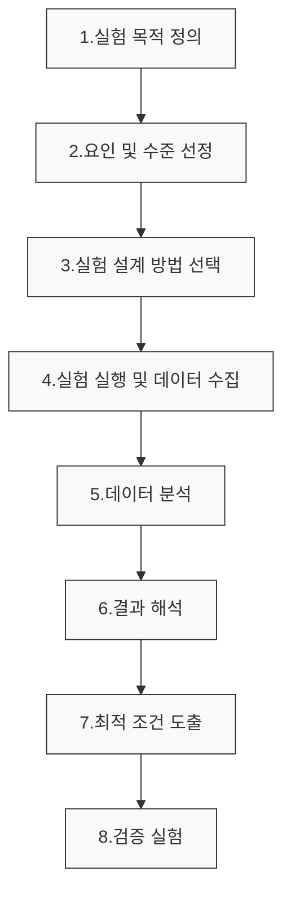

# 실험계획법(DOE): 최소의 실험으로 최대의 정보를 획득하는 통계적 방법론

<!-- mtoc-start -->

- [정의 및 개념](#정의-및-개념)
- [주요 특징](#주요-특징)
- [실험계획법 프로세스](#실험계획법-프로세스)
- [실험 설계의 기본 원칙](#실험-설계의-기본-원칙)
- [실험 설계의 종류](#실험-설계의-종류)
- [주요 실험계획법 유형](#주요-실험계획법-유형)
  - [완전요인실험계획법(Full Factorial Design)](#완전요인실험계획법full-factorial-design)
  - [부분요인실험계획법(Fractional Factorial Design)](#부분요인실험계획법fractional-factorial-design)
  - [직교배열법(Orthogonal Array Design)](#직교배열법orthogonal-array-design)
- [활용 사례](#활용-사례)
- [기대 효과 및 필요성](#기대-효과-및-필요성)
- [실무적 고려사항](#실무적-고려사항)
  - [실험계획법 적용 시 핵심 고려사항](#실험계획법-적용-시-핵심-고려사항)
- [마무리](#마무리)
- [Keywords](#keywords)

<!-- mtoc-end -->

실험계획법(Design of Experiments, DOE)은 제한된 자원 내에서 실험의 효율성과 효과성을 극대화하기 위한 체계적인 접근 방식입니다. 이 방법론은 변수 간의 복잡한 관계를 파악하고 최적의 조건을 도출함으로써 연구개발, 품질관리, 공정 최적화 등 다양한 분야에서 혁신적인 성과를 가능하게 합니다.

## 정의 및 개념

- 실험계획법: 변수 간의 인과관계를 규명하고 최적 조건을 효율적으로 찾기 위해 실험을 체계적으로 설계하는 통계적 기법.
- 목적: 최소한의 실험으로 최대한의 정보를 획득하여 시간, 비용, 자원을 절약하며 신뢰성 있는 결론 도출.
- **요인(Factor)**: 실험에 영향을 미치는 독립 변수.
- **수준(Level)**: 요인이 가질 수 있는 각기 다른 값이나 조건.
- **반복(Replication)**: 동일 조건의 실험을 여러 번 반복하여 신뢰성을 높이는 과정.
- **무작위화(Randomization)**: 실험 순서를 무작위로 배치해 외부 영향의 편향을 방지하는 기법.

## 주요 특징

- **실험 설계의 체계화**: 요인(인자)과 수준을 명확히 정의하고 체계적인 실험 구조를 설계하여 무작위성과 편향 방지
- **교호작용 분석**: 여러 요인들이 결과에 미치는 개별 효과뿐 아니라 요인들 간의 상호작용까지 동시에 분석 가능
- **최소 실험횟수**: 전체 실험 조합에서 중요한 정보만 추출할 수 있는 부분요인 설계로 실험 횟수 최소화
- **통계적 유의성**: 실험 결과의 통계적 분석을 통해 우연의 영향과 실제 효과를 구분하여 의사결정의 신뢰성 향상

## 실험계획법 프로세스

실험계획법은 문제 정의부터 최적 조건 도출까지 체계적인 단계를 따르며, 각 단계에서 통계적 원리를 적용하여 실험의 효율성과 결과의 신뢰성을 보장합니다. 최종 도출된 조건은 검증 실험을 통해 재확인됩니다.

## 실험 설계의 기본 원칙

- **반복**: 실험의 신뢰도 향상을 위한 반복 수행.
- **무작위화**: 편향 최소화를 위한 무작위 실험 순서 배치.
- **블록화(Block)**: 실험에서 통제할 수 없는 변동을 줄이기 위해 비슷한 조건끼리 묶어 실험.

## 실험 설계의 종류

- **완전 요인 실험(Full Factorial Design)**: 모든 요인 조합을 실험하여 가장 정확한 분석 가능.
- **부분 요인 실험(Fractional Factorial Design)**: 자원의 효율성을 위해 일부 조합만 실험.
- **반응표면법(Response Surface Methodology, RSM)**: 최적 조건을 찾기 위한 고급 실험 설계 및 분석.

## 주요 실험계획법 유형

### 완전요인실험계획법(Full Factorial Design)

- 모든 요인들의 모든 수준 조합에 대해 실험을 수행
- 모든 요인과 교호작용에 대한 완전한 정보 획득 가능
- 요인과 수준이 많을 경우 실험 횟수가 기하급수적으로 증가하는 단점

### 부분요인실험계획법(Fractional Factorial Design)

- 완전요인설계의 일부분만 사용하여 실험 횟수 감소
- 고차 교호작용을 무시하고 주효과와 저차 교호작용에 집중
- 실험 경제성 확보와 주요 효과 파악에 유용

### 직교배열법(Orthogonal Array Design)

- 다구찌 방법으로도 알려진 효율적인 실험 설계
- 변동에 강건한(robust) 설계를 위한 신호대잡음비(S/N비) 활용
- 품질 엔지니어링에 특히 유용한 방법론

## 활용 사례

- **제조업**: 공정 파라미터 최적화, 품질 향상, 제품 수율 증대
- **IT 시스템**: 소프트웨어 성능 튜닝, 네트워크 설정 최적화, 클라우드 자원 할당 최적화
- **마케팅**: A/B 테스팅, 가격 전략 수립, 프로모션 효과 분석
- **의약품 개발**: 약물 조성 최적화, 임상 시험 설계, 부작용 최소화
- **농업**: 작물 재배 조건 최적화, 비료 사용량 결정, 생산성 향상

## 기대 효과 및 필요성

- **자원 절약**: 실험 횟수 감소로 시간, 비용, 자원의 효율적 사용
- **품질 향상**: 최적 조건 도출을 통한 제품/서비스 품질 개선
- **의사결정 신뢰성**: 통계적 접근을 통한 객관적이고 신뢰성 있는 의사결정 지원
- **경쟁력 강화**: 연구개발 및 문제해결 속도 향상으로 시장 경쟁력 제고
- **지식 확장**: 변수 간의 관계와 시스템 동작 원리에 대한 이해 증진

## 실무적 고려사항

### 실험계획법 적용 시 핵심 고려사항

- **요인 선정의 중요성**: 핵심 요인을 누락하면 최적화의 의미가 감소
- **실험 오차 통제**: 측정 오차, 환경 변화 등 실험 결과의 일관성을 위협하는 요소 관리
- **적절한 분석 방법**: 데이터 특성에 맞는 통계 분석 기법 선택 필요
- **실험 규모와 효율성**: 자원 제약 조건 내에서 최대 정보를 얻을 수 있는 설계 방법 선택

## 마무리

실험계획법은 데이터 기반 의사결정의 핵심 방법론으로, 복잡한 시스템의 최적화와 문제해결에 강력한 도구입니다. IT 분야에서도 시스템 성능 최적화, 소프트웨어 테스팅, 사용자 경험 개선 등에 널리 활용되고 있습니다. 실험계획법의 체계적인 접근은 단순한 시행착오를 넘어 과학적이고 효율적인 혁신을 가능하게 하므로, 복잡한 문제에 직면한 기업과 조직에 적극적인 도입을 권장합니다.

## Keywords

Design of Experiments, 실험계획법, 요인설계, Factorial Design, 직교배열, Orthogonal Array, 다구찌 방법, Taguchi Method, 분산분석, 교호작용, 최적화, 통계적 유의성
